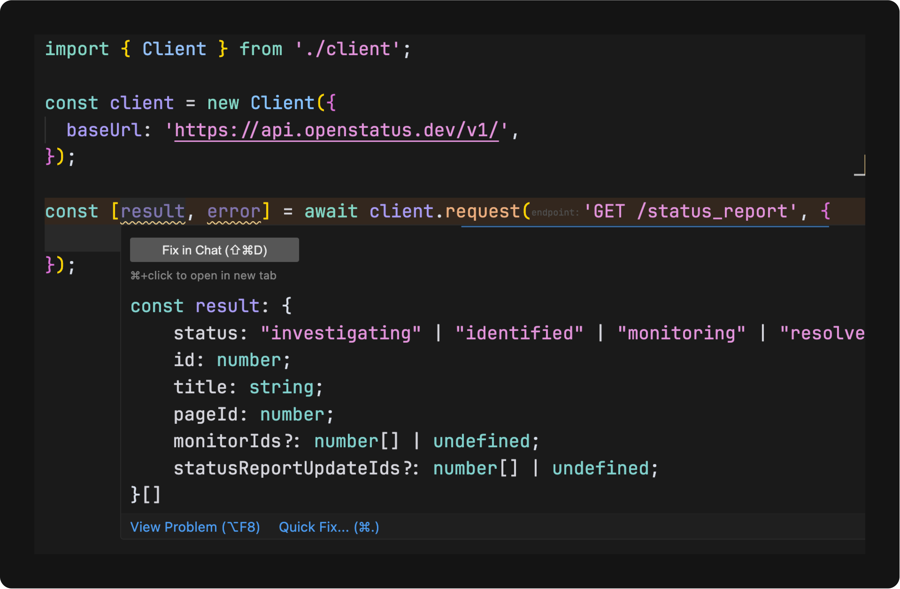

# SDK-IT

SDK-IT generates type-safe client SDKs from OpenAPI specifications and creates OpenAPI specs from TypeScript code.

## Features

1. **Generating type-safe client SDKs from OpenAPI specifications to different languages**

Also

2. Generating OpenAPI specifications from TypeScript code

3. TypeScript RPC Client From OpenAPI specifications. (WIP)

## Quick Start

- Generate an SDK from an OpenAPI specification

```bash
npx @sdk-it/cli@latest typescript \
  --spec https://api.openstatus.dev/v1/openapi \
  --output ./client \
  --name OpenStatus \
  --mode full
```

- Use the generated SDK

```typescript
import { OpenStatus } from './client';

const client = new Client({
  baseUrl: 'https://api.openstatus.dev/v1/',
});

const [result, error] = await client.request('GET /status_report', {});
```

Voilà!



### 2. OpenAPI Generation from TypeScript

With the right framework integration, SDK-IT can statically examine your codebase and generate OpenAPI specifications with minimal input required.

- Extracts TypeScript types for request/response schemas
- Uses framework-specific adapters to detect API patterns
- Requires little to no additional configuration or annotations; depends on your code structure and naming conventions

The result is accurate OpenAPI documentation that stays in sync with your code.

```typescript
import { validate } from '@sdk-it/hono/runtime';

const app = new Hono();

/**
 * @openapi listBooks
 * @tags books
 */
app.get(
  '/books',
  validate((payload) => ({
    author: {
      select: payload.query.author,
      against: z.string(),
    },
  })),
  async (c) => {
    const books = [{ name: 'OpenAPI' }];
    return c.json(books);
  },
);
```

This route will be correctly inferred because it uses the validate middleware and has an `@openapi` tag.

[Supported frameworks](#OpenAPI-Generation-Framework-Support)

## Guides

- [Monorepos](./docs/monorepos.md)

## Examples

- [Docker Engine](./docs/examples/docker-engine.md)
- [OpenAI](./docs/examples/openai.md)
- [Figma](./docs/examples/figma.md)
- [Hetzner Cloud](./docs/examples/hetzner.md)
- [Discord](./docs/examples/discord.md)
- [OpenStatus](./docs/examples/openstatus.md)

## Roadmap

SDK-IT is evolving to support more languages and frameworks. Here's our current roadmap:

### SDK Generation Languages

- [x] TypeScript/JavaScript
- [ ] Dart (WIP)
- [ ] Python
- [ ] Go
- [ ] Rust
- ...

### Frontend Framework Integration

- [x] [React Query](./docs/react-query.md)
- [x] [Angular](./docs/angular.md)

### OpenAPI Generation Framework Support

- [x] [Generic HTTP primitives](./packages/generic/README.md)
- [x] [Hono](./packages/hono/README.md)
- [ ] Express (WIP)
- [ ] Fastify
- [ ] Koa.js
- [ ] Next.js

We welcome contributions to help us expand language and framework support!

## Contributing

SDK-IT is organized as a monorepo with multiple packages:

```
.
├── packages/
│   ├── core/             # Core functionality and utilities
│   ├── cli/              # Command-line interface
│   ├── generic/          # Generic OpenAPI generation
│   ├── hono/             # Hono OpenAPI generation
│   └── typescript/       # TypeScript code generation
```

Each package serves a specific purpose:

- **core**: Provides fundamental utilities and services used by all other packages
- **cli**: Command-line interface for SDK-IT
- **typescript**: Focuses on generating TypeScript code from OpenAPI specifications (primary use case)
- **generic**: OpenAPI generation using `output` and `validate` constructs.
- **hono**: OpenAPI generation for the Hono framework

For more detailed information about the codebase structure and development process, see the [contributing guide](CONTRIBUTING.md).
