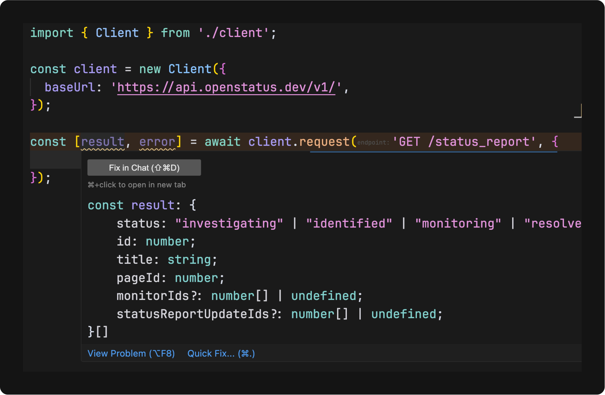

# SDK-IT

SDK-IT generates type-safe client SDKs from OpenAPI specifications and creates OpenAPI specs from TypeScript code.

## Features

- Type-safe TypeScript, Dart, and Python SDK generation from OpenAPI specs
- OpenAPI generation from TypeScript code, including Hono integration
- A command builder and runtime RPC client generated from OpenAPI operations
- CLI and Vite workflows for generating clients from specs or TypeScript backends
- API reference and README generation

## Quick Start

- Generate an SDK from an OpenAPI specification

```bash
npx @sdk-it/cli@latest typescript \
  --spec https://api.openstatus.dev/v1/openapi \
  --output ./client \
  --name OpenStatus \
  --mode full
```

- Use the generated SDK

```typescript
import { OpenStatus } from './client';

const client = new OpenStatus({
  baseUrl: 'https://api.openstatus.dev/v1/',
});

const [result, error] = await client.request('GET /status_report', {});
```

Voilà!



### 2. OpenAPI Generation from TypeScript

SDK-IT statically examines your codebase and generates OpenAPI specifications from it.

- Extracts TypeScript types for request/response schemas
- Uses framework-specific adapters to detect API patterns
- Minimal configuration needed; relies on your code structure and naming conventions

```typescript
import { validate } from '@sdk-it/hono/runtime';

const app = new Hono();

/**
 * @openapi listBooks
 * @tags books
 */
app.get(
  '/books',
  validate((payload) => ({
    author: {
      select: payload.query.author,
      against: z.string(),
    },
  })),
  async (c) => {
    const books = [{ name: 'OpenAPI' }];
    return c.json(books);
  },
);
```

The analyzer infers this route because it uses the validate middleware and has an `@openapi` tag.

[Supported frameworks](#OpenAPI-Generation-Framework-Support)

## Guides

- [Monorepo development](./CONTRIBUTING.md#project-structure)
- [Generate a client from a TypeScript backend](./docs/recipes/backend-to-client.md)

## Examples

- [Docker Engine](./docs/examples/docker-engine.md)
- [OpenAI](./docs/examples/openai.md)
- [Figma](./docs/examples/figma.md)
- [Hetzner Cloud](./docs/examples/hetzner.md)
- [Discord](./docs/examples/discord.md)
- [OpenStatus](./docs/examples/openstatus.md)

## Roadmap

SDK-IT supports and plans to add:

### SDK Generation Languages

- [x] TypeScript/JavaScript
- [x] Dart
- [x] Python
- [ ] Go
- [ ] Rust
- ...

### Frontend Framework Integration

- [x] [React Query](./docs/react-query.md)
- [x] [Angular](./docs/angular.md)

### OpenAPI Generation Framework Support

- [x] [Generic HTTP primitives](./packages/generic/README.md)
- [x] [Hono](./packages/hono/README.md)
- [ ] Express (WIP)
- [ ] Fastify
- [ ] Koa.js
- [ ] Next.js

Contributions welcome.

## Contributing

SDK-IT is organized as a monorepo with multiple packages:

```
.
├── packages/
│   ├── core/             # Core functionality and utilities
│   ├── cli/              # Command-line interface
│   ├── command/          # OpenAPI operation command builder
│   ├── dart/             # Dart SDK generator
│   ├── generic/          # Generic OpenAPI generation
│   ├── hono/             # Hono OpenAPI generation
│   ├── python/           # Python SDK generator
│   ├── readme/           # README generation
│   ├── rpc/              # Runtime RPC client and agent tools
│   ├── spec/             # OpenAPI normalization and IR
│   ├── typescript/       # TypeScript SDK generator
│   └── vite/             # Vite generation plugin
```

Each package serves a specific purpose:

- **core**: Shared utilities used by all packages
- **cli**: Command-line interface for SDK-IT
- **typescript**: Focuses on generating TypeScript code from OpenAPI specifications (primary use case)
- **generic**: OpenAPI generation using `output` and `validate` constructs.
- **hono**: OpenAPI generation for the Hono framework
- **dart** and **python**: Language-specific SDK generators
- **spec**: Shared OpenAPI loading, normalization, and intermediate representation
- **command** and **rpc**: Operation command construction and runtime dispatch
- **readme**: Generated SDK documentation
- **vite**: Development/build integration backed by the CLI generation engine

For more detailed information about the codebase structure and development process, see the [contributing guide](CONTRIBUTING.md).
