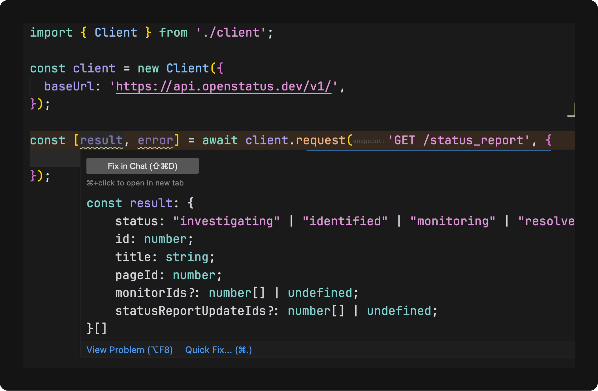

# File: .github/copilot-instructions.md


# File: README.md

# SDK-IT

SDK-IT generates type-safe client SDKs from OpenAPI specifications and creates OpenAPI specs from TypeScript code.

## Features

1. **Generating type-safe client SDKs from OpenAPI specifications to different languages**

Also

2. Generating OpenAPI specifications from TypeScript code

3. TypeScript RPC Client From OpenAPI specifications. (WIP)

## Quick Start

- Generate an SDK from an OpenAPI specification

```bash
npx @sdk-it/cli@latest typescript \
  --spec https://api.openstatus.dev/v1/openapi \
  --output ./client \
  --name OpenStatus \
  --mode full
```

- Use the generated SDK

```typescript
import { OpenStatus } from './client';

const client = new Client({
  baseUrl: 'https://api.openstatus.dev/v1/',
});

const [result, error] = await client.request('GET /status_report', {});
```

Violla!



### 2. OpenAPI Generation from TypeScript

With the right framework integration, SDK-IT can statically examine your codebase and generate OpenAPI specifications with minimal input required.

- Extracts TypeScript types for request/response schemas
- Uses framework-specific adapters to detect API patterns
- Requires little to no additional configuration or annotations; depends on your code structure and naming conventions

The result is accurate OpenAPI documentation that stays in sync with your code.

```typescript
import { validate } from '@sdk-it/hono/runtime';

const app = new Hono();

/**
 * @openapi listBooks
 * @tags books
 */
app.get(
  '/books',
  validate((payload) => ({
    author: {
      select: payload.query.author,
      against: z.string(),
    },
  })),
  async (c) => {
    const books = [{ name: 'OpenAPI' }];
    return c.json(books);
  },
);
```

This route will be correctly inferred because it uses the validate middleware and has an `@openapi` tag.

[Supported frameworks](#OpenAPI-Generation-Framework-Support)

## Guides

- [Monorepos](./docs/monorepos.md)

## Examples

- [Docker Engine](./docs/examples/docker-engine.md)
- [OpenAI](./docs/examples/openai.md)
- [Figma](./docs/examples/figma.md)
- [Hetzner Cloud](./docs/examples/hetzner.md)
- [Discord](./docs/examples/discord.md)
- [OpenStatus](./docs/examples/openstatus.md)

## Roadmap

SDK-IT is evolving to support more languages and frameworks. Here's our current roadmap:

### SDK Generation Languages

- [x] TypeScript/JavaScript
- [ ] Dart (WIP)
- [ ] Python
- [ ] Go
- [ ] Rust
- ...

### Frontend Framework Integration

- [x] [React Query](./docs/react-query.md)
- [x] [Angular](./docs/angular.md)

### OpenAPI Generation Framework Support

- [x] [Generic HTTP primitives](./packages/generic/README.md)
- [x] [Hono](./packages/hono/README.md)
- [ ] Express (WIP)
- [ ] Fastify
- [ ] Koa.js
- [ ] Next.js

We welcome contributions to help us expand language and framework support!

## Contributing

SDK-IT is organized as a monorepo with multiple packages:

```
.
├── packages/
│   ├── core/             # Core functionality and utilities
│   ├── cli/              # Command-line interface
│   ├── generic/          # Generic OpenAPI generation
│   ├── hono/             # Hono OpenAPI generation
│   └── typescript/       # TypeScript code generation
```

Each package serves a specific purpose:

- **core**: Provides fundamental utilities and services used by all other packages
- **cli**: Command-line interface for SDK-IT
- **typescript**: Focuses on generating TypeScript code from OpenAPI specifications (primary use case)
- **generic**: OpenAPI generation using `output` and `validate` constructs.
- **hono**: OpenAPI generation for the Hono framework

For more detailed information about the codebase structure and development process, see the [contributing guide](CONTRIBUTING.md).

# File: dev.md

- Generate Lib

npx nx generate @nx/js:library --directory=packages/spec --bundler=esbuild --importPath=@sdk-it/spec --linter=eslint --name=spec --publishable=true --unitTestRunner=none --minimal=true --setParserOptionsProject=true --simpleName=true --useProjectJson=true --no-interactive


npx nx generate @nx/react:application --directory=packages/apiref --linter=eslint --name=apiref --compiler=swc --e2eTestRunner=none --globalCss=true --minimal=true --useProjectJson=true --useReactRouter=true --no-interactive
# File: docs/angular.md

## Integrate with Angular

This integration builds on Angular's [`resource`](https://angular.dev/guide/signals/resource) function for fetching data and simple wrapper for submitting data to the server.

> [!IMPORTANT]
> When generating the TypeScript client SDK within your Angular project or workspace, ensure you include the `--useTsExtension=false` flag.

---

Copy the following code into your project.

- **`api.ts` file:**

<details>
<summary>View the API code</summary>

```ts
import {
  type PromiseResourceOptions,
  type Signal,
  isSignal,
  resource,
} from '@angular/core';
import { FormGroup } from '@angular/forms';

import { Client, type Endpoints } from '../client/src';

export const client = new Client({
  baseUrl: 'http://localhost:3000',
});

type DataEndpoints = {
  [K in keyof Endpoints]: K extends `${'GET'} ${string}` ? K : never;
}[keyof Endpoints];

type MutationEndpoints = {
  [K in keyof Endpoints]: K extends `${'POST' | 'PUT' | 'PATCH' | 'DELETE'} ${string}`
    ? K
    : never;
}[keyof Endpoints];

export function useData<E extends DataEndpoints>(
  endpoint: E,
  input?: Endpoints[E]['input'] | Signal<Endpoints[E]['input'] | undefined>,
  options?: Omit<
    PromiseResourceOptions<
      readonly [Endpoints[E]['output'], Endpoints[E]['error'] | null],
      typeof input
    >,
    'request' | 'loader' | 'stream'
  > & { headers?: HeadersInit },
) {
  return resource({
    ...options,
    request: isSignal(input) ? () => input() : () => input,
    loader: async ({ abortSignal, previous, request }) => {
      const input = isSignal(request) ? request() : (request ?? ({} as never));
      return client.request(endpoint, input ?? ({} as never), {
        signal: abortSignal,
        headers: options?.headers,
      });
    },
  });
}

export function useAction<E extends MutationEndpoints>(endpoint: E) {
  return {
    mutate: (
      input:
        | Endpoints[E]['input']
        | Signal<Endpoints[E]['input']>
        | { value: Endpoints[E]['input'] },
    ) => {
      const payload = isSignal(input)
        ? input()
        : input instanceof FormGroup
          ? input.value
          : input;
      return client.request(endpoint, payload);
    },
  };
}
```

</details>

## Examples

### `useData`

- Fetch a list of payments with static parameters:

```ts
import { Component } from '@angular/core';

import { useData } from './api';

@Component({
  selector: 'payments-list',
  template: `
    @if (paymentsResource.value()?.[0]; as result) {
      <ul>
        @for (payment of result; track payment.id) {
          ...
        }
      </ul>
    }
  `,
})
export class PaymentsListComponent {
  paymentsResource = useData('GET /payments', {
    since: '2023-01-01',
    until: '2023-12-31',
  });
}
```

- With signals

```ts
import { Component, computed, signal } from '@angular/core';

import { useData } from './api';

@Component({
  // ...
})
export class FilteredPaymentsComponent {
  dateRange = signal({
    since: '2023-01-01',
    until: '2023-12-31',
  });

  // Pass the signal directly to useData
  paymentsResource = useData('GET /payments', this.dateRange);

  // Method to update the filter
  updateDateRange(since: string, until: string) {
    this.dateRange.set({ since, until });
  }
}
```

- Dependent queries

```ts
import { Component, computed, signal } from '@angular/core';

import { useData } from './api';

@Component({
  // ...
})
export class FilteredPaymentsComponent {
  // assuming we don't have initial id value
  id = signal<string | undefined>(undefined);

  paymentsResource = useData(
    'GET /payments/{id}',
    computed(() => (this.id() ? { id: this.id() } : undefined)),
    // return undefined if id is not available so the request is not sent
  );

  selectChat(chat: { id: string }) {
    this.id.set(chat.id);
  }
}
```

### `useAction` Use Cases

- Simple form submission

```ts
import { Component } from '@angular/core';
import { FormBuilder, FormGroup, Validators } from '@angular/forms';

import { useAction } from './api';

@Component({
  selector: 'app-payment-form',
  template: `<form [formGroup]="form" (ngSubmit)="submit()">...</form>`,
})
export class PaymentFormComponent {
  form: FormGroup;
  isSubmitting = signal(false);

  // Simple action for creating a payment
  createPayment = useAction('POST /payments');

  constructor(private fb: FormBuilder) {
    this.form = this.fb.group({
      amount: [null, [Validators.required, Validators.min(1)]],
      date: [null, Validators.required],
      description: [''],
    });
  }

  async submit() {
    if (this.form.invalid) return;

    this.isSubmitting.set(true);

    try {
      const [result, error] = await this.createPayment.mutate(this.form);

      if (error) {
        // Handle error
        console.error('Failed to create payment:', error);
      } else {
        // Handle success
        this.form.reset();
      }
    } finally {
      this.isSubmitting.set(false);
    }
  }
}
```

#### Update with Optimistic UI

```ts
import { Component, input } from '@angular/core';

import { useAction, useData } from './api';

@Component({
  selector: 'app-payment-status',
  template: `<button (click)="updateStatus('COMPLETED')">
    Mark as Completed
  </button>`,
})
export class PaymentStatusComponent {
  // Get payment ID from component input
  paymentId = input.required<string>();

  // Fetch the payment data
  paymentResource = useData('GET /payments/{id}', () => ({
    id: this.paymentId(),
  }));

  // Action for updating payment status
  updatePaymentStatus = useAction('PATCH /payments/{id}/status');

  async updateStatus(newStatus: string) {
    // Get the current payment
    const currentPayment = this.paymentResource.value?.[0];
    if (!currentPayment) return;

    // Store original status for rollback
    const originalStatus = currentPayment.status;

    // Optimistically update the UI
    this.paymentResource.set(([payment, error]) => {
      if (!payment) return [payment, error];

      const updatedPayment = {
        ...payment,
        status: newStatus,
      };

      return [updatedPayment, error];
    });

    // Send the actual update to the server
    const [result, error] = await this.updatePaymentStatus.mutate({
      id: this.paymentId(),
      status: newStatus,
    });

    // If there was an error, roll back the optimistic update
    if (error) {
      this.paymentResource.mutate(([payment, _]) => {
        if (!payment) return [payment, error];

        return [{ ...payment, status: originalStatus }, error];
      });
    }
  }
}
```

# File: docs/examples/discord.md

## Build Discord SDK

### Generate SDK

```bash
npx @sdk-it/cli@latest typescript \
  --spec https://raw.githubusercontent.com/discord/discord-api-spec/refs/heads/main/specs/openapi.json \
  --output ./discord \
  --name Discord \
  --mode full
```

### Create and configure Client

```ts
import { Discord } from './discord';

const discord = new Discord({
  baseUrl: 'https://discord.com/api/v10',
  Authorization: `Bot ${process.env.DISCORD_BOT_TOKEN}`,
});
```

### Get Current Bot User

```ts
const [result, error] = await discord.request('GET /users/@me', {});

if (!error) {
  console.log(`Bot User: ${result.username}#${result.discriminator}`);
  console.log(`ID: ${result.id}`);
  console.log(`Avatar: ${result.avatar}`);
} else {
  console.error(error);
}
```

### Get Guild Information

```ts
const [result, error] = await discord.request('GET /guilds/{guild_id}', {
  guild_id: '123456789012345678',
});

if (!error) {
  console.log(`Guild: ${result.name}`);
  console.log(`Member Count: ${result.approximate_member_count}`);
  console.log(`Icon: ${result.icon}`);
  console.log(`Owner ID: ${result.owner_id}`);
} else {
  console.error(error);
}
```

### Get Guild Channels

```ts
const [result, error] = await discord.request(
  'GET /guilds/{guild_id}/channels',
  {
    guild_id: '123456789012345678',
  },
);

if (!error) {
  console.log(`Total channels: ${result.length}`);
  for (const channel of result) {
    console.log(`- ${channel.name} (${channel.type}): ${channel.id}`);
  }
} else {
  console.error(error);
}
```

### Send Message to Channel

```ts
const [result, error] = await discord.request(
  'POST /channels/{channel_id}/messages',
  {
    channel_id: '123456789012345678',
    content: 'Hello from SDK-IT!',
    embeds: [
      {
        title: 'SDK-IT Discord Example',
        description:
          'This message was sent using a type-safe Discord client generated with SDK-IT',
        color: 0x3498db,
        fields: [
          {
            name: 'Documentation',
            value:
              '[Discord Developer Portal](https://discord.com/developers/docs)',
          },
        ],
      },
    ],
  },
);

if (!error) {
  console.log(`Message sent successfully! ID: ${result.id}`);
} else {
  console.error(error);
}
```

### Create Channel Invite

```ts
const [result, error] = await discord.request(
  'POST /channels/{channel_id}/invites',
  {
    channel_id: '123456789012345678',
    max_age: 86400, // 24 hours
    max_uses: 5,
    temporary: false,
    unique: true,
  },
);

if (!error) {
  console.log(`Invite created: https://discord.gg/${result.code}`);
  console.log(`- Expires at: ${result.expires_at}`);
  console.log(`- Max uses: ${result.max_uses}`);
} else {
  console.error(error);
}
```

### Edit Guild Role

```ts
const [result, error] = await discord.request(
  'PATCH /guilds/{guild_id}/roles/{role_id}',
  {
    guild_id: '123456789012345678',
    role_id: '123456789012345678',
    name: 'New Role Name',
    color: 0xff0000, // Red
    permissions: '1073741824', // Permissions integer
    hoist: true, // Display role separately in the sidebar
    mentionable: true,
  },
);

if (!error) {
  console.log(`Role updated: ${result.name}`);
  console.log(`- Color: ${result.color.toString(16)}`);
  console.log(`- Position: ${result.position}`);
} else {
  console.error(error);
}
```

# File: docs/examples/docker-engine.md

## Build Docker Engine SDK

### Generate SDK

```bash
npx @sdk-it/cli@latest typescript \
  --spec https://docs.docker.com/reference/api/engine/version/v1.48.yaml \
  --output ./dockerengine \
  --name DockerEngine \
  --mode full
```

### Create and configure Client

```ts
import Modem from 'docker-modem';
import { IncomingMessage } from 'node:http';
import { Readable } from 'node:stream';

import { DockerEngine } from './dockerengine';

const modem = new Modem();
const docker = new DockerEngine({
  baseUrl: 'http://localhost',
  fetch: (request) => {
    const url = new URL(request.url);
    return new Promise((resolve, reject) => {
      modem.dial(
        {
          path: request.url.replace('http://localhost', ''),
          method: request.method,
          options: {
            _body: request.body,
            _query: url.searchParams,
          },
          isStream: true,
          headers: { ...request.headers } as any,
        },
        (err, data) => {
          if (err) {
            return reject(err);
          }
          if (data instanceof IncomingMessage) {
            return resolve(
              new Response(Readable.toWeb(data) as ReadableStream<Uint8Array>, {
                status: data.statusCode,
                statusText: data.statusMessage,
                headers: new Headers(data.headers as any),
              }),
            );
          }
          throw new Error('Unexpected response');
        },
      );
    });
  },
});
```

### Get Version

```ts
const [result, error] = await docker.request('GET /version', {});
if (!error) {
  console.log(result);
} else {
  console.error(error);
}
```

### Stream logs from a container

```ts
const [result, error] = await docker.request('GET /containers/{id}/logs', {
  id: '1daf90ceeee2',
  follow: true,
  stdout: true,
  stderr: true,
});
if (!error) {
  const decoder = new TextDecoder();
  for await (const chunk of result) {
    console.log(decoder.decode(chunk as Uint8Array));
  }
}
```

### Demux container logs

```ts
const [result, error] = await docker.request('GET /containers/{id}/logs', {
  id: '3b85714a4095',
  follow: true,
  stdout: true,
  stderr: true,
  timestamps: false,
});

if (!error) {
  modem.demuxStream(
    Readable.fromWeb(result as any),
    process.stdout,
    process.stderr,
  );
} else {
  console.error(error);
}
```

# File: docs/examples/figma.md

## Build Figma SDK

### Generate SDK

```bash
npx @sdk-it/cli@latest typescript \
  --spec https://raw.githubusercontent.com/figma/rest-api-spec/refs/heads/main/openapi/openapi.yaml \
  --output ./figma \
  --name Figma \
  --mode full
```

### Create and configure Client

```ts
import { Figma } from './figma';

const figma = new Figma({
  baseUrl: 'https://api.figma.com/v1',
  token: process.env.FIGMA_ACCESS_TOKEN,
});
```

### Get File Information

```ts
const [result, error] = await figma.request('GET /files/{file_key}', {
  file_key: 'your-file-key',
});

if (!error) {
  console.log(`File name: ${result.name}`);
  console.log(`Last modified: ${result.lastModified}`);
  console.log(`Version: ${result.version}`);
  console.log(`Document: ${result.document.name}`);
} else {
  console.error(error);
}
```

### Get File Comments

```ts
const [result, error] = await figma.request('GET /files/{file_key}/comments', {
  file_key: 'your-file-key',
});

if (!error) {
  console.log(`Total comments: ${result.comments.length}`);
  for (const comment of result.comments) {
    console.log(`- ${comment.user.handle}: ${comment.message}`);
  }
} else {
  console.error(error);
}
```

### Get Component Sets

```ts
const [result, error] = await figma.request(
  'GET /files/{file_key}/component_sets',
  {
    file_key: 'your-file-key',
  },
);

if (!error) {
  for (const [id, componentSet] of Object.entries(result.meta.component_sets)) {
    console.log(`Component set: ${componentSet.name} (${id})`);
    console.log(`- Description: ${componentSet.description}`);
    console.log(`- Contains ${componentSet.components.length} components`);
  }
} else {
  console.error(error);
}
```

### Get Style References

```ts
const [result, error] = await figma.request('GET /files/{file_key}/styles', {
  file_key: 'your-file-key',
});

if (!error) {
  for (const style of Object.values(result.meta.styles)) {
    console.log(`Style: ${style.name} (${style.key})`);
    console.log(`- Type: ${style.style_type}`);
    console.log(`- Description: ${style.description || 'No description'}`);
  }
} else {
  console.error(error);
}
```

### Post a Comment

```ts
const [result, error] = await figma.request('POST /files/{file_key}/comments', {
  file_key: 'your-file-key',
  message: 'This is a new comment added via the API',
  client_meta: {
    x: 100,
    y: 200,
  },
});

if (!error) {
  console.log(`Comment posted successfully! Comment ID: ${result.id}`);
} else {
  console.error(error);
}
```

# File: docs/examples/hetzner.md

## Build Hetzner Cloud SDK

### Generate SDK

```bash
npx @sdk-it/cli@latest typescript \
  --spec https://docs.hetzner.cloud/spec.json \
  --output ./hetzner \
  --name Hetzner \
  --mode full
```

### Create and configure Client

```ts
import { Hetzner } from './hetzner';

const hetzner = new Hetzner({
  baseUrl: 'https://api.hetzner.cloud/v1',
  token: process.env.HETZNER_API_TOKEN,
});
```

### Get All Servers

```ts
const [result, error] = await hetzner.request('GET /servers', {});

if (!error) {
  console.log(`Total servers: ${result.meta.pagination.total_entries}`);
  for (const server of result.servers) {
    console.log(`Server: ${server.name} (ID: ${server.id})`);
    console.log(`- Status: ${server.status}`);
    console.log(`- Type: ${server.server_type.name}`);
    console.log(`- IP: ${server.public_net.ipv4.ip}`);
  }
} else {
  console.error(error);
}
```

### Create a New Server

```ts
const [result, error] = await hetzner.request('POST /servers', {
  name: 'my-server-name',
  server_type: 'cx11',
  image: 'ubuntu-22.04',
  location: 'nbg1',
  ssh_keys: ['12345'],
  start_after_create: true,
});

if (!error) {
  console.log(`Server created successfully!`);
  console.log(`- ID: ${result.server.id}`);
  console.log(`- Status: ${result.server.status}`);
  console.log(`- Root password: ${result.root_password}`); // Only provided on creation
} else {
  console.error(error);
}
```

### Power On/Off Server

```ts
const [result, error] = await hetzner.request(
  'POST /servers/{id}/actions/poweron',
  {
    id: 42,
  },
);

if (!error) {
  console.log(`Power on action initiated successfully`);
  console.log(`- Action ID: ${result.action.id}`);
  console.log(`- Status: ${result.action.status}`);
} else {
  console.error(error);
}
```

### Create a Snapshot

```ts
const [result, error] = await hetzner.request(
  'POST /servers/{id}/actions/create_image',
  {
    id: 42,
    description: 'My server snapshot',
    type: 'snapshot',
  },
);

if (!error) {
  console.log(`Snapshot creation initiated`);
  console.log(`- Image ID: ${result.image.id}`);
  console.log(`- Image name: ${result.image.description}`);
  console.log(`- Action status: ${result.action.status}`);
} else {
  console.error(error);
}
```

### List Volumes

```ts
const [result, error] = await hetzner.request('GET /volumes', {});

if (!error) {
  console.log(`Total volumes: ${result.meta.pagination.total_entries}`);
  for (const volume of result.volumes) {
    console.log(`Volume: ${volume.name} (ID: ${volume.id})`);
    console.log(`- Size: ${volume.size} GB`);
    console.log(`- Server: ${volume.server || 'Not attached'}`);
  }
} else {
  console.error(error);
}
```

# File: docs/examples/openai.md

## Build OpenAI SDK

### Generate SDK

```bash
npx @sdk-it/cli@latest typescript \
  --spec https://raw.githubusercontent.com/openai/openai-openapi/refs/heads/master/openapi.yaml \
  --output ./openai \
  --name OpenAI \
  --mode full
```

### Create and configure Client

```ts
import { OpenAI } from './openai';

const openai = new Client({
  baseUrl: 'https://api.openai.com/v1',
  token: process.env.OPENAI_API_KEY,
});
```

### Create ai response with web search tool

```ts
const [result, error] = await openai.request('POST /responses', {
  model: 'gpt-4o',
  instructions: `You are an expert business developer`,
  input: 'How is the market for sdk generation products?',
  tool_choice: 'required',
  parallel_tool_calls: true,
  tools: [
    {
      type: 'web_search_preview',
      user_location: {
        type: 'approximate',
      },
      search_context_size: 'high',
    },
  ],
});

if (!error) {
  console.log(
    result.output
      .filter((it) => it.type === 'message')
      .flatMap((it) =>
        it.content.filter((c) => c?.type === 'output_text').map((c) => c.text),
      ),
  );
} else {
  if (error.kind === 'parse') {
    console.log('Parse Error'); // you sent invalid or non-compliant data
    console.error(error);
  } else {
    console.log('HTTP Error');
    console.error(error);
  }
}
```

### Create a Chat Completion

```ts
const [result, error] = await openai.request('POST /chat/completions', {
  model: 'gpt-4',
  messages: [
    { role: 'system', content: 'You are a helpful assistant.' },
    { role: 'user', content: 'Hello, who are you?' },
  ],
});

if (!error) {
  console.log(result.choices[0].message.content);
} else {
  console.error(error);
}
```

### Create an Embedding

```ts
const [result, error] = await openai.request('POST /embeddings', {
  model: 'text-embedding-ada-002',
  input: 'The quick brown fox jumps over the lazy dog',
});

if (!error) {
  console.log(result.data[0].embedding);
} else {
  console.error(error);
}
```

### List Available Models

```ts
const [result, error] = await openai.request('GET /models', {});

if (!error) {
  for (const model of result.data) {
    console.log(`${model.id}: ${model.owned_by}`);
  }
} else {
  console.error(error);
}
```

# File: docs/examples/openstatus.md

# OpenStatus API Example

This example demonstrates how to use the SDK-IT generated client for [OpenStatus](https://www.openstatus.dev/), an open-source synthetic monitoring tool.

## Setup

### Generate the SDK

First, generate the SDK using the CLI:

```bash
npx @sdk-it/cli@latest typescript \
  --spec https://api.openstatus.dev/v1/openapi \
  --output ./openstatus \
  --name OpenStatus \
  --mode full
```

### Create and configure Client

```typescript
import { OpenStatus } from './openstatus';

// Initialize the client with your API key
const openstatus = new OpenStatus({
  baseUrl: 'https://api.openstatus.dev/v1',
  'x-openstatus-key': process.env.OPENSTATUS_API_KEY,
});
```

### Create Monitor

```typescript
const [monitor, error] = await openstatus.request('POST /monitor', {
  body: {
    name: 'My Website Monitor',
    url: 'https://example.com',
    periodicity: '5m',
    regions: ['ams', 'nyc'],
    method: 'GET',
    assertions: [
      {
        type: 'status',
        compare: 'eq',
        target: 200,
      },
    ],
    active: true,
  },
});

if (error) {
  console.error('Failed to create monitor:', error);
} else {
  console.log('Monitor created:', monitor);
}
```

### Get Monitor Status

```ts
const [status, error] = await openstatus.request('GET /monitor/{monitorId}', {
  params: {
    monitorId,
  },
});

if (error) {
  console.error('Failed to get monitor status:', error);
} else {
  console.log('Monitor status:', status);
}
```

### Create Status Page

```typescript
const [page, error] = await openstatus.request('POST /page', {
  body: {
    name: 'My Service Status',
    description: 'Current status of our services',
    slug: 'my-service-status',
    subdomain: 'status',
    isPublic: true,
  },
});

if (error) {
  console.error('Failed to create status page:', error);
} else {
  console.log('Status page created:', page);
}
```

### Report Incident

```typescript
const [incident, error] = await openstatus.request('POST /incident', {
  body: {
    title: 'Service Degradation',
    status: 'investigating',
    impact: 'minor',
    message: 'We are investigating reports of increased latency',
    pageId: 123, // Your status page ID
  },
});

if (error) {
  console.error('Failed to report incident:', error);
} else {
  console.log('Incident reported:', incident);
}
```

# File: docs/react-query.md

## Integrate with React Query

Using the `useQuery` and `useMutation` hooks from React Query, you can integrate your API client with the library's caching and synchronization capabilities. This integration builds on React Query's declarative approach to data fetching while leveraging your type-safe API client.

---

Copy the following code into your project.

- **`api.tsx` file**:

<details>
<summary>View the API code</summary>

```ts
import { Client, type Endpoints } from '@impact/client';
import {
  type MutationFunction,
  type UseMutationOptions,
  useMutation,
  useQuery,
  useQueryClient,
} from '@tanstack/react-query';

export const client = new Client({
  baseUrl:
    import.meta.env.VITE_API_URL === '/'
      ? window.location.origin
      : import.meta.env.VITE_API_URL,
});

type DataEndpoints = {
  [K in keyof Endpoints]: K extends `${'GET'} ${string}` ? K : never;
}[keyof Endpoints];

type MutationEndpoints = {
  [K in keyof Endpoints]: K extends `${'POST' | 'PUT' | 'PATCH' | 'DELETE'} ${string}`
    ? K
    : never;
}[keyof Endpoints];

/**
 * A hook to fetch data from the API
 * @param endpoint - The API endpoint to fetch from (e.g. 'GET /payments')
 * @param params - Query parameters for the request
 * @param options - Additional options for the query
 * @returns The query result containing data and status
 *
 * @example
 * // Fetch all payments
 * const { data: payments } = useData('GET /payments', {
 *   since: '2023-01-01',
 *   until: '2023-12-31'
 * });
 */
export function useData<E extends DataEndpoints>(
  endpoint: E,
  input?: Endpoints[E]['input'],
  options?: { staleTime?: number; queryKey?: string[] },
) {
  return useQuery({
    queryKey: options?.queryKey ?? [endpoint, JSON.stringify(input)],
    staleTime: options?.staleTime,
    meta: { endpoint, input },
    queryFn: async () => {
      const [result, error] = await client.request(
        endpoint,
        input ?? ({} as never),
      );
      if (error) {
        throw error;
      }
      return result;
    },
  });
}

/**
 * A hook to perform an action on the API
 * @param endpoint - The API endpoint to perform the action on (e.g. 'POST /payments')
 * @param input - The input data for the request
 * @returns The mutation result containing data and status
 *
 * @example
 * // Create a new payment
 * const { mutate, isLoading } = useAction('POST /payments', {
 *  amount: 1000,
 * date: '2023-01-01',
 * });
 */
export function useAction<E extends MutationEndpoints, TData>(
  endpoint: E,
  options: Omit<
    UseMutationOptions<TData, Endpoints[E]['error']>,
    'mutationFn' | 'mutationKey'
  > & {
    invalidate?: DataEndpoints[];
    mutationFn: MutationFunction<
      TData,
      (input: Endpoints[E]['input']) => Promise<Endpoints[E]['output']>
    >;
  },
) {
  const queryClient = useQueryClient();
  return useMutation({
    ...options,
    mutationKey: [endpoint],
    mutationFn: () => {
      return options.mutationFn(async (input: Endpoints[E]['input']) => {
        const [output, error] = await client.request(endpoint, input);
        if (error) {
          throw error;
        }
        return output;
      });
    },
    onSuccess: async (result, variables, context) => {
      for (const endpoint of options.invalidate ?? []) {
        await queryClient.invalidateQueries({
          predicate(query) {
            return query.meta?.endpoint === endpoint;
          },
        });
      }
      return options.onSuccess?.(result, variables, context);
    },
  });
}
```

</details>

## Examples

- Fetch data from the API using the `useData` hook.

```tsx
import { useData } from './api';

function Payments() {
  const { data: payments, isLoading } = useData('GET /payments', {
    since: '2023-01-01',
    until: '2023-12-31',
  });

  if (isLoading) {
    return <div>Loading...</div>;
  }

  return (
    <ul>
      {payments.map((payment) => (
        <li key={payment.id}>{payment.amount}</li>
      ))}
    </ul>
  );
}
```

- Performing Mutations with Invalidation

```tsx
import { useAction, useData } from './api';

function CreatePaymentForm() {
  const [amount, setAmount] = useState(0);
  const [date, setDate] = useState('');

  // The second argument specifies which queries to invalidate after successful mutation
  const { mutate, isLoading, error } = useAction('POST /payments', {
    invalidate: ['GET /payments'], // This will invalidate the payments query
    mutationFn: async (dispatch) => {
      return dispatch({ amount, date });
    },
    onSuccess: (result) => {
      // Handle success
    },
  });

  return (
    <form
      onSubmit={(e) => {
        e.preventDefault();
        mutate({ amount, date });
      }}
    >
      {/* Form fields */}
      <button type="submit" disabled={isLoading}>
        {isLoading ? 'Creating...' : 'Create Payment'}
      </button>
      {error && <p>Error: {error.message}</p>}
    </form>
  );
}
```

# File: docs/recipes/file-upload.md

## Handling File Uploads with SDK-IT, Hono, and React Query

This article demonstrates implementing type-safe `multipart/form-data` file uploads using SDK-IT with Hono on the backend and React Query on the frontend.

We use the `@sdk-it/hono/runtime` `validate` middleware for backend validation and the generated SDK with the `useAction` hook (from the React Query integration recipe) for the frontend.

### Backend: Hono Route with Validation

- Define a Hono route accepting `multipart/form-data`.
- Use the `validate` middleware from `@sdk-it/hono/runtime`, specifying `'multipart/form-data'` as the content type and `z.instanceof(File)` for file validation.
- The `@openapi` tag enables SDK generation.

```typescript
// upload.ts
import { Hono } from 'hono';
import { z } from 'zod';

import { validate } from '@sdk-it/hono/runtime';

const app = new Hono();

/**
 * @openapi uploadFile
 * @summary Uploads a single file.
 * @tags uploads
 */
app.post(
  '/upload',
  validate('multipart/form-data', (payload) => ({
    // Validate the 'file' field in the form data
    file: {
      select: payload.body.file,
      against: z.instanceof(File), // Ensure it's a File object
    },
    // Validate other non-file form fields if needed
    description: {
      select: payload.body.description,
      against: z.string().optional(),
    },
  })),
  async (c) => {
    // Access validated input, including the File object
    const { file, description } = c.var.input;

    console.log(`Received file: ${file.name} (${file.size} bytes)`);
    if (description) {
      console.log(`Description: ${description}`);
    }

    // --- Add file processing logic here (e.g., save to storage) ---
    // const fileBuffer = Buffer.from(await file.arrayBuffer());
    // await writeFile(join(process.cwd(), 'uploads', crypto.randomUUID()), fileBuffer);
    // ---

    return c.json({
      message: `File '${file.name}' uploaded successfully.`,
      fileName: file.name,
      size: file.size,
      type: file.type,
    });
  },
);

export default app;
```

### SDK Generation

> [!NOTE]
> This step analyzes your backend code (specifically the route using `validate` and `@openapi`) to generate the type-safe client SDK used by the frontend.

<details>
<summary>View SDK Generation Script and Execution</summary>

Create a script to analyze the backend code and generate the TypeScript client SDK.

**`sdk.ts` (example script):**

```typescript
import { writeFile } from 'node:fs/promises';
import { join } from 'node:path';

import { analyze } from '@sdk-it/generic';
import { responseAnalyzer } from '@sdk-it/hono';
import { generate } from '@sdk-it/typescript';

console.log('Analyzing backend code...');

// Point to your backend's tsconfig.json
const { paths, components } = await analyze('./tsconfig.json', {
  responseAnalyzer,
});

const spec = {
  openapi: '3.1.0',
  info: {
    title: 'My API',
    version: '1.0.0',
  },
  paths,
  components,
};

// Optional: Save the intermediate OpenAPI spec
// await writeFile('openapi.json', JSON.stringify(spec, null, 2));

console.log('Generating TypeScript SDK...');
// Generate the client SDK into the frontend source
await generate(spec, {
  output: join(process.cwd(), './client'),
  name: 'Client', // Optional client class name
});

console.log('SDK generated successfully!');
```

**Run the generation script:**

```bash
# Using tsx
npx tsx ./generate-sdk.ts

# Using Node.js >= 22 (experimental)
# node --experimental-strip-types ./generate-sdk.ts

# Using Bun
# bun ./generate-sdk.ts
```

This process generates a type-safe function for the `/upload` endpoint in your frontend SDK directory (`./path/to/your/frontend/src/sdk` in this example).

**Further Reading:**

- **Code Analysis:** [`@sdk-it/generic`](../../packages/generic/README.md)
- **Hono Integration:** [`@sdk-it/hono`](../../packages/hono/README.md)
- **TypeScript SDK Output:** [`@sdk-it/typescript`](../../packages/typescript/README.md)

</details>

### Frontend: React Component with `useAction`

Use the generated SDK in a React component via the `useAction` hook (from the `api.tsx` recipe). Pass an object to `mutateAsync` where keys match the backend's expected form field names (`file`, `description`). The underlying `fetch` handles `FormData` creation when a `File` object is detected.

```tsx
// src/components/FileUpload.tsx
import React from 'react';

import { useAction } from '../api';

// Path to your api.tsx recipe

function FileUpload() {
  // Hook for the 'POST /upload' endpoint
  const uploadMutation = useAction('POST /upload', {
    onSuccess: (data) => {
      console.log('Upload successful:', data);
      alert(`Successfully uploaded ${data.fileName}`);
    },
    onError: (error) => {
      console.error('Upload failed:', error);
      alert(`Upload failed: ${error.message || 'Unknown error'}`);
    },
  });

  const handleFileChange = async (e: React.ChangeEvent<HTMLInputElement>) => {
    const fileInput = e.target;
    const file = fileInput.files?.[0];

    if (!file) return;

    // Trigger mutation, passing the File object directly.
    // Keys 'file' and 'description' match the backend validator.
    await uploadMutation.mutateAsync({
      file: file,
      description: `Uploaded via React on ${new Date().toLocaleDateString()}`,
    });
    // Reset input for subsequent uploads
    fileInput.value = '';
  };

  return (
    <div>
      <label htmlFor="file-upload">Choose file to upload:</label>
      <input
        id="file-upload"
        type="file"
        onChange={handleFileChange}
        disabled={uploadMutation.isPending} // Disable while uploading
      />
      {uploadMutation.isPending && <p>Uploading...</p>}
      {uploadMutation.isError && (
        <p style={{ color: 'red' }}>
          Error: {uploadMutation.error?.message || 'Upload failed'}
        </p>
      )}
    </div>
  );
}

export default FileUpload;
```

### Notes

- The combination of `validate('multipart/form-data', ...)` and `z.instanceof(File)` on the backend is key for correct validation and SDK generation.
- The `@openapi` tag on the Hono route is essential for the analyzer to discover the endpoint.
- The `useAction` hook ([as defined in the React Query helper](../react-query.md)) automatically handles creating the `FormData` object when it detects a `File` instance in the in the mutation payload. You don't need to manually create `FormData`.
- Type safety is preserved throughout the process, from backend validation to frontend usage.

# File: e2e/index.ts

import chalk from 'chalk';
import { execSync } from 'child_process';
import { join } from 'path';

function runCommand(title: string, command: string, memory?: number) {
  const width = process.stdout.columns || 80;
  const divider = '='.repeat(width);

  // Print header
  console.log('\n' + chalk.blue(divider));
  console.log(chalk.bgBlue.white.bold(` ${title} `));
  console.log(chalk.blue(divider) + '\n');

  // Run the command and let errors propagate naturally
  const flags: string[] = [];
  if (memory) {
    flags.push(`--max-old-space-size=${memory}`);
  }
  flags.push('--experimental-strip-types');

  console.log(
    chalk.dim(`$ ${command}`),
    `with`,
    chalk.dim(`NODE_OPTIONS: ${flags.join(' ')}`),
  );

  execSync(command, {
    encoding: 'utf-8',
    stdio: 'inherit',
    env: {
      ...process.env,
      NODE_OPTIONS: flags.join(' '),
      NODE_NO_WARNINGS: '1',
    },
  });

  // Show success message if execution completes
  console.log('\n' + chalk.green(`✓ ${title} completed successfully`) + '\n');
}

const specs = [
  {
    name: 'Nowa',
    spec: 'https://nowa-server-dev-412327058882.europe-west1.run.app/swagger/v1/swagger.json',
  },
  {
    name: 'openstatus',
    spec: 'https://api.openstatus.dev/v1/openapi',
  },
  {
    spec: 'https://raw.githubusercontent.com/openai/openai-openapi/refs/heads/master/openapi.yaml',
    name: 'openai',
  },
  {
    spec: 'https://raw.githubusercontent.com/figma/rest-api-spec/refs/heads/main/openapi/openapi.yaml',
    name: 'figma',
  },
  { spec: 'https://docs.hetzner.cloud/spec.json', name: 'hetzner' },
  {
    spec: 'https://raw.githubusercontent.com/discord/discord-api-spec/refs/heads/main/specs/openapi.json',
    name: 'discord',
  },
];

for (const { spec, name } of specs) {
  console.log('\n' + chalk.magenta('='.repeat(80)));
  console.log(chalk.magenta.bold(`RUNNING TEST SUITE FOR: ${spec}`));
  console.log(chalk.magenta('='.repeat(80)) + '\n');

  const cliPath = './packages/cli/src/index.ts';

  const sdkOutput = `./.client-${name}`;
  const sdkFlags = [
    `-s ${spec}`,
    `-o ${sdkOutput}`,
    `--name ${name}`,
    '--mode full',
    '--no-install',
  ];

  // Generate SDK
  runCommand(
    `GENERATING SDK: ${name}`,
    `node ${cliPath} typescript ${sdkFlags.join(' ')}`,
  );

  // Run type checking with Node environment
  runCommand(
    `TYPE CHECKING: ${name}`,
    `./node_modules/.bin/tsc -p ${sdkOutput}/tsconfig.json`,
    8096,
  );

  // Test with Bun runtime
  runCommand(
    `TESTING WITH BUN RUNTIME: ${name}`,
    `bun ${join(sdkOutput, 'src/index.ts')}`,
  );

  // Test with Node runtime
  runCommand(
    `TESTING WITH NODE RUNTIME: ${name}`,
    `node ${join(sdkOutput, 'src/index.ts')}`,
  );

  // Test browser compatibility by type checking with DOM lib
  runCommand(
    `TYPE CHECKING WITH DOM LIB: ${name}`,
    `./node_modules/.bin/tsc -p ${sdkOutput}/tsconfig.json --lib ES2022,DOM,DOM.Iterable --skipLibCheck`,
    8096,
  );
}

const width = process.stdout.columns || 80;
const divider = '='.repeat(width);
console.log('\n' + chalk.blue(divider));
console.log(chalk.bgGreen.white.bold(` ALL TESTS COMPLETED SUCCESSFULLY `));

# File: packages/apiref/app/hooks/use-api-operations.ts

import type { OpenAPIObject } from 'openapi3-ts/oas31';
import { useMemo } from 'react';
import { titlecase } from 'stringcase';

import {
  type OperationEntry,
  type TunedOperationObject,
  forEachOperation,
} from '@sdk-it/spec/operation.js';

import type { CategoryItem, ChildNavItem } from '../sidebar/nav';

export function useApiOperations(spec: OpenAPIObject) {
  return useMemo(() => {
    // Safety check for empty spec
    if (!spec || !spec.paths) {
      return { sidebarData: [], operationsMap: {} };
    }

    const categoryMap: Record<string, Record<string, ChildNavItem[]>> = {};
    const operationsMap: Record<
      string,
      { entry: OperationEntry; operation: TunedOperationObject }
    > = {};

    forEachOperation({ spec }, (entry, operation) => {
      const category = entry.tag;
      const group = entry.groupName;

      categoryMap[category] ??= {};
      categoryMap[category][group] ??= [];

      const operationId = operation.operationId;
      const title = entry.name || operation.summary || titlecase(operationId);
      const url = `/${group}/${operationId}`;

      categoryMap[category][group].push({
        title,
        url,
        isActive: true,
      });

      // Store operation details for rendering in the main content
      operationsMap[operationId] = {
        entry,
        operation,
      };
    });

    // Convert the map to the SidebarData structure
    const sidebarData: CategoryItem[] = Object.entries(categoryMap).map(
      ([categoryName, groupsMap]) => ({
        category: titlecase(categoryName),
        items: Object.entries(groupsMap).map(([groupName, operations]) => ({
          title: titlecase(groupName),
          url: `/${groupName}`,
          items: operations,
        })),
      }),
    );

    return {
      sidebarData,
      operationsMap,
    };
  }, [spec]);
}

# File: packages/apiref/app/hooks/use-scroll-operations.ts

import { useEffect, useRef } from 'react';

import type {
  OperationEntry,
  TunedOperationObject,
} from '@sdk-it/spec/operation.js';

interface UseScrollOperationsProps {
  operationsMap: Record<
    string,
    { entry: OperationEntry; operation: TunedOperationObject }
  >;
}

export function useScrollOperations({
  operationsMap,
}: UseScrollOperationsProps) {
  const contentRef = useRef<HTMLDivElement>(null);

  // Handle scroll event to update URL when scrolling
  useEffect(() => {
    if (Object.keys(operationsMap).length === 0) {
      return;
    }

    const handleScroll = () => {
      if (!contentRef.current) return;

      const operations = Object.entries(operationsMap);
      if (operations.length === 0) return;

      for (const [operationId, { entry }] of operations) {
        const element = document.getElementById(`operation-${operationId}`);
        if (!element) continue;

        const rect = element.getBoundingClientRect();
        // If the operation is in view (with some buffer), update the URL
        if (rect.top <= 150 && rect.bottom >= 0) {
          window.history.replaceState(
            null,
            '',
            `/${entry.groupName}/${operationId}`,
          );
          break;
        }
      }
    };

    const contentElement = contentRef.current;
    if (contentElement) {
      contentElement.addEventListener('scroll', handleScroll);
      return () => contentElement.removeEventListener('scroll', handleScroll);
    }
  }, [operationsMap]);

  return {
    contentRef,
  };
}

# File: packages/apiref/react-router.config.ts

import type { Config } from '@react-router/dev/config';

export default {
  ssr: true,
} satisfies Config;

# File: packages/apiref/vite.config.ts

import { reactRouter } from '@react-router/dev/vite';
import tailwindcss from '@tailwindcss/vite';
import { defineConfig } from 'vite';
import { nodePolyfills } from 'vite-plugin-node-polyfills';


export default defineConfig(() => ({
  root: __dirname,
  cacheDir: 'node_modules/.vite/packages/apiref',
  server: {
    port: 4200,
    host: 'localhost',
  },
  preview: {
    port: 4300,
    host: 'localhost',
  },
  resolve: {
    alias: {
      'node:path': 'rollup-plugin-node-polyfills/polyfills/path',
    },
  },
  plugins: [
    tailwindcss(),
    reactRouter(),
    // nodePolyfills({
    //   exclude: ['stream'],
    //   include: ['path'],
    //   protocolImports: false,
    // }),
  ],
  build: {
    outDir: './dist',
    emptyOutDir: true,
    reportCompressedSize: true,
    commonjsOptions: {
      transformMixedEsModules: true,
    },
  },
  define: {
    'import.meta.vitest': undefined,
  },
}));
# File: packages/cli/README.md

# @sdk-it/cli

<p align="center">Command-line interface for SDK-IT that simplifies generating type-safe client SDKs from OpenAPI specifications</p>

## Installation

```bash
# Install globally
npm install -g sdk-it

# Or use with npx without installing
npx sdk-it
```

## Usage

The CLI provides a simple way to generate SDKs from OpenAPI specifications

### Basic Command Structure

```bash
npx sdk-it --spec <path-to-spec> --output <output-directory> [options]
```

### Options

| Option        | Alias | Description                                              | Default    |
| ------------- | ----- | -------------------------------------------------------- | ---------- |
| `--spec`      | `-s`  | Path to OpenAPI specification file (local or remote URL) | _Required_ |
| `--output`    | `-o`  | Output directory for the generated SDK                   | _Required_ |
| `--name`      | `-n`  | Name of the generated client                             | `Client`   |
| `--mode`      | `-m`  | Generation mode: `full` or `minimal`                     | `minimal`  |
| `--formatter` |       | Formatter command to run on generated code               |            |

#### Mode Options

- `minimal`: Generates only the client SDK files (default)
- `full`: Generates a complete project including package.json and tsconfig.json (useful for monorepo/workspaces)

#### Formatter

You can specify a command to format the generated code. The special variable `$SDK_IT_OUTPUT` will be replaced with the output directory path.

Examples:

- `--formatter "prettier $SDK_IT_OUTPUT --write"`
- `--formatter "biome check $SDK_IT_OUTPUT --write"`

### Supported Specification Formats

- JSON (`.json`)
- YAML (`.yaml`, `.yml`)

## Examples

### Generate SDK from a Remote OpenAPI Specification

```bash
npx sdk-it -s https://petstore.swagger.io/v2/swagger.json -o ./client
```

### Generate SDK with Custom Client Name

```bash
npx sdk-it -s ./openapi.json -o ./client -n PetStore
```

### Generate Full Project with Formatting

```bash
npx sdk-it -s ./openapi.yaml -o ./client -m full --formatter "prettier $SDK_IT_OUTPUT --write"
```

## Complete Example

Let's generate a client SDK for the Hetzner Cloud API with automatic formatting:

```bash
# Generate SDK from Hetzner Cloud API spec with Prettier formatting
npx sdk-it -s https://docs.hetzner.cloud/spec.json -o ./client --formatter "prettier $SDK_IT_OUTPUT --write"
```

After running this command:

1. The OpenAPI specification is downloaded from the Hetzner Cloud documentation
2. A type-safe TypeScript SDK is generated in the `./client` directory
3. Prettier is run on the generated code to ensure consistent formatting

You can then use the generated SDK in your application:

```typescript
import { Client } from './client';

// Create a client instance with your API token
const client = new Client({
  baseUrl: 'https://api.hetzner.cloud/v1',
  headers: {
    Authorization: 'Bearer your_api_token',
  },
});

// Call API methods with type safety
const [servers, error] = await client.request('GET /servers', {});

if (error) {
  console.error('Error fetching servers:', error);
} else {
  console.log('Servers:', servers);
}
```

# File: packages/cli/src/index.ts

#!/usr/bin/env node
export * from './lib/cli.ts';

# File: packages/cli/src/lib/cli.ts

#!/usr/bin/env node
import { Command, program } from 'commander';

import dart from './langs/dart.ts';
import typescript from './langs/typescript.ts';

const generate = new Command('generate')
  .addCommand(typescript)
  .addCommand(dart);
const cli = program
  .description(`CLI tool to interact with SDK-IT.`)
  .addCommand(generate, { isDefault: true })
  .addCommand(
    new Command('_internal').action(() => {
      // do nothing
    }),
    { hidden: true },
  )
  .parse(process.argv);

export default cli;

# File: packages/cli/src/lib/generate.ts

import { Command } from 'commander';

import typescript from './langs/typescript';

export default new Command('generate').addCommand(typescript);

# File: packages/cli/src/lib/langs/dart.ts

import { Command } from 'commander';
import { execFile, execSync } from 'node:child_process';

import { generate } from '@sdk-it/dart';
import { loadSpec } from '@sdk-it/spec';

import { outputOption, specOption } from '../options.ts';

interface Options {
  spec: string;
  output: string;
  language: string;
  mode?: 'full' | 'minimal';
  name?: string;
  useTsExtension: boolean;
  /**
   * Command to run the formatter.
   * @example 'biome check $SDK_IT_OUTPUT --write'
   * @example 'prettier $SDK_IT_OUTPUT --write'
   */
  formatter?: string;
  verbose: boolean;
}

export default new Command('dart')
  .description('Generate Dart SDK')
  .addOption(specOption.makeOptionMandatory(true))
  .addOption(outputOption.makeOptionMandatory(true))
  .option('-l, --language <language>', 'Programming language for the SDK')
  // .option(
  //   '-m, --mode <mode>',
  //   'full: generate a full project including package.json and tsconfig.json. useful for monorepo/workspaces minimal: generate only the client sdk',
  // )
  .option('-n, --name <name>', 'Name of the generated client', 'Client')
  .option('-v, --verbose', 'Verbose output', false)
  // .option('--formatter <formatter>', 'Formatter to use for the generated code')
  .action(async (options: Options) => {
    const spec = await loadSpec(options.spec);
    await generate(spec, {
      output: options.output,
      mode: options.mode || 'full',
      name: options.name,
      formatCode: ({ output }) => {
        if (options.formatter) {
          const [command, ...args] = options.formatter.split(' ');
          execFile(command, args, {
            env: { ...process.env, SDK_IT_OUTPUT: output },
          });
        } else {
          execSync('dart format $SDK_IT_OUTPUT ', {
            env: { ...process.env, SDK_IT_OUTPUT: output },
            stdio: options.verbose ? 'inherit' : 'pipe',
          });
          // execSync('dart fix --apply $SDK_IT_OUTPUT ', {
          //   env: { ...process.env, SDK_IT_OUTPUT: output },
          //   stdio: options.verbose ? 'inherit' : 'pipe',
          // });
        }
      },
    });
  });

# File: packages/cli/src/lib/langs/typescript.ts

import { Command } from 'commander';
import { execFile, execSync } from 'node:child_process';

import { loadSpec } from '@sdk-it/spec';
import { generate } from '@sdk-it/typescript';

import { outputOption, specOption } from '../options.ts';

interface Options {
  spec: string;
  output: string;
  language: string;
  mode?: 'full' | 'minimal';
  name?: string;
  useTsExtension: boolean;
  /**
   * Command to run the formatter.
   * @example 'biome check $SDK_IT_OUTPUT --write'
   * @example 'prettier $SDK_IT_OUTPUT --write'
   */
  formatter?: string;
  framework?: string;
  install: boolean;
  verbose: boolean;
  defaultFormatter: boolean;
}

export default new Command('typescript')
  .alias('ts')
  .description('Generate TypeScript SDK')
  .addOption(specOption.makeOptionMandatory(true))
  .addOption(outputOption.makeOptionMandatory(true))
  .option(
    '--useTsExtension [value]',
    'Use .ts extension for generated files',
    (value) => (value === 'false' ? false : true),
    true,
  )
  .option('-l, --language <language>', 'Programming language for the SDK')
  .option(
    '-m, --mode <mode>',
    'full: generate a full project including package.json and tsconfig.json. useful for monorepo/workspaces minimal: generate only the client sdk',
  )
  .option('-n, --name <name>', 'Name of the generated client', 'Client')
  .option(
    '-f, --framework <framework>',
    'Framework that is integrating with the SDK',
  )
  .option('--formatter <formatter>', 'Formatter to use for the generated code')
  .option(
    '--install',
    'Install dependencies using npm (only in full mode)',
    true,
  )
  .option('--no-default-formatter', 'Do not use the default formatter')
  .option('--no-install', 'Do not install dependencies')
  .option('-v, --verbose', 'Verbose output', false)
  .action(async (options: Options) => {
    const spec = await loadSpec(options.spec);
    await generate(spec, {
      output: options.output,
      mode: options.mode || 'minimal',
      name: options.name,
      useTsExtension: options.useTsExtension,
      formatCode: ({ env, output }) => {
        if (options.formatter) {
          const [command, ...args] = options.formatter.split(' ');
          execFile(command, args, {
            env: { ...env, SDK_IT_OUTPUT: output },
          });
        } else if (options.defaultFormatter) {
          execSync('npx -y prettier $SDK_IT_OUTPUT --write', {
            env: {
              ...env,
              SDK_IT_OUTPUT: output,
              NODE_OPTIONS: '--experimental-strip-types',
            },
            stdio: options.verbose ? 'inherit' : 'pipe',
          });
        }
      },
    });

    // Install dependencies if in full mode and install option is enabled

    if (options.install && options.mode === 'full') {
      console.log('Installing dependencies...');
      execSync('npm install', {
        cwd: options.output,
        stdio: options.verbose ? 'inherit' : 'pipe',
      });
    }
  });

# File: packages/cli/src/lib/options.ts

import { Option } from 'commander';

export const specOption = new Option(
  '-s, --spec <spec>',
  'Path to OpenAPI specification file',
);

export const outputOption = new Option(
  '-o, --output <output>',
  'Output directory for the generated SDK',
);

# File: packages/core/src/index.ts

import {
  pascalcase as _pascalcase,
  snakecase as _snakecase,
  spinalcase as _spinalcase,
} from 'stringcase';
import type ts from 'typescript';

import type { TypeDeriver } from './lib/deriver.ts';
import type { ResponseItem } from './lib/paths.ts';

export * from './lib/deriver.ts';
export * from './lib/file-system.ts';
export * from './lib/paths.ts';
export * from './lib/program.ts';
export * from './lib/ref.ts';

export function removeDuplicates<T>(
  data: T[],
  accessor: (item: T) => T[keyof T] | T = (item) => item,
): T[] {
  return [...new Map(data.map((x) => [accessor(x), x])).values()];
}

export type InferRecordValue<T> = T extends Record<string, infer U> ? U : any;

export function toLitObject<T extends Record<string, any>>(
  obj: T,
  accessor: (value: InferRecordValue<T>) => string = (value) => value,
) {
  return `{${Object.keys(obj)
    .map((key) => `${key}: ${accessor(obj[key])}`)
    .join(', ')}}`;
}

export type NaunceResponseAnalyzerFn = (
  handler: ts.ArrowFunction,
  deriver: TypeDeriver,
  node: ts.Node,
) => ResponseItem[];
export type NaunceResponseAnalyzer = Record<string, NaunceResponseAnalyzerFn>;

export type ResponseAnalyzerFn = (
  handler: ts.ArrowFunction,
  deriver: TypeDeriver,
) => ResponseItem[];

export function isEmpty(value: unknown): value is null | undefined | '' {
  if (value === null || value === undefined || value === '') {
    return true;
  }
  if (Array.isArray(value) && value.length === 0) {
    return true;
  }
  if (typeof value === 'object' && Object.keys(value).length === 0) {
    return true;
  }
  return false;
}

export function pascalcase(value: string) {
  return _pascalcase(value.split('/').join(' '));
}
export function spinalcase(value: string) {
  return _spinalcase(value.split('/').join(' '));
}
export function snakecase(value: string) {
  return _snakecase(value.split('/').join(' '));
}

# File: packages/core/src/lib/deriver.ts

import ts, { TypeFlags, symbolName } from 'typescript';

type Collector = Record<string, any>;
export const deriveSymbol = Symbol.for('serialize');
export const $types = Symbol.for('types');
const defaults: Record<string, string> = {
  Readable: 'any',
  ReadableStream: 'any',
  DateConstructor: 'string',
  ArrayBufferConstructor: 'any',
  SharedArrayBufferConstructor: 'any',
  Int8ArrayConstructor: 'any',
  Uint8Array: 'any',
};
export class TypeDeriver {
  public readonly collector: Collector = {};
  public readonly checker: ts.TypeChecker;
  constructor(checker: ts.TypeChecker) {
    this.checker = checker;
  }

  serializeType(type: ts.Type): any {
    const indexType = type.getStringIndexType();
    if (indexType) {
      return {
        [deriveSymbol]: true,
        kind: 'record',
        optional: false,
        [$types]: [this.serializeType(indexType)],
      };
    }
    if (type.flags & TypeFlags.Any) {
      return {
        [deriveSymbol]: true,
        optional: false,
        [$types]: [],
      };
    }
    if (type.flags & TypeFlags.Unknown) {
      return {
        [deriveSymbol]: true,
        optional: false,
        [$types]: [],
      };
    }
    if (type.isStringLiteral()) {
      return {
        [deriveSymbol]: true,
        optional: false,
        kind: 'literal',
        value: type.value,
        [$types]: ['string'],
      };
    }
    if (type.isNumberLiteral()) {
      return {
        [deriveSymbol]: true,
        optional: false,
        kind: 'literal',
        value: type.value,
        [$types]: ['number'],
      };
    }
    if (type.flags & TypeFlags.BooleanLiteral) {
      return {
        [deriveSymbol]: true,
        optional: false,
        [$types]: ['boolean'],
      };
    }

    if (type.flags & TypeFlags.TemplateLiteral) {
      return {
        [deriveSymbol]: true,
        optional: false,
        [$types]: ['string'],
      };
    }
    if (type.flags & TypeFlags.String) {
      return {
        [deriveSymbol]: true,
        optional: false,
        [$types]: ['string'],
      };
    }
    if (type.flags & TypeFlags.Number) {
      return {
        [deriveSymbol]: true,
        optional: false,
        [$types]: ['number'],
      };
    }
    if (type.flags & ts.TypeFlags.Boolean) {
      return {
        [deriveSymbol]: true,
        optional: false,
        [$types]: ['boolean'],
      };
    }
    if (type.flags & TypeFlags.Null) {
      return {
        [deriveSymbol]: true,
        optional: true,
        [$types]: ['null'],
      };
    }
    if (type.isIntersection()) {
      let optional: boolean | undefined;
      const types: any[] = [];
      for (const unionType of type.types) {
        if (optional === undefined) {
          optional = (unionType.flags & ts.TypeFlags.Undefined) !== 0;
          if (optional) {
            continue;
          }
        }

        types.push(this.serializeType(unionType));
      }
      return {
        [deriveSymbol]: true,
        kind: 'intersection',
        optional,
        [$types]: types,
      };
    }
    if (type.isUnion()) {
      let optional: boolean | undefined;
      const types: any[] = [];
      for (const unionType of type.types) {
        if (optional === undefined) {
          // ignore undefined
          optional = (unionType.flags & ts.TypeFlags.Undefined) !== 0;
          if (optional) {
            continue;
          }
        }

        types.push(this.serializeType(unionType));
      }
      return {
        [deriveSymbol]: true,
        kind: 'union',
        optional,
        [$types]: types,
      };
    }
    if (this.checker.isArrayLikeType(type)) {
      const [argType] = this.checker.getTypeArguments(type as ts.TypeReference);
      if (!argType) {
        const typeName = type.symbol?.getName() || '<unknown>';
        console.warn(
          `Could not find generic type argument for array type ${typeName}`,
        );
        return {
          [deriveSymbol]: true,
          optional: false,
          kind: 'array',
          [$types]: ['any'],
        };
      }
      const typeSymbol = argType.getSymbol();
      if (!typeSymbol) {
        return {
          [deriveSymbol]: true,
          optional: false,
          kind: 'array',
          [$types]: [this.serializeType(argType)],
        };
      }

      if (typeSymbol.valueDeclaration) {
        return {
          kind: 'array',
          [deriveSymbol]: true,
          [$types]: [this.serializeNode(typeSymbol.valueDeclaration)],
        };
      }
      const maybeDeclaration = typeSymbol.declarations?.[0];
      if (maybeDeclaration) {
        if (ts.isMappedTypeNode(maybeDeclaration)) {
          const resolvedType = this.checker
            .getPropertiesOfType(argType)
            .reduce<Record<string, unknown>>((acc, prop) => {
              const propType = this.checker.getTypeOfSymbol(prop);
              acc[prop.name] = this.serializeType(propType);
              return acc;
            }, {});
          return {
            kind: 'array',
            optional: false,
            [deriveSymbol]: true,
            [$types]: [resolvedType],
          };
        } else {
          return {
            kind: 'array',
            ...this.serializeNode(maybeDeclaration),
          };
        }
      }

      return {
        kind: 'array',
        optional: false,
        [deriveSymbol]: true,
        [$types]: ['any'],
      };
    }
    if (type.isClass()) {
      const declaration = type.symbol?.valueDeclaration;
      if (!declaration) {
        return {
          [deriveSymbol]: true,
          optional: false,
          [$types]: [type.symbol.getName()],
        };
      }
      return this.serializeNode(declaration);
    }
    if (isInterfaceType(type)) {
      const valueDeclaration =
        type.symbol.valueDeclaration ?? type.symbol.declarations?.[0];
      if (!valueDeclaration) {
        return {
          [deriveSymbol]: true,
          optional: false,
          [$types]: [type.symbol.getName()],
        };
      }
      return this.serializeNode(valueDeclaration);
    }
    if (type.flags & TypeFlags.Object) {
      if (defaults[symbolName(type.symbol)]) {
        return {
          [deriveSymbol]: true,
          optional: false,
          [$types]: [defaults[type.symbol.name]],
        };
      }
      const properties = this.checker.getPropertiesOfType(type);
      if (properties.length > 0) {
        const serializedProps: Record<string, any> = {};
        for (const prop of properties) {
          const propAssingment = (prop.getDeclarations() ?? []).find((it) =>
            ts.isPropertyAssignment(it),
          );
          // get literal properties values if any
          if (propAssingment) {
            const type = this.checker.getTypeAtLocation(
              propAssingment.initializer,
            );
            serializedProps[prop.name] = this.serializeType(type);
          }
          if (
            (prop.getDeclarations() ?? []).find((it) =>
              ts.isPropertySignature(it),
            )
          ) {
            const propType = this.checker.getTypeOfSymbol(prop);
            serializedProps[prop.name] = this.serializeType(propType);
          }
        }
        return {
          [deriveSymbol]: true,
          kind: 'object',
          optional: false,
          [$types]: [serializedProps],
        };
      }
      const declaration =
        type.symbol.valueDeclaration ?? type.symbol.declarations?.[0];
      if (!declaration) {
        return {
          [deriveSymbol]: true,
          optional: false,
          [$types]: [type.symbol.getName()],
        };
      }
      return this.serializeNode(declaration);
    }
    console.warn(`Unhandled type: ${type.flags} ${ts.TypeFlags[type.flags]}`);

    return {
      [deriveSymbol]: true,
      optional: false,
      [$types]: [
        this.checker.typeToString(
          type,
          undefined,
          ts.TypeFormatFlags.NoTruncation,
        ),
      ],
    };
  }

  serializeNode(node: ts.Node): any {
    if (ts.isObjectLiteralExpression(node)) {
      const symbolType = this.checker.getTypeAtLocation(node);
      const props: Record<string, any> = {};
      for (const symbol of symbolType.getProperties()) {
        const type = this.checker.getTypeOfSymbol(symbol);
        props[symbol.name] = this.serializeType(type);
      }

      // get literal properties values if any
      for (const prop of node.properties) {
        if (ts.isPropertyAssignment(prop)) {
          const type = this.checker.getTypeAtLocation(prop.initializer);
          props[prop.name.getText()] = this.serializeType(type);
        }
      }

      return props;
    }
    if (ts.isPropertyAccessExpression(node)) {
      const symbol = this.checker.getSymbolAtLocation(node.name);
      if (!symbol) {
        console.warn(`No symbol found for ${node.name.getText()}`);
        return null;
      }
      const type = this.checker.getTypeOfSymbol(symbol);
      return this.serializeType(type);
    }
    if (ts.isPropertySignature(node)) {
      const symbol = this.checker.getSymbolAtLocation(node.name);
      if (!symbol) {
        console.warn(`No symbol found for ${node.name.getText()}`);
        return null;
      }
      const type = this.checker.getTypeOfSymbol(symbol);
      return this.serializeType(type);
    }
    if (ts.isPropertyDeclaration(node)) {
      const symbol = this.checker.getSymbolAtLocation(node.name);
      if (!symbol) {
        console.warn(`No symbol found for ${node.name.getText()}`);
        return null;
      }
      const type = this.checker.getTypeOfSymbol(symbol);
      return this.serializeType(type);
    }
    if (ts.isInterfaceDeclaration(node)) {
      if (!node.name?.text) {
        throw new Error('Interface has no name');
      }
      if (defaults[node.name.text]) {
        return {
          [deriveSymbol]: true,
          optional: false,
          [$types]: [defaults[node.name.text]],
        };
      }
      if (!this.collector[node.name.text]) {
        this.collector[node.name.text] = {};
        const members: Record<string, any> = {};
        for (const member of node.members.filter(ts.isPropertySignature)) {
          members[member.name.getText()] = this.serializeNode(member);
        }
        this.collector[node.name.text] = members;
      }
      return {
        [deriveSymbol]: true,
        optional: false,
        [$types]: [`#/components/schemas/${node.name.text}`],
      };
    }
    if (ts.isClassDeclaration(node)) {
      if (!node.name?.text) {
        throw new Error('Class has no name');
      }
      if (defaults[node.name.text]) {
        return {
          [deriveSymbol]: true,
          optional: false,
          [$types]: [defaults[node.name.text]],
        };
      }

      if (!this.collector[node.name.text]) {
        this.collector[node.name.text] = {};
        const members: Record<string, unknown> = {};
        for (const member of node.members.filter(ts.isPropertyDeclaration)) {
          members[member.name!.getText()] = this.serializeNode(member);
        }
        this.collector[node.name.text] = members;
      }
      return {
        [deriveSymbol]: true,
        optional: false,
        [$types]: [`#/components/schemas/${node.name.text}`],
        $ref: `#/components/schemas/${node.name.text}`,
      };
    }
    if (ts.isVariableDeclaration(node)) {
      const symbol = this.checker.getSymbolAtLocation(node.name);
      if (!symbol) {
        console.warn(`No symbol found for ${node.name.getText()}`);
        return null;
      }
      if (!node.type) {
        console.warn(`No type found for ${node.name.getText()}`);
        return 'any';
      }
      const type = this.checker.getTypeFromTypeNode(node.type);
      return this.serializeType(type);
    }
    if (ts.isIdentifier(node)) {
      const symbol = this.checker.getSymbolAtLocation(node);
      if (!symbol) {
        console.warn(`Identifer: No symbol found for ${node.getText()}`);
        return null;
      }
      const type = this.checker.getTypeAtLocation(node);
      return this.serializeType(type);
    }
    if (ts.isAwaitExpression(node)) {
      const type = this.checker.getTypeAtLocation(node);
      return this.serializeType(type);
    }
    if (ts.isCallExpression(node)) {
      const type = this.checker.getTypeAtLocation(node);
      return this.serializeType(type);
    }
    if (ts.isAsExpression(node)) {
      const type = this.checker.getTypeAtLocation(node);
      return this.serializeType(type);
    }
    if (ts.isTypeLiteralNode(node)) {
      const symbolType = this.checker.getTypeAtLocation(node);
      const props: Record<string, unknown> = {};
      for (const symbol of symbolType.getProperties()) {
        const type = this.checker.getTypeOfSymbol(symbol);
        props[symbol.name] = this.serializeType(type);
      }
      return {
        [deriveSymbol]: true,
        optional: false,
        [$types]: [props],
      };
    }
    if (node.kind === ts.SyntaxKind.NullKeyword) {
      return {
        [deriveSymbol]: true,
        optional: true,
        [$types]: ['null'],
      };
    }
    if (node.kind === ts.SyntaxKind.BooleanKeyword) {
      return {
        [deriveSymbol]: true,
        optional: false,
        [$types]: ['boolean'],
      };
    }
    if (node.kind === ts.SyntaxKind.TrueKeyword) {
      return {
        [deriveSymbol]: true,
        optional: false,
        kind: 'literal',
        value: true,
        [$types]: ['boolean'],
      };
    }
    if (node.kind === ts.SyntaxKind.FalseKeyword) {
      return {
        [deriveSymbol]: true,
        optional: false,
        kind: 'literal',
        value: false,
        [$types]: ['boolean'],
      };
    }
    if (ts.isArrayLiteralExpression(node)) {
      const type = this.checker.getTypeAtLocation(node);
      return this.serializeType(type);
    }

    console.warn(`Unhandled node: ${ts.SyntaxKind[node.kind]} ${node.flags}`);
    return {
      [deriveSymbol]: true,
      optional: false,
      [$types]: ['any'],
    };
  }
}

function isInterfaceType(type: ts.Type): boolean {
  if (type.isClassOrInterface()) {
    // Check if it's an interface
    return !!(type.symbol.flags & ts.SymbolFlags.Interface);
  }
  return false;
}

# File: packages/core/src/lib/file-system.ts

import type { Dirent } from 'node:fs';
import { mkdir, readFile, readdir, stat, writeFile } from 'node:fs/promises';
import { dirname, extname, isAbsolute, join } from 'node:path';

export async function getFile(filePath: string) {
  if (await exist(filePath)) {
    return readFile(filePath, 'utf-8');
  }
  return null;
}

export async function exist(file: string): Promise<boolean> {
  return stat(file)
    .then(() => true)
    .catch(() => false);
}

export async function readFolder(path: string) {
  if (await exist(path)) {
    return readdir(path);
  }
  return [] as string[];
}

export async function writeFiles(
  dir: string,
  contents: Record<
    string,
    null | string | { content: string; ignoreIfExists?: boolean }
  >,
) {
  await Promise.all(
    Object.entries(contents).map(async ([file, content]) => {
      if (content === null) {
        return;
      }
      const filePath = isAbsolute(file) ? file : join(dir, file);
      await mkdir(dirname(filePath), { recursive: true });
      if (typeof content === 'string') {
        await writeFile(filePath, content, 'utf-8');
      } else {
        if (content.ignoreIfExists) {
          if (!(await exist(filePath))) {
            await writeFile(filePath, content.content, 'utf-8');
          }
        } else {
          await writeFile(filePath, content.content, 'utf-8');
        }
      }
    }),
  );
}

export async function getFolderExports(
  folder: string,
  includeExtension = true,
  extensions = ['ts'],
  ignore: (dirent: Dirent) => boolean = () => false,
) {
  const files = await readdir(folder, { withFileTypes: true });
  const exports: string[] = [];
  for (const file of files) {
    if (ignore(file)) {
      continue;
    }
    if (file.isDirectory()) {
      if (await exist(`${file.parentPath}/${file.name}/index.ts`)) {
        exports.push(
          `export * from './${file.name}/index${includeExtension ? '.ts' : ''}';`,
        );
      }
    } else if (
      file.name !== 'index.ts' &&
      extensions.includes(getExt(file.name))
    ) {
      exports.push(
        `export * from './${includeExtension ? file.name : file.name.replace(extname(file.name), '')}';`,
      );
    }
  }
  return exports.join('\n');
}

export async function getFolderExportsV2(
  folder: string,
  options: {
    includeExtension?: boolean;
    extensions: string;
    ignore?: (dirent: Dirent) => boolean;
    exportSyntax: string;
  } = {
    extensions: 'ts',
    ignore: () => false,
    includeExtension: true,
    exportSyntax: 'export * from ',
  },
) {
  options.includeExtension ??= true;
  if (!(await exist(folder))) {
    return '';
  }
  const files = await readdir(folder, { withFileTypes: true });
  const exports: string[] = [];
  for (const file of files) {
    if (options.ignore?.(file)) {
      continue;
    }
    if (file.isDirectory()) {
      if (
        await exist(
          `${file.parentPath}/${file.name}/index.${options.extensions}`,
        )
      ) {
        exports.push(
          `${options.exportSyntax} './${file.name}/index${options.includeExtension ? `.${options.extensions}` : ''}';`,
        );
      }
    } else if (
      file.name !== `index.${options.extensions}` &&
      options.extensions.includes(getExt(file.name))
    ) {
      exports.push(
        `${options.exportSyntax} './${options.includeExtension ? file.name : file.name.replace(extname(file.name), '')}';`,
      );
    }
  }
  return exports.join('\n');
}

export const getExt = (fileName?: string) => {
  if (!fileName) {
    return ''; // shouldn't happen as there will always be a file name
  }
  const lastDot = fileName.lastIndexOf('.');
  if (lastDot === -1) {
    return '';
  }
  const ext = fileName
    .slice(lastDot + 1)
    .split('/')
    .filter(Boolean)
    .join('');
  if (ext === fileName) {
    // files that have no extension
    return '';
  }
  return ext || 'txt';
};

# File: packages/core/src/lib/paths.ts

import type {
  HeadersObject,
  OperationObject,
  ParameterObject,
  PathsObject,
  ResponseObject,
  ResponsesObject,
  SchemaObject,
} from 'openapi3-ts/oas31';

import { $types } from './deriver.ts';

export type Method =
  | 'get'
  | 'post'
  | 'put'
  | 'patch'
  | 'delete'
  | 'trace'
  | 'head';
export const methods = [
  'get',
  'post',
  'put',
  'patch',
  'delete',
  'trace',
  'head',
] as const;
export type SemanticSource =
  | 'query'
  | 'queries'
  | 'body'
  | 'params'
  | 'headers';

const semanticSourceToOpenAPI = {
  queries: 'query',
  query: 'query',
  headers: 'header',
  params: 'path',
} as const;
export interface Selector {
  name: string;
  select: string;
  against: string;
  source: SemanticSource;
  nullable: boolean;
  required: boolean;
}

export interface ResponseItem {
  statusCode: string;
  response?: DateType;
  contentType: string;
  headers: (string | Record<string, string[]>)[];
}

export type OnOperation = (
  sourceFile: string,
  method: Method,
  path: string,
  operation: OperationObject,
) => PathsObject;
export class Paths {
  #commonZodImport?: string;
  #onOperation?: OnOperation;
  #operations: Array<{
    sourceFile: string;
    name: string;
    path: string;
    method: Method;
    selectors: Selector[];
    responses: ResponsesObject;
    contentType?: string;
    tags?: string[];
    description?: string;
  }> = [];

  constructor(config: { commonZodImport?: string; onOperation?: OnOperation }) {
    this.#commonZodImport = config.commonZodImport;
    this.#onOperation = config.onOperation;
  }

  addPath(
    name: string,
    path: string,
    method: Method,
    contentType: string | undefined,
    selectors: Selector[],
    responses: ResponseItem[],
    sourceFile: string,
    tags?: string[],
    description?: string,
  ) {
    const responsesObject = this.#responseItemToResponses(responses);

    this.#operations.push({
      name,
      path: this.#tunePath(path),
      sourceFile,
      contentType: contentType,
      method,
      selectors,
      responses: responsesObject,
      tags,
      description,
    });
    return this;
  }

  #responseItemToResponses(responses: ResponseItem[]): ResponsesObject {
    const responsesObject: ResponsesObject = {};
    for (const item of responses) {
      const ct = item.contentType;
      const schema = item.response ? toSchema(item.response) : {};
      if (!responsesObject[item.statusCode]) {
        responsesObject[item.statusCode] = {
          description: `Response for ${item.statusCode}`,
          content:
            ct !== 'empty'
              ? {
                  [ct]:
                    ct === 'application/octet-stream'
                      ? { schema: { type: 'string', format: 'binary' } }
                      : { schema },
                }
              : undefined,
          headers: item.headers.length
            ? item.headers.reduce<HeadersObject>((acc, current) => {
                const headers =
                  typeof current === 'string' ? { [current]: [] } : current;
                return Object.entries(headers).reduce<HeadersObject>(
                  (subAcc, [key, value]) => {
                    const header: HeadersObject = {
                      [key]: {
                        schema: {
                          type: 'string',
                          enum: value.length ? value : undefined,
                        },
                      },
                    };
                    return { ...subAcc, ...header };
                  },
                  acc,
                );
              }, {})
            : undefined,
        } satisfies ResponseObject;
      } else {
        if (!responsesObject[item.statusCode].content[ct]) {
          responsesObject[item.statusCode].content[ct] = { schema };
        } else {
          const existing = responsesObject[item.statusCode].content[ct]
            .schema as SchemaObject;
          if (existing.oneOf) {
            if (
              !existing.oneOf.find(
                (it) => JSON.stringify(it) === JSON.stringify(schema),
              )
            ) {
              existing.oneOf.push(schema);
            }
          } else if (JSON.stringify(existing) !== JSON.stringify(schema)) {
            responsesObject[item.statusCode].content[ct].schema = {
              oneOf: [existing, schema],
            };
          }
        }
      }
    }
    return responsesObject;
  }

  async #selectosToParameters(selectors: Selector[]) {
    const parameters: ParameterObject[] = [];
    const bodySchemaProps: Record<
      string,
      { required: boolean; schema: SchemaObject }
    > = {};
    for (const selector of selectors) {
      if (selector.source === 'body') {
        bodySchemaProps[selector.name] = {
          required: selector.required,
          schema: await evalZod(selector.against, this.#commonZodImport),
        };
        continue;
      }

      const parameter: ParameterObject = {
        in: semanticSourceToOpenAPI[selector.source],
        name: selector.name,
        required: selector.required,
        schema: await evalZod(selector.against, this.#commonZodImport),
      };
      parameters.push(parameter);
    }
    return { parameters, bodySchemaProps };
  }

  async getPaths() {
    const operations: PathsObject = {};
    for (const operation of this.#operations) {
      const { path, method, selectors } = operation;
      const { parameters, bodySchemaProps } =
        await this.#selectosToParameters(selectors);
      const bodySchema: Record<string, SchemaObject> = {};
      const required: string[] = [];
      for (const [key, value] of Object.entries(bodySchemaProps)) {
        if (value.required) {
          required.push(key);
        }
        bodySchema[key] = value.schema;
      }
      const operationObject: OperationObject = {
        operationId: operation.name,
        parameters,
        tags: operation.tags,
        description: operation.description,
        requestBody: Object.keys(bodySchema).length
          ? {
              required: required.length ? true : false,
              content: {
                [operation.contentType || 'application/json']: {
                  schema: {
                    required: required.length ? required : undefined,
                    type: 'object',
                    properties: bodySchema,
                  },
                },
              },
            }
          : undefined,
        responses:
          Object.keys(operation.responses).length === 0
            ? undefined
            : operation.responses,
      };
      if (!operations[path]) {
        operations[path] = {};
      }
      operations[path][method] = operationObject;
      if (this.#onOperation) {
        const paths = this.#onOperation?.(
          operation.sourceFile,
          method,
          path,
          operationObject,
        );
        Object.assign(operations, paths ?? {});
      }
    }
    return operations;
  }

  /**
   * Converts Express/Node.js style path parameters (/path/:param) to OpenAPI style (/path/{param})
   */
  #tunePath(path: string): string {
    return path.replace(/:([^/]+)/g, '{$1}');
  }
}

async function evalZod(schema: string, commonZodImport?: string) {
  // https://github.com/nodejs/node/issues/51956
  const lines = [
    `import { createRequire } from "node:module";`,
    `const filename = "${import.meta.url}";`,
    `const require = createRequire(filename);`,
    `const z = require("zod");`,
    commonZodImport ? `const commonZod = require('${commonZodImport}');` : '',
    `const {zodToJsonSchema} = require('zod-to-json-schema');`,
    `const schema = ${schema.replace('.optional()', '').replaceAll('instanceof(File)', 'string().base64()')};`,
    `const jsonSchema = zodToJsonSchema(schema, {
      $refStrategy: 'root',
      basePath: ['#', 'components', 'schemas'],
      target: 'jsonSchema7',
      base64Strategy: 'format:binary',
  });`,
    `export default jsonSchema;`,
  ];

  const base64 = Buffer.from(lines.join('\n')).toString('base64');
  return import(`data:text/javascript;base64,${base64}`)
    .then((mod) => mod.default)
    .then(({ $schema, ...result }) => result);
}

interface DateType {
  [$types]: any[];
  kind: string;
  optional: boolean;
  value?: string;
}

export function toSchema(data: DateType | string | null | undefined): any {
  if (data === null || data === undefined) {
    return { type: 'any' };
  } else if (typeof data === 'string') {
    const isRef = data.startsWith('#');
    if (isRef) {
      return { $ref: data };
    }
    return { type: data };
  } else if (data.kind === 'literal') {
    return { enum: [data.value], type: data[$types][0] };
  } else if (data.kind === 'record') {
    return {
      type: 'object',
      additionalProperties: toSchema(data[$types][0]),
    };
  } else if (data.kind === 'array') {
    const items = data[$types].map(toSchema);
    return { type: 'array', items: data[$types].length ? items[0] : {} };
  } else if (data.kind === 'union') {
    return { anyOf: data[$types].map(toSchema) };
  } else if (data.kind === 'intersection') {
    return { allOf: data[$types].map(toSchema) };
  } else if ($types in data) {
    return data[$types].map(toSchema)[0] ?? {};
  } else {
    const props: Record<string, unknown> = {};
    const required: string[] = [];
    for (const [key, value] of Object.entries(data)) {
      props[key] = toSchema(value as any);
      if (!(value as any).optional) {
        required.push(key);
      }
    }
    return {
      type: 'object',
      properties: props,
      required,
      additionalProperties: false,
    };
  }
}

export function isHttpMethod(name: string): name is Method {
  return ['get', 'post', 'put', 'delete', 'patch'].includes(name);
}

# File: packages/core/src/lib/program.ts

import debug from 'debug';
import { dirname, join } from 'node:path';
import ts from 'typescript';

const logger = debug('january:client');

export function parseTsConfig(tsconfigPath: string) {
  logger(`Using TypeScript version: ${ts.version}`);
  const configContent = ts.readConfigFile(tsconfigPath, ts.sys.readFile);

  if (configContent.error) {
    console.error(
      `Failed to read tsconfig file:`,
      ts.formatDiagnosticsWithColorAndContext([configContent.error], {
        getCanonicalFileName: (path) => path,
        getCurrentDirectory: ts.sys.getCurrentDirectory,
        getNewLine: () => ts.sys.newLine,
      }),
    );
    throw new Error('Failed to parse tsconfig.json');
  }

  const parsed = ts.parseJsonConfigFileContent(
    configContent.config,
    ts.sys,
    dirname(tsconfigPath),
  );

  if (parsed.errors.length > 0) {
    console.error(
      `Errors found in tsconfig.json:`,
      ts.formatDiagnosticsWithColorAndContext(parsed.errors, {
        getCanonicalFileName: (path) => path,
        getCurrentDirectory: ts.sys.getCurrentDirectory,
        getNewLine: () => ts.sys.newLine,
      }),
    );
    throw new Error('Failed to parse tsconfig.json');
  }
  return parsed;
}
export function getProgram(tsconfigPath: string) {
  const tsConfigParseResult = parseTsConfig(tsconfigPath);
  logger(`Parsing tsconfig`);
  return ts.createProgram({
    options: {
      ...tsConfigParseResult.options,
      noEmit: true,
      incremental: true,
      tsBuildInfoFile: join(dirname(tsconfigPath), './.tsbuildinfo'), // not working atm
    },
    rootNames: tsConfigParseResult.fileNames,
    projectReferences: tsConfigParseResult.projectReferences,
    configFileParsingDiagnostics: tsConfigParseResult.errors,
  });
}
export function getPropertyAssignment(node: ts.Node, name: string) {
  if (ts.isObjectLiteralExpression(node)) {
    return node.properties
      .filter((prop) => ts.isPropertyAssignment(prop))
      .find((prop) => prop.name!.getText() === name);
  }
  return undefined;
}
export function isCallExpression(
  node: ts.Node,
  name: string,
): node is ts.CallExpression {
  return (
    ts.isCallExpression(node) &&
    node.expression &&
    ts.isIdentifier(node.expression) &&
    node.expression.text === name
  );
}

export function isInterfaceType(type: ts.Type): boolean {
  if (type.isClassOrInterface()) {
    // Check if it's an interface
    return !!(type.symbol.flags & ts.SymbolFlags.Interface);
  }
  return false;
}

# File: packages/core/src/lib/ref.ts

import { get } from 'lodash-es';
import type {
  OpenAPIObject,
  ParameterObject,
  ReferenceObject,
  RequestBodyObject,
  SchemaObject,
} from 'openapi3-ts/oas31';

export function isRef(obj: any): obj is ReferenceObject {
  return obj && '$ref' in obj;
}
export function notRef(obj: any): obj is SchemaObject {
  return !isRef(obj);
}

export function cleanRef(ref: string) {
  return ref.replace(/^#\//, '');
}

export function parseRef(ref: string) {
  const parts = ref.split('/');
  const [model] = parts.splice(-1);
  const [namespace] = parts.splice(-1);
  return {
    model,
    namespace,
    path: cleanRef(parts.join('/')),
  };
}
export function followRef<
  T extends SchemaObject | ParameterObject | RequestBodyObject = SchemaObject,
>(spec: OpenAPIObject, ref: string): T {
  const pathParts = cleanRef(ref).split('/');
  const entry = get(spec, pathParts) as T | ReferenceObject;
  if (entry && '$ref' in entry) {
    return followRef<T>(spec, entry.$ref);
  }
  return entry;
}

# File: packages/dart/README.md


# File: packages/dart/global.d.ts

declare module '*.txt' {
  const content: string;
  export default content;
}

# File: packages/dart/src/index.ts

export * from './lib/generate.ts';
# File: packages/dart/src/lib/dart-emitter.ts

import { merge } from 'lodash-es';
import assert from 'node:assert';
import type {
  OpenAPIObject,
  ReferenceObject,
  SchemaObject,
} from 'openapi3-ts/oas31';
import { camelcase, snakecase } from 'stringcase';

import {
  cleanRef,
  followRef,
  isEmpty,
  isRef,
  notRef,
  parseRef,
  pascalcase,
} from '@sdk-it/core';

const formatName = (it: any): string => {
  const startsWithDigitPattern = /^-?\d/;
  // 1. Handle numbers
  if (typeof it === 'number') {
    if (Math.sign(it) === -1) {
      return `$_${Math.abs(it)}`;
    }
    return `$${it}`;
  }

  // 2. Handle the specific string 'default'
  if (it === 'default') {
    return '$default';
  }

  // 3. Handle other strings
  if (typeof it === 'string') {
    // 3a. Check if the string starts with a digit FIRST
    if (startsWithDigitPattern.test(it)) {
      if (typeof it === 'number') {
        if (Math.sign(it) === -1) {
          return `$_${Math.abs(it)}`;
        }
        return `$${it}`;
      }
    }

    // 3b. If not starting with a digit, handle brackets and snake_case
    let nameToFormat = it;

    // Remove a single leading '[' if present
    if (nameToFormat.startsWith('[')) {
      nameToFormat = nameToFormat.slice(1);
    }

    // Remove a single trailing ']' if present
    if (nameToFormat.endsWith(']')) {
      nameToFormat = nameToFormat.slice(0, -1);
    }

    // Apply snakecase to the (potentially modified) string
    return snakecase(nameToFormat);
  }

  // 4. Fallback for any other types (e.g., null, undefined, objects)
  // Convert to string first, then apply snakecase
  return snakecase(String(it));
};

type Context = Record<string, any>;
type Serialized = {
  use: string;
  toJson: string;
  matches?: string;
  fromJson: string;
  type?: string;
  content: string;
  simple?: boolean;
};
type Emit = (name: string, content: string) => void;
/**
 * Convert an OpenAPI (JSON Schema style) object into Dart classes
 */
export class DartSerializer {
  #spec: OpenAPIObject;
  #emit: Emit;

  constructor(spec: OpenAPIObject, emit: Emit) {
    this.#spec = spec;
    this.#emit = emit;
  }

  #getRefUsage(schemaName: string, list: string[] = []): string[] {
    this.#spec.components ??= {};
    this.#spec.components.schemas ??= {};
    this.#spec.components.responses ??= {};

    const checkSchema = (schema: SchemaObject | ReferenceObject): boolean => {
      if (isRef(schema)) {
        const { model } = parseRef(schema.$ref);
        return model === schemaName;
      }
      if (schema.oneOf && Array.isArray(schema.oneOf)) {
        return (schema.oneOf as Array<SchemaObject | ReferenceObject>).some(
          (subSchema) => checkSchema(subSchema),
        );
      }
      if (
        schema.type === 'array' &&
        schema.items &&
        notRef(schema.items) &&
        schema.items.oneOf
      ) {
        return checkSchema(schema.items);
      }
      return false;
    };

    for (const [key, value] of Object.entries(this.#spec.components.schemas)) {
      if (checkSchema(value)) {
        list.push(key);
      }
    }

    return list;
  }

  #object(
    className: string,
    schema: SchemaObject,
    context: Context,
  ): Serialized {
    if (schema.additionalProperties) {
      return {
        content: '',
        use: 'Map<String, dynamic>',
        toJson: `this.${camelcase(context.name)}`,
        fromJson: `json['${camelcase(context.name)}']`,
        matches: `json['${camelcase(context.name)}'] is Map<String, dynamic>`,
      };
    }
    if (isEmpty(schema.properties)) {
      if (context.noEmit !== true) {
        this.#emit(
          className,
          `class ${className} {
  const ${className}(); // Add const constructor

  factory ${className}.fromJson(Map<String, dynamic> json) {
    return const ${className}();
  }

  Map<String, dynamic> toJson() => {};

  /// Determines if a given map can be parsed into an instance of this class.
  /// Returns true for any map since this class has no properties.
  static bool matches(Map<String, dynamic> json) {
    return true; // Any map is fine for an empty object
  }
}`,
        );
      }
      return {
        content: '',
        use: className,
        toJson: `${this.#safe(context.name as string, context.required)}`,
        fromJson: `${className}.fromJson(json['${context.name}'])`,
        matches: `${className}.matches(json['${context.name}'])`,
      };
    }

    const props: string[] = [];
    const toJsonProperties: string[] = [];
    const constructorParams: string[] = [];
    const fromJsonParams: string[] = [];
    const matches: string[] = [];

    for (const [key, propSchema] of Object.entries(schema.properties)) {
      const propName = key.replace('[]', '');
      const required = (schema.required ?? []).includes(key);
      const typeStr = this.handle(className, propSchema, required, {
        name: propName,
        required,
        propName: [className, propName].filter(Boolean).join('_'),
      });
      const nullable = !required;
      const nullableSuffix = nullable ? '?' : '';
      props.push(
        `final ${typeStr.use}${nullableSuffix} ${camelcase(propName)};`,
      );
      fromJsonParams.push(`${camelcase(propName)}: ${typeStr.fromJson}`);
      toJsonProperties.push(`'${propName}': ${typeStr.toJson}`);
      constructorParams.push(
        `${required ? 'required ' : ''}this.${camelcase(propName)},`,
      );
      if (required) {
        matches.push(`(
  json.containsKey('${camelcase(propName)}')
  ? ${nullable ? `json['${propName}'] == null` : `json['${propName}'] != null`} && ${typeStr.matches}
  : false)`);
      } else {
        matches.push(`(
  json.containsKey('${camelcase(propName)}')
  ? ${nullable ? `json['${propName}'] == null` : `json['${propName}'] != null`} || ${typeStr.matches}
  : true)`);
      }
    }

    const { mixins, withMixins } = this.#mixinise(className, context);
    const content = `class ${className} ${withMixins} {
      ${props.join('\n')}
      ${!mixins.length ? 'const' : ''} ${className}({
      ${constructorParams.join('\n')}})${mixins.length > 1 ? '' : `:super()`};
       factory ${className}.fromJson(Map<String, dynamic> json) {
return ${className}(\n${fromJsonParams.join(',\n')});
      }
      Map<String, dynamic> toJson() => {
${toJsonProperties.join(',\n')}
      };
      static bool matches(Map<String, dynamic> json) {
return ${matches.join(' && ')};
      }
    }`;
    if (context.noEmit !== true) {
      this.#emit(className, content);
    }
    const nullable = !context.required || context.nullable === true;
    const serialized = {
      use: className,
      content,
      toJson: `${this.#safe(context.name, context.required)}`,
      fromJson: context.name
        ? `${context.forJson || className}.fromJson(json['${context.name}'])`
        : `${context.forJson || className}.fromJson(json)`,
      matches: `${className}.matches(json['${context.name}'])`,
    };
    return serialized;
  }

  #safe(accces: string, required: boolean) {
    return required
      ? `this.${camelcase(accces)}.toJson()`
      : `this.${camelcase(accces)} != null ? this.${camelcase(accces)}!.toJson() : null`;
  }

  #array(
    className: string,
    schema: SchemaObject,
    required = false,
    context: Context,
  ): Serialized {
    let serialized: Serialized;
    if (!schema.items) {
      serialized = {
        content: '',
        use: 'List<dynamic>',
        toJson: '',
        fromJson: `List<dynamic>.from(${context.name ? `json['${context.name}']` : `json`})})`,
        matches: '',
      };
    } else {
      const itemsType = this.handle(className, schema.items, true, context);
      const fromJson = required
        ? context.name
          ? `(json['${context.name}'] as List<${itemsType.simple ? itemsType.use : 'dynamic'}>)
            .map((it) => ${itemsType.simple ? 'it' : `${itemsType.use}.fromJson(it)`})
            .toList()`
          : `(json as List<${itemsType.simple ? itemsType.use : 'dynamic'}>)
            .map((it) => ${itemsType.simple ? 'it' : `${itemsType.use}.fromJson(it)`})
            .toList()`
        : context.name
          ? `json['${context.name}'] != null
            ? (json['${context.name}'] as List)
                .map((it) => ${itemsType.fromJson})
                .toList()
            : null`
          : `json != null
            ? (json as List)
                .map((it) => ${itemsType.fromJson})
                .toList()
            : null`;

      serialized = {
        content: '',
        use: `List<${itemsType.use}>`,
        fromJson,
        toJson: `${context.required ? `this.${camelcase(context.name)}${itemsType.simple ? '' : '.map((it) => it.toJson()).toList()'}` : `this.${camelcase(context.name)}!= null? this.${camelcase(context.name)}${itemsType.simple ? '' : '!.map((it) => it.toJson()).toList()'} : null`}`,
        matches: `json['${camelcase(context.name)}'].every((it) => ${itemsType.matches})`,
      };
    }

    return serialized;
  }

  /**
   * Convert a basic type to Dart
   */
  #primitive(
    className: string,
    type: string,
    schema: SchemaObject,
    context: Record<string, unknown>,
    required = false,
  ): Serialized {
    switch (type) {
      case 'string':
        return this.#string(schema, context);
      case 'number':
      case 'integer':
        return this.number(schema, context);
      case 'boolean':
        return {
          content: '',
          use: 'bool',
          toJson: `${camelcase(context.name as string)}`,
          fromJson: `json['${context.name}']`,
          matches: `json['${context.name}'] is bool`,
        };
      case 'object':
        return this.#object(className, schema, context);
      case 'array':
        return this.#array(className, schema, required, context);
      case 'null':
        return {
          content: '',
          use: 'Null',
          toJson: `${camelcase(context.name as string)}`,
          fromJson: `json['${context.name}']`,
        };
      default:
        // Unknown type -> fallback
        return {
          content: '',
          use: 'dynamic',
          toJson: `${camelcase(context.name as string)}`,
          fromJson: `json['${context.name}']`,
        };
    }
  }

  #ref(
    className: string,
    $ref: string,
    required: boolean,
    context: Context,
  ): Serialized {
    const schemaName = cleanRef($ref).split('/').pop()!;

    const serialized = this.handle(
      schemaName,
      followRef<SchemaObject>(this.#spec, $ref),
      required,
      {
        ...context,
        propName: schemaName,
        noEmit: !!context.alias || !!className || !context.forceEmit,
      },
    );
    return serialized;
  }

  // fixme: this method should no longer be needed because the logic in it is being preprocessed before emitting begins
  #allOf(
    className: string,
    schemas: (SchemaObject | ReferenceObject)[],
    context: Context,
  ): Serialized {
    const name = pascalcase(context.propName || className); // className in case is top level

    const refs = schemas.filter(isRef);
    const nonRefs = schemas.filter(notRef);
    if (nonRefs.some((it) => it.type && it.type !== 'object')) {
      assert(false, `allOf ${name} must be an object`);
    }
    const objectSchema = merge(
      {},
      ...nonRefs,
      ...refs.map((ref) => followRef(this.#spec, ref.$ref)),
    );
    delete objectSchema.allOf;
    return this.handle(name, objectSchema, true, context);
  }

  anyOf(
    className: string,
    schemas: (SchemaObject | ReferenceObject)[],
    context: Record<string, unknown>,
  ): Serialized {
    // fixme: handle
    if (schemas.length === 0) {
      return {
        content: '',
        use: 'dynamic',
        toJson: `${camelcase(context.name as string)}`,
        fromJson: `json['${context.name}']`,
      };
    }

    return this.handle(className, schemas[0], true, context);
  }

  #mixinise(name: string, context: Context) {
    const mixins = this.#getRefUsage(name);
    if (context.mixin) {
      mixins.unshift(context.mixin);
    }
    const withMixins =
      mixins.length > 1
        ? ` with ${mixins.join(', ')}`
        : mixins.length === 1
          ? `extends ${mixins[0]}`
          : '';
    return {
      withMixins,
      mixins,
    };
  }

  #oneOf(
    className: string,
    schemas: (SchemaObject | ReferenceObject)[],
    context: Context,
  ): Serialized {
    const name = pascalcase(context.propName || className); // className in case is top level

    if (schemas.length === 0) {
      return {
        content: '',
        use: 'dynamic',
        toJson: `${camelcase(context.name as string)}`,
        fromJson: `json['${context.name}']`,
      };
    }
    const content: string[] = [];
    const patterns: { pattern: string; name: string }[] = [];
    // FIXME: if there is just one type then no need to add the discriminator
    const objects = schemas.filter(notRef).filter((it) => it.type === 'object');
    for (const schema of schemas) {
      if (isRef(schema)) {
        const refType = this.#ref(className, schema.$ref, true, context);
        patterns.push({
          pattern: `case ${refType.type || 'Map<String, dynamic>'} map when ${refType.use}.matches(map): return ${refType.use}.fromJson(map);`,
          name: refType.use,
        });
      } else if (schema.type === 'string') {
        // todo: make this into a schema with ref (preproccesing)
        content.push(`class ${name}Text with ${name} {
          final String value;
          ${name}Text(this.value);
          @override
          dynamic toJson() => value;
          static bool matches(dynamic value) {
    return value is String;
        }}
          `);
        patterns.push({
          pattern: `case String(): return ${name}Text(json);`,
          name: `${name}Text`,
        });
      } else if (schema.type === 'array') {
        // todo: make this into a schema with ref (preproccesing) with all varients types (integer, string)
        // todo: this can be abstracted so the varients somehow dynamic without having to replicate the same classes all the time
        const itemsType = this.handle(name, schema.items!, true, {
          ...context,
          noEmit: true,
        });
        content.push(`class ${name}List with ${name} {
            final List<${itemsType.use}> value;
            ${name}List(this.value);
            @override
            dynamic toJson() => value;
  static bool matches(dynamic value) {
    return value is List;
        }}`);
        patterns.push({
          pattern: `case List(): return ${name}List(List<${itemsType.use}>.from(json));`,
          name: `${name}List`,
        });
      }
    }
    if (objects.length) {
      // todo: take a look at CompoundFilterFilters at the end
      const candidates: Record<string, Set<string>> = {};
      for (const schema of objects) {
        if (schema.additionalProperties === true) {
          continue;
        }
        assert(
          schema.properties,
          `Schema ${name} has no properties which are required in oneOf in order to determine the discriminator.`,
        );
        for (const [propName, propSchema] of Object.entries(
          schema.properties,
        )) {
          if (
            notRef(propSchema) &&
            propSchema.enum &&
            // fixme: the enum can have more than one value as long as it is not duplicated else where on the other schemas
            propSchema.enum.length === 1
          ) {
            candidates[propName] ??= new Set();
            candidates[propName].add(String(propSchema.enum[0]));
          }
        }
      }

      let discriminatorProp: string | undefined;

      for (const [name, values] of Object.entries(candidates)) {
        if (
          // make sure we pick the prop that exists on all objects
          values.size === objects.filter((it) => it.properties?.[name]).length
        ) {
          discriminatorProp = name;
          break;
        }
      }

      // if (objects.filter((it) => it.additionalProperties !== true).length) {
      // }
      // assert(discriminatorProp, `No discriminator property found in ${name}`);

      if (discriminatorProp) {
        for (const schema of objects) {
          const discriminatorValue: string = (
            (schema as SchemaObject).properties![
              discriminatorProp!
            ] as SchemaObject
          ).enum?.[0];

          const varientName = `${name}${pascalcase(discriminatorValue)}`;
          patterns.push({
            pattern: `case Map<String, dynamic> map when ${varientName}.matches(json): return ${varientName}.fromJson(map);`,
            name: varientName,
          });

          const objResult = this.#object(varientName, schema, {
            ...context,
            noEmit: true,
            mixin: name,
          });
          content.push(objResult.content);
        }
      }
    }

    const { mixins, withMixins } = this.#mixinise(name, context);
    content.unshift(`abstract ${mixins.length ? '' : 'mixin'} class ${name} ${withMixins} {
      dynamic toJson();
      ${
        patterns.length
          ? `static ${name} fromJson(dynamic json) {
      switch (json){
        ${patterns.map((it) => it.pattern).join('\n')}
        default:
          throw ArgumentError("Invalid type for query property: \${json}");
        }
      }


     ${
       patterns.length
         ? ` static bool matches(dynamic value) {
        return ${patterns.map((it) => `value is ${it.name}`).join(' || ')};
      }`
         : ''
     }

      `
          : ''
      }
    }`);
    this.#emit(name, content.join('\n'));

    return {
      content: content.join('\n'),
      use: name,
      toJson: `${this.#safe(context.name as string, context.required)}`,
      fromJson: `${name}.fromJson(json['${context.name}'])`,
      matches: `${name}.matches(json['${context.name}'])`,
    };
  }

  #simple(type: string) {
    switch (type) {
      case 'string':
        return 'String';
      case 'number':
        return 'double';
      case 'integer':
        return 'int';
      case 'boolean':
        return 'bool';
      default:
        return 'dynamic';
    }
  }

  #enum(className: string, schema: SchemaObject, context: Context): Serialized {
    const name = context.propName || className; // className in case enum is top level
    const values = schema.enum as string[];
    const valType = this.#simple((schema.type as string) || 'string');
    // fixme: if enum have one value and cannot be null then use it as default value

    const { mixins, withMixins } = this.#mixinise(className, context);

    const content = `
  class _EnumValue implements ${pascalcase(name)} {
  final ${valType} value;
  const _EnumValue(this.value);
  @override
  toJson() {return this.value;}
}
    abstract ${mixins.length ? '' : 'mixin'} class ${pascalcase(name)} ${withMixins} {
      ${values.map((it) => `static const _EnumValue ${formatName(it)} = _EnumValue(${typeof it === 'number' ? it : `'${it}'`});`).join('\n')}
      dynamic toJson();

    static _EnumValue fromJson(${valType} value) {
      switch (value) {
${values
  .map(
    (it) =>
      `case ${typeof it === 'number' ? it : `'${it}'`}: return ${formatName(it)};`,
  )
  .join('\n')}
default:
  throw ArgumentError.value(value, "value", "No enum value with that name");
      }
    }

    static bool matches(${valType} value) {
      try {
fromJson(value);
return true;
      } catch (error) {
return false;
      }
  }

    }`;
    if (context.noEmit !== true) {
      this.#emit(name, content);
    }
    return {
      type: Array.isArray(schema.type)
        ? this.#simple(schema.type[0])
        : schema.type
          ? this.#simple(schema.type)
          : undefined,
      content: content,
      use: pascalcase(name),
      toJson: `${context.required ? `this.${camelcase(context.name)}.toJson()` : `this.${camelcase(context.name)} != null ? this.${camelcase(context.name)}!.toJson() : null`}`,
      fromJson: `${pascalcase(name)}.fromJson(json['${context.name}'])`,
      matches: `${pascalcase(name)}.matches(json['${context.name}'])`,
    };
  }

  /**
   * Handle string type with formats
   */
  #string(schema: SchemaObject, context: Context): Serialized {
    switch (schema.format) {
      case 'date-time':
      case 'datetime':
      case 'date':
        return {
          content: '',
          use: 'DateTime',
          simple: true,
          toJson: context.required
            ? `this.${camelcase(context.name)}.toIso8601String()`
            : `this.${camelcase(context.name)} != null ? this.${camelcase(
                context.name,
              )}!.toIso8601String() : null`,
          fromJson: context.name
            ? `json['${context.name}'] != null ? DateTime.parse(json['${context.name}']) : null`
            : 'json',
          matches: `json['${context.name}'] is String`,
        };
      case 'binary':
      case 'byte':
        return {
          content: '',
          use: 'Uint8List',
          toJson: `this.${camelcase(context.name)}`,
          simple: true,
          fromJson: context.name ? `json['${context.name}']` : 'json',
          matches: `json['${context.name}'] is Uint8List`,
        };
      default:
        return {
          use: 'String',
          content: '',
          simple: true,
          toJson: `this.${camelcase(context.name)}`,
          fromJson: context.name ? `json['${context.name}'] as String` : 'json',
          matches: `json['${context.name}'] is String`,
        };
    }
  }

  /**
   * Handle number/integer types with formats
   */
  number(schema: SchemaObject, context: Context): Serialized {
    const type = schema.type === 'integer' ? 'int' : 'double';

    if (schema.format === 'int64') {
      return {
        content: '',
        use: 'int',
        simple: true,
        toJson: `this.${camelcase(context.name)}`,
        fromJson: `json['${context.name}']`,
        matches: `json['${context.name}'] is int`,
      };
    }

    return {
      content: '',
      simple: true,
      use: type,
      toJson: `this.${camelcase(context.name)}`,
      fromJson: `json['${context.name}']`,
      matches: `json['${context.name}'] is int`,
    };
  }

  #serialize(
    className: string,
    schema: SchemaObject | ReferenceObject,
    required = true,
    context: Context = {},
  ): Serialized {
    if (isRef(schema)) {
      return this.#ref(className, schema.$ref, required, context);
    }
    if (schema.allOf && Array.isArray(schema.allOf)) {
      return this.#allOf(className, schema.allOf, context);
    }
    if (schema.anyOf && Array.isArray(schema.anyOf)) {
      return this.anyOf(className, schema.anyOf, context);
    }
    if (schema.oneOf && Array.isArray(schema.oneOf)) {
      return this.#oneOf(className, schema.oneOf, context);
    }
    if (schema.enum && Array.isArray(schema.enum)) {
      return this.#enum(className, schema, context);
    }
    // Handle types
    const types = Array.isArray(schema.type)
      ? schema.type
      : schema.type
        ? [schema.type]
        : [];

    let nullable = false;
    if ('nullable' in schema && schema.nullable) {
      nullable = true;
    } else if (schema.default === null) {
      nullable = true;
    } else if (types.includes('null')) {
      nullable = true;
    }

    // If no explicit "type", fallback to dynamic
    if (!types.length) {
      // unless properties are defined then assume object
      if ('properties' in schema) {
        return this.#object(className, schema, context);
      }
      if ('items' in schema) {
        return this.#array(className, schema, true, context);
      }
      return {
        content: '',
        use: 'dynamic',
        toJson: `${camelcase(context.name as string)}`,
        fromJson: `json['${context.name}']`,
      };
    }
    return this.#primitive(
      className,
      types[0],
      schema,
      { ...context, nullable },
      required,
    );
  }

  handle(
    className: string,
    schema: SchemaObject | ReferenceObject,
    required = true,
    context: Context = {},
  ): Serialized {
    const alias = context.alias;
    context.alias = undefined;
    const serialized = this.#serialize(className, schema, required, {
      ...context,
      forJson: alias,
    });

    if (alias) {
      this.#emit(className, `typedef ${alias} = ${serialized.use};`);
      return serialized;
    }
    return serialized;
  }
}

export function isObjectSchema(
  schema: SchemaObject | ReferenceObject,
): schema is SchemaObject {
  return !isRef(schema) && (schema.type === 'object' || !!schema.properties);
}

# File: packages/dart/src/lib/generate.ts

import { merge } from 'lodash-es';
import assert from 'node:assert';
import { writeFile } from 'node:fs/promises';
import { join } from 'node:path';
import type {
  OpenAPIObject,
  OperationObject,
  ReferenceObject,
  RequestBodyObject,
  ResponseObject,
  SchemaObject,
} from 'openapi3-ts/oas31';
import { camelcase } from 'stringcase';
import yaml from 'yaml';

import {
  followRef,
  getFolderExportsV2,
  isEmpty,
  isRef,
  notRef,
  pascalcase,
  snakecase,
  writeFiles,
} from '@sdk-it/core';
import {
  type Operation,
  forEachOperation,
  isJsonContentType,
} from '@sdk-it/spec';

import { DartSerializer, isObjectSchema } from './dart-emitter.ts';
import dispatcherTxt from './http/dispatcher.txt';
import interceptorsTxt from './http/interceptors.txt';

function tuneSpec(
  spec: OpenAPIObject,
  schemas: Record<string, SchemaObject | ReferenceObject>,
  refs: { name: string; value: SchemaObject }[],
) {
  for (const [name, schema] of Object.entries(schemas)) {
    if (isRef(schema)) continue;

    if (schema.allOf && Array.isArray(schema.allOf) && schema.allOf.length) {
      const schemas = schema.allOf;
      const refs = schemas.filter(isRef);
      const nonRefs = schemas.filter(notRef);
      if (nonRefs.some((it) => it.type && it.type !== 'object')) {
        assert(false, `allOf ${name} must be an object`);
      }
      const objectSchema = merge(
        {},
        ...nonRefs,
        ...refs.map((ref) => followRef(spec, ref.$ref)),
      );
      delete objectSchema.allOf;
      delete schema.allOf;
      Object.assign(schema, objectSchema);
    }

    if (schema.type === 'object') {
      if (!isEmpty(schema.oneOf)) {
        for (const oneOfIdx in schema.oneOf) {
          const oneOf = schema.oneOf[oneOfIdx];
          if (isRef(oneOf)) continue;
          if (!isEmpty(oneOf.required) && schema.properties) {
            schema.oneOf[oneOfIdx] = schema.properties[oneOf.required[0]];
          }
        }

        delete schema.type;
        tuneSpec(spec, schemas, refs);
        continue;
      }

      schema.properties ??= {};

      for (const [propName, value] of Object.entries(schema.properties)) {
        if (isRef(value)) continue;
        const refName = pascalcase(`${name} ${propName.replace('[]', '')}`);
        refs.push({ name: refName, value });
        schema.properties[propName] = {
          $ref: `#/components/schemas/${refName}`,
        };
        const props = Object.fromEntries(
          Object.entries(value.properties ?? {}).map(([key, value]) => {
            return [pascalcase(`${refName} ${key}`), value];
          }),
        );
        tuneSpec(spec, props, refs);
        // if (value.oneOf && Array.isArray(value.oneOf) && value.oneOf.length) {
        //   for (const oneOfIdx in value.oneOf) {
        //     const oneOf = value.oneOf[oneOfIdx];
        //     if (isRef(oneOf)) continue;
        //     if (oneOf.type === 'string') {
        //       console.log(refName);
        //       // const refName= pascalcase(`${name} ${key} ${oneOfIdx}`);
        //       // schema.oneOf[oneOfIdx] = {
        //       //   $ref: `#/components/schemas/${refName}`,
        //       // };
        //     }
        //   }
        // }
      }
    } else if (schema.type === 'array') {
      if (isRef(schema.items)) continue;
      const refName = name;
      refs.push({ name: refName, value: schema.items ?? {} });
      schema.items = {
        $ref: `#/components/schemas/${refName}`,
      };
    }
  }
}
export async function generate(
  spec: OpenAPIObject,
  settings: {
    output: string;
    name?: string;
    /**
     * full: generate a full project including package.json and tsconfig.json. useful for monorepo/workspaces
     * minimal: generate only the client sdk
     */
    mode?: 'full' | 'minimal';
    formatCode?: (options: { output: string }) => void | Promise<void>;
  },
) {
  const clientName = settings.name || 'Client';
  const output = join(settings.output, 'lib');
  const groups: Record<
    string,
    {
      use: string;
      methods: string[];
    }
  > = {};
  spec.components ??= {};
  spec.components.schemas ??= {};
  const inputs: Record<string, string> = {};
  const outputs: Record<string, string> = {};
  forEachOperation({ spec }, (entry, operation) => {
    // if (entry.path !== '/Auth/resetpassword') {
    //   return;
    // }
    console.log(`Processing ${entry.method} ${entry.path}`);
    const group =
      groups[entry.groupName] ??
      (groups[entry.groupName] = {
        methods: [],
        use: `final ${entry.groupName} = new ${pascalcase(entry.groupName)}();`,
      });

    const input = toInputs(spec, { entry, operation });
    Object.assign(inputs, input.inputs);

    const response = toOutput(spec, operation);
    if (response) {
      Object.assign(outputs, response.outputs);
    }
    group.methods.push(`
        Future<${response ? response.outputName : 'http.Response'}> ${camelcase(operation.operationId)}(
       ${isEmpty(operation.requestBody) ? '' : `${input.inputName} ${camelcase(input.inputName)}`}
        ) async {
          final stream = await this.dispatcher.dispatch(RequestConfig(
            method: '${entry.method}',
            url: Uri.parse('${entry.path}'),
            headers: {},
          ));
          final response = await http.Response.fromStream(stream);
          ${
            response
              ? `final dynamic json = jsonDecode(response.body);
          return ${response.parse};`
              : 'return response;'
          }
      }
    `);
  });

  const newRefs: { name: string; value: SchemaObject }[] = [];
  tuneSpec(spec, spec.components.schemas, newRefs);
  for (const ref of newRefs) {
    spec.components.schemas[ref.name] = ref.value;
  }
  await writeFile(
    join(process.cwd(), 'openai.json'),
    JSON.stringify(spec, null, 2),
  );

  const models = Object.entries(spec.components.schemas).reduce<
    Record<string, string>
  >((acc, [name, schema]) => {
    const serializer = new DartSerializer(spec, (name, content) => {
      acc[`models/${snakecase(name)}.dart`] =
        `import 'dart:typed_data'; import './index.dart';\n\n${content}`;
    });
    serializer.handle(pascalcase(name), schema);
    return acc;
  }, {});

  const clazzez = Object.entries(groups).reduce<Record<string, string>>(
    (acc, [name, { methods }]) => {
      return {
        ...acc,
        [`api/${snakecase(name)}.dart`]: `
import 'dart:convert';

import 'package:http/http.dart' as http;

import '../interceptors.dart';
import '../inputs/index.dart';
import '../outputs/index.dart';
import '../models/index.dart';
import '../http.dart';

    class ${pascalcase(name)}Client {
      final Dispatcher dispatcher;
      ${pascalcase(name)}Client(this.dispatcher);
      ${methods.join('\n')}
    }
    `,
      };
    },
    {},
  );

  const client = `
  ${Object.keys(groups)
    .map((name) => `import './api/${snakecase(name)}.dart';`)
    .join('\n')}
import './interceptors.dart';
import './http.dart';

  class ${clientName} {
  final Options options;
${Object.keys(groups)
  .map((name) => `late final ${pascalcase(name)}Client ${camelcase(name)};`)
  .join('\n')}

  ${clientName}(this.options) {
    final interceptors = [new BaseUrlInterceptor(() => this.options.baseUrl)];
    final dispatcher = new Dispatcher(interceptors);
    ${Object.keys(groups)
      .map(
        (name) =>
          `this.${camelcase(name)} = new ${pascalcase(name)}Client(dispatcher);`,
      )
      .join('\n')}

      }

    void setOptions({String? baseUrl}) {
      if (baseUrl != null) {
        options.baseUrl = baseUrl;
      }
    }
  }


class Options {
  String baseUrl;
  Options({required this.baseUrl});
}

  `;
  await writeFiles(output, {
    ...models,
    ...inputs,
    ...outputs,
  });

  await writeFiles(output, {
    'models/index.dart': await getFolderExportsV2(join(output, 'models'), {
      exportSyntax: 'export',
      extensions: 'dart',
    }),
    'inputs/index.dart': await getFolderExportsV2(join(output, 'inputs'), {
      exportSyntax: 'export',
      extensions: 'dart',
    }),
    'outputs/index.dart': await getFolderExportsV2(join(output, 'outputs'), {
      exportSyntax: 'export',
      extensions: 'dart',
    }),
    'interceptors.dart': interceptorsTxt,
    'http.dart': dispatcherTxt,
    ...clazzez,
  });
  await writeFiles(output, {
    'package.dart': `${await getFolderExportsV2(join(output), {
      exportSyntax: 'export',
      extensions: 'dart',
    })}${client}`,
  });

  await writeFiles(settings.output, {
    'pubspec.yaml': {
      ignoreIfExists: true,
      content: yaml.stringify({
        name: settings.name
          ? `${snakecase(clientName.toLowerCase())}_sdk`
          : 'sdk',
        version: '0.0.1',
        environment: {
          sdk: '^3.7.2',
        },
        dependencies: {
          http: '^1.3.0',
        },
      }),
    },
  });

  await settings.formatCode?.({
    output: output,
  });
}

function toInputs(spec: OpenAPIObject, { entry, operation }: Operation) {
  const inputs: Record<string, unknown> = {};
  const inputName = pascalcase(`${operation.operationId} input`);
  if (!isEmpty(operation.requestBody)) {
    const requestBody = isRef(operation.requestBody)
      ? followRef<RequestBodyObject>(spec, operation.requestBody.$ref)
      : operation.requestBody;

    for (const type in requestBody.content) {
      const ctSchema = isRef(requestBody.content[type].schema)
        ? followRef(spec, requestBody.content[type].schema.$ref)
        : requestBody.content[type].schema;
      if (!ctSchema) {
        console.warn(
          `Schema not found for ${type} in ${entry.method} ${entry.path}`,
        );
        continue;
      }

      const objectSchema = ctSchema;

      const serializer = new DartSerializer(spec, (name, content) => {
        inputs[join(`inputs/${name}.dart`)] =
          `import 'dart:typed_data';import '../models/index.dart'; import './index.dart';\n\n${content}`;
      });
      serializer.handle(inputName, objectSchema, true, {
        alias: isObjectSchema(objectSchema) ? undefined : inputName,
      });
      // const schema = merge({}, objectSchema, {
      //   required: additionalProperties
      //     .filter((p) => p.required)
      //     .map((p) => p.name),
      //   properties: additionalProperties.reduce<Record<string, unknown>>(
      //     (acc, p) => ({
      //       ...acc,
      //       [p.name]: p.schema,
      //     }),
      //     {},
      //   ),
      // });

      // Object.assign(inputs, bodyInputs(config, objectSchema));
      // schemas[shortContenTypeMap[type]] = zodDeserialzer.handle(schema, true);
    }
  }
  return { inputs, inputName };
}

function toOutput(spec: OpenAPIObject, operation: OperationObject) {
  const outputName = pascalcase(`${operation.operationId} output`);
  operation.responses ??= {};
  const outputs: Record<string, string> = {};
  for (const status in operation.responses) {
    const response = isRef(operation.responses[status] as ReferenceObject)
      ? followRef<ResponseObject>(spec, operation.responses[status].$ref)
      : (operation.responses[status] as ResponseObject);
    for (const type in response.content) {
      const { schema } = response.content[type];
      if (!schema) {
        console.warn(
          `Schema not found for ${type} in ${operation.operationId}`,
        );
        continue;
      }
      const serializer = new DartSerializer(spec, (name, content) => {
        outputs[join(`outputs/${name}.dart`)] =
          `import 'dart:typed_data'; import '../models/index.dart'; \n\n${content}`;
      });
      if (isJsonContentType(type)) {
        const serialized = serializer.handle(outputName, schema, true, {
          alias: outputName,
        });
        return {
          type: 'json',
          outputName,
          outputs,
          parse: serialized.fromJson,
        };
      }
    }
  }
  return null;
}

# File: packages/dart/src/lib/http/dispatcher.txt

import './interceptors.dart';
import 'package:http/http.dart' as http;

class Dispatcher {
  final List<Interceptor> interceptors;

  Dispatcher(this.interceptors);

  Future<http.StreamedResponse> dispatch(RequestConfig config) {
    final modifedConfig = interceptors.fold(
      config,
      (acc, interceptor) => interceptor.before(acc),
    );
    final request = http.Request(modifedConfig.method, modifedConfig.url);
    return request.send();
  }
}
# File: packages/dart/src/lib/http/interceptors.txt

abstract class Interceptor {
  RequestConfig before(RequestConfig config);
  void after();
}

class BaseUrlInterceptor extends Interceptor {
  final String Function() getBaseUrl;
  BaseUrlInterceptor(this.getBaseUrl);

  @override
  RequestConfig before(RequestConfig config) {
    final baseUrl = getBaseUrl();
    if (config.url.scheme.isEmpty) {
      config.url = Uri.parse(baseUrl + config.url.toString());
    }
    return config;
  }

  @override
  void after() {
    //
  }
}

class RequestConfig {
  final String method;
  Uri url;
  final Map<String, String> headers;
  RequestConfig({required this.method, required this.url, required this.headers});
}

# File: packages/generic/README.md

# @sdk-it/generic

<p align="center">A TypeScript analysis tool for generating OpenAPI specifications from TypeScript code</p>

This package provides tools to analyze TypeScript code and generate OpenAPI specifications from it. It can extract route information, parameter types, and response schemas from your TypeScript codebase.

## Frameworks specific integrations

- [hono](../hono/README.md)

## Installation

```bash
npm install @sdk-it/generic
```

## Usage

Consider the following example:

- Create a route using your API framework of choice with the `@openapi` tag and validate middleware.

```typescript
import z from 'zod';

import { validate } from '@sdk-it/express/runtime';

const app = express();

/**
 * @openapi getAuthor
 * @tags authors
 */
app.get(
  '/authors/:id',
  validate((payload) => ({
    id: {
      select: payload.param.id,
      against: z.string(),
    },
  })),
  async (req, res) => {
    const author = [{ name: 'John Doe' }];
    return res.json(author);
  },
);
```

- Use the generate fn to create an OpenAPI spec from your routes.

```typescript
import { join } from 'node:path';

import { analyze, responseAnalyzer } from '@sdk-it/generic';
import { generate } from '@sdk-it/typescript';

const { paths, components } = await analyze('path/to/tsconfig.json', {
  responseAnalyzer,
});

// Now you can use the generated specification to create an SDK or save it to a file
const spec = {
  info: {
    title: 'My API',
    version: '1.0.0',
  },
  paths,
  components,
};
await generate(spec, {
  output: join(process.cwd(), './client'),
});
```

> [!TIP]
> See [typescript](../typescript/README.md) for more info.

### Customizing Operations

You can customize the operations as well as add more through the `onOperation` fn.

**Use file name as tag**

Assuming your projects structurd like the following where routes are grouped by representivie file names.

```
apps/
  backend/
    tsconfig.app.json
    src/
      routes/
        authors.ts
```

Then you can consider the file name as the tag for the operation which means you don't need to specify the tag in the JSDoc comment or only specify the tag if you want to override the default behavior.

```typescript
import { basename } from 'node:path';
import { camelcase } from 'stringcase';

import { analyze, responseAnalyzer } from '@sdk-it/generic';

const { paths, components } = await analyze('apps/backend/tsconfig.app.json', {
  responseAnalyzer,
  onOperation(sourceFile, method, path, operation) {
    const fileName = basename(sourceFile.split('/').at(-1), '.ts');
    return {
      [method]: {
        [path]: {
          ...operation,
          tags: [fileName],
        },
      },
    };
  },
});
```

# File: packages/generic/src/index.ts

export * from './lib/generic.ts';
export * from './lib/response-analyzer.ts';

# File: packages/generic/src/lib/generic.ts

import debug from 'debug';
import type { ComponentsObject } from 'openapi3-ts/oas31';
import { camelcase } from 'stringcase';
import ts from 'typescript';

import {
  type NaunceResponseAnalyzer,
  type OnOperation,
  Paths,
  type ResponseAnalyzerFn,
  type ResponseItem,
  type Selector,
  type SemanticSource,
  TypeDeriver,
  getProgram,
  isCallExpression,
  isHttpMethod,
  toSchema,
} from '@sdk-it/core';

export const returnToken = (node: ts.ArrowFunction) => {
  const tokens: { token: string; node: ts.Expression }[] = [];

  const visitor: ts.Visitor = (node) => {
    if (ts.isThrowStatement(node)) {
      if (ts.isNewExpression(node.expression)) {
        tokens.push({
          token: `throw.new.${node.expression.expression.getText()}`,
          node: node.expression,
        });
      }
    }

    if (ts.isReturnStatement(node) && node.expression) {
      if (ts.isCallExpression(node.expression)) {
        tokens.push({
          token: node.expression.expression.getText(),
          node: node.expression,
        });
      }
      return undefined;
    }

    return ts.forEachChild(node, visitor);
  };

  ts.forEachChild(node, visitor);
  return tokens;
};

const logger = debug('@sdk-it/generic');

const jsDocsTags = ['openapi', 'tags', 'description'];

function parseJSDocComment(node: ts.Node) {
  let tags: string[] = [];
  let name = '';
  let description = '';
  for (const tag of ts.getAllJSDocTags(node, (tag): tag is ts.JSDocTag =>
    jsDocsTags.includes(tag.tagName.text),
  )) {
    if (typeof tag.comment !== 'string') {
      continue;
    }
    switch (tag.tagName.text) {
      case 'openapi':
        name = tag.comment;
        break;
      case 'tags':
        tags = tag.comment.split(',').map((tag) => tag.trim());
        break;
      case 'description':
        description = tag.comment;
        break;
    }
  }
  return {
    name,
    tags,
    description,
  };
}

function visit(
  node: ts.Node,
  responseAnalyzer: (
    handler: ts.ArrowFunction,
    token: string,
    node: ts.Node,
  ) => ResponseItem[],
  paths: Paths,
) {
  if (!ts.isCallExpression(node) || node.arguments.length < 2) {
    return moveOn();
  }
  if (
    !ts.isPropertyAccessExpression(node.expression) ||
    !ts.isIdentifier(node.expression.name) ||
    !isHttpMethod(node.expression.name.text)
  ) {
    return moveOn();
  }

  const [pathNode] = node.arguments;
  if (!ts.isStringLiteral(pathNode)) {
    return moveOn();
  }
  const method = node.expression.name.text;
  const path = pathNode.text;
  const validate = node.arguments.find((arg) =>
    isCallExpression(arg, 'validate'),
  );
  if (!validate) {
    return moveOn();
  }
  const handler = node.arguments.at(-1);
  if (!handler || !ts.isArrowFunction(handler)) {
    return moveOn();
  }

  const metadata = parseJSDocComment(node.parent);
  const operationName =
    metadata.name ||
    camelcase(`${method} ${path.replace(/[^a-zA-Z0-9]/g, '')}`);
  if (!validate.arguments.length) {
    return moveOn();
  }
  let selector: ts.Expression | undefined;
  let contentType: ts.Expression | undefined;
  if (validate.arguments.length === 2) {
    contentType = validate.arguments[0];
    selector = validate.arguments[1];
  } else {
    selector = validate.arguments[0];
  }
  if (!ts.isArrowFunction(selector)) {
    return moveOn();
  }
  if (
    !selector ||
    !ts.isParenthesizedExpression(selector.body) ||
    !ts.isObjectLiteralExpression(selector.body.expression)
  ) {
    return moveOn();
  }
  const props = selector.body.expression.properties.filter(
    ts.isPropertyAssignment,
  );

  const sourceFile = node.getSourceFile();
  const tokens = returnToken(handler);

  const responses: ResponseItem[] = [];
  for (const { token, node } of tokens) {
    responses.push(...responseAnalyzer(handler, token, node));
  }

  paths.addPath(
    operationName,
    path,
    method,
    contentType
      ? ts.isStringLiteral(contentType)
        ? contentType.text
        : undefined
      : undefined,
    toSelectors(props),
    responses,
    sourceFile.fileName,
    metadata.tags,
    metadata.description,
  );

  function moveOn() {
    ts.forEachChild(node, (node) => visit(node, responseAnalyzer, paths));
  }
}

function toSelectors(props: ts.PropertyAssignment[]) {
  const selectors: Selector[] = [];
  for (const prop of props) {
    if (!ts.isObjectLiteralExpression(prop.initializer)) {
      continue;
    }
    const name = prop.name.getText();
    const select = prop.initializer.properties
      .filter(ts.isPropertyAssignment)
      .find((prop) => prop.name.getText() === 'select');
    if (!select) {
      console.warn(`No select found in ${name}`);
      continue;
    }
    const against = prop.initializer.properties
      .filter(ts.isPropertyAssignment)
      .find((prop) => prop.name.getText() === 'against');
    if (!against) {
      console.warn(`No against found in ${name}`);
      continue;
    }
    const [, source, selectText] = select.initializer.getText().split('.');
    selectors.push({
      name,
      nullable: against.initializer.getText().includes('nullable'),
      required: !against.initializer.getText().includes('optional'),
      select: selectText,
      against: against.initializer.getText(),
      source: source as SemanticSource,
    });
  }
  return selectors;
}

export async function analyze(
  tsconfigPath: string,
  config: {
    /**
     * Additional code to inject before resolving zod schemas
     */
    commonZodImport?: string;
    responseAnalyzer: ResponseAnalyzerFn | NaunceResponseAnalyzer;
    onOperation?: OnOperation;
  },
) {
  logger(`Parsing tsconfig`);
  const program = getProgram(tsconfigPath);
  logger(`Program created`);
  const typeChecker = program.getTypeChecker();

  logger(`Type checker created`);
  const typeDeriver = new TypeDeriver(typeChecker);
  const paths = new Paths({
    commonZodImport: config.commonZodImport,
    onOperation: config.onOperation,
  });

  for (const sourceFile of program.getSourceFiles()) {
    logger(`Analyzing ${sourceFile.fileName}`);
    if (!sourceFile.isDeclarationFile) {
      logger(`Visiting ${sourceFile.fileName}`);
      visit(
        sourceFile,
        (handler, token, node) => {
          const responseAnalyzer = config.responseAnalyzer;
          if (typeof responseAnalyzer !== 'function') {
            const naunce =
              responseAnalyzer[token] || responseAnalyzer['default'];
            if (!naunce) {
              throw new Error(`No response analyzer for token ${token}`);
            }
            return naunce(handler, typeDeriver, node);
          }
          return responseAnalyzer(handler, typeDeriver);
        },
        paths,
      );
    }
  }

  const components: ComponentsObject = {
    schemas: Object.entries(typeDeriver.collector).reduce(
      (acc, [key, value]) => ({ ...acc, [key]: toSchema(value) }),
      {},
    ),
  };

  return {
    paths: await paths.getPaths(),
    components,
  };
}

export type Serialized = ReturnType<typeof analyze>;

# File: packages/generic/src/lib/response-analyzer.ts

import ts from 'typescript';

import type {
  NaunceResponseAnalyzer,
  ResponseItem,
  TypeDeriver,
} from '@sdk-it/core';

const handlerVisitor: (
  on: (
    node: ts.Node | undefined,
    statusCode: ts.Node | undefined,
    headers: ts.Node | undefined,
    contentType: string,
  ) => void,
) => ts.Visitor = (callback) => {
  return (node: ts.Node) => {
    if (ts.isReturnStatement(node) && node.expression) {
      if (
        ts.isCallExpression(node.expression) &&
        ts.isPropertyAccessExpression(node.expression.expression)
      ) {
        const propAccess = node.expression.expression;
        if (
          ts.isIdentifier(propAccess.expression) &&
          propAccess.expression.text === 'output'
        ) {
          let contentType = 'application/json';
          const callerMethod = propAccess.name.text;
          const [body, statusCode, headers] = node.expression.arguments;
          if (callerMethod === 'attachment') {
            contentType = 'application/octet-stream';
          }
          if (!body) {
            contentType = 'empty';
          }
          callback(body, statusCode, headers, contentType);
        }
      }
    }
    return ts.forEachChild(node, handlerVisitor(callback));
  };
};

function toResponses(handler: ts.ArrowFunction, deriver: TypeDeriver) {
  const responsesList: ResponseItem[] = [];
  const visit = handlerVisitor((node, statusCode, headers, contentType) => {
    responsesList.push({
      headers: headers ? Object.keys(deriver.serializeNode(headers)) : [],
      contentType,
      statusCode: statusCode ? resolveStatusCode(statusCode) : '200',
      response: node ? deriver.serializeNode(node) : undefined,
    });
  });
  visit(handler.body);
  return responsesList;
}

function resolveStatusCode(node: ts.Node) {
  if (ts.isNumericLiteral(node)) {
    return node.text;
  }
  throw new Error(`Could not resolve status code`);
}

export function defaultResponseAnalyzer(
  handler: ts.ArrowFunction,
  deriver: TypeDeriver,
) {
  try {
    return toResponses(handler, deriver);
  } catch (error) {
    console.error('Error analyzing response\n', handler.getText());
    throw error;
  }
}

export const responseAnalyzer: NaunceResponseAnalyzer = {
  'throw.new.ProblemDetailsException': (handler, deriver, node) => {
    if (ts.isNewExpression(node)) {
      const [problem] = node.arguments ?? [];
      if (!ts.isObjectLiteralExpression(problem)) {
        return [];
      }
      const properties = problem.properties.reduce<Record<string, string>>(
        (acc, prop) => {
          if (ts.isPropertyAssignment(prop)) {
            const key = prop.name.getText();
            if (ts.isLiteralExpression(prop.initializer)) {
              acc[key] = prop.initializer.text;
            } else {
              acc[key] = prop.initializer.getText();
            }
          }
          return acc;
        },
        {},
      );
      return [
        {
          contentType: 'application/problem+json',
          headers: [],
          statusCode: properties.status,
          response: problem ? deriver.serializeNode(problem) : undefined,
        },
      ];
    }
    return [];
  },
  default: defaultResponseAnalyzer,
};

# File: packages/hono/README.md

# @sdk-it/hono

Hono framework integration for SDK-IT that provides type-safe request validation and semantic response handling.

To learn more about SDK code generation, see the [TypeScript Doc](../typescript/readme.md)

## Installation

```bash
npm install @sdk-it/{hono,generic}
```

## Runtime Primitives

You can use these functions without the SDK-IT code generation tools, they're completely separate and functional on their own.

### Validator Middleware

The validator middleware offers type-safe request validation using [Zod](https://github.com/colinhacks/zod) schemas. It automatically validates incoming requests against your defined schemas and provides typed inputs to your handlers.

> [!IMPORTANT]
> For openapi generation to work correctly, you must use the `validate` middleware for each route.

**Basic Usage:**

```typescript
import { z } from 'zod';

import { validate } from '@sdk-it/hono/runtime';

app.post(
  '/books',
  // No content type specified - validation runs regardless of content type
  validate((payload) => ({
    // Query parameter validation
    page: {
      select: payload.query.page,
      against: z.number().min(1).default(1),
    },

    // Multiple query parameters (array)
    categories: {
      select: payload.queries.category,
      against: z.array(z.string()),
    },

    // Body property validation
    title: {
      select: payload.body.title,
      against: z.string().min(1),
    },

    author: {
      select: payload.body.author,
      against: z.string().min(1),
    },

    // For nested objects in body
    metadata: {
      select: payload.body.metadata,
      against: z.object({
        isbn: z.string(),
        publishedYear: z.number(),
      }),
    },

    // URL parameter validation
    userId: {
      select: payload.params.userId,
      against: z.string().uuid(),
    },

    // Header validation
    apiKey: {
      select: payload.headers['x-api-key'],
      against: z.string().min(32),
    },
  })),
  (c) => {
    // TypeScript knows the shape of all inputs
    const { page, categories, title, author, metadata, userId, apiKey } =
      c.var.input;
    return c.json({ success: true });
  },
);
```

**Enforcing Content Type:**

The `validate` function can optionally enforce a specific content type before validation.

```typescript
import { z } from 'zod';

import { validate } from '@sdk-it/hono/runtime';

// Specifying content type enforcement
app.post(
  '/users',
  validate('application/json', (payload) => ({
    // <-- Enforces 'application/json'
    name: {
      select: payload.body.name,
      against: z.string(),
    },
  })),
  (c) => {
    // Handle request with guaranteed JSON content
    const { name } = c.var.input;
    return c.json({ success: true });
  },
);
```

**Handling File Uploads (`multipart/form-data`):**

Use `z.instanceof(File)` to validate file uploads when enforcing `multipart/form-data`.

```typescript
import { z } from 'zod';

import { validate } from '@sdk-it/hono/runtime';

// import { writeFile } from 'node:fs/promises'; // Example for saving file

/**
 * @openapi uploadProfilePicture
 * @tags users
 */
app.post(
  '/users/:userId/avatar',
  validate('multipart/form-data', (payload) => ({
    userId: {
      select: payload.params.userId,
      against: z.string().uuid(),
    },
    // File validation
    avatar: {
      select: payload.body.avatar, // 'avatar' is the field name in the form data
      against: z.instanceof(File), // <-- Validate that 'avatar' is a File object
    },
    // Other form fields can also be validated
    caption: {
      select: payload.body.caption,
      against: z.string().optional(), // Example: optional caption field
    },
  })),
  async (c) => {
    const { userId, avatar, caption } = c.var.input;

    // Example: Process the uploaded file
    // const fileBuffer = Buffer.from(await avatar.arrayBuffer());
    // await writeFile(`./uploads/${userId}_${avatar.name}`, fileBuffer);

    console.log(
      `Received avatar for user ${userId}: ${avatar.name}, size: ${avatar.size}`,
    );
    if (caption) {
      console.log(`Caption: ${caption}`);
    }
    return c.json({
      message: `Avatar for user ${userId} uploaded successfully.`,
    });
  },
);
```

### Content Type Consumption

If you only need to enforce a content type without performing validation, use the `consume` middleware:

```typescript
import { consume } from '@sdk-it/hono/runtime';

app.post(
  '/upload',
  consume('multipart/form-data'), // <-- Enforces 'multipart/form-data'
  async (c) => {
    // Process raw multipart form data from the request body
    const body = await c.req.parseBody();
    const file = body['file']; // Access file data
    // ... process file ...
    return c.json({ success: true });
  },
);
```

### Response Helper

The output function provides a clean API for sending HTTP responses with proper status codes and content types.

The `output` utility builds on hono's `context.body`.

> [!NOTE]
> You don't necessarily need to use this function for OpenAPI generation, but it provides a clean and consistent way to send responses.

```typescript
import { createOutput } from '@sdk-it/hono/runtime';

app.post('/users', (c) => {
  const output = createOutput(() => c);

  // Success responses
  return output.ok({ data: 'success' });
  return output.accepted({ status: 'processing' });

  // Error responses
  return output.badRequest({ error: 'Invalid input' });
  return output.unauthorized({ error: 'Not authenticated' });
  return output.forbidden({ error: 'Not authorized' });
  return output.notImplemented({ error: 'Coming soon' });

  // Redirects
  return output.redirect('/new-location');

  // Custom headers
  return output.ok({ data: 'success' }, { 'Cache-Control': 'max-age=3600' });
});
```

## OpenAPI Generation

SDK-IT relies on the `validator` middleware and JSDoc to correctly infer each route specification.

Consider the following example:

- Create hono routes with the `@openapi` tag and validate middleware.

```typescript
import { z } from 'zod';

import { validate } from '@sdk-it/hono/runtime';

const app = new Hono();

/**
 * @openapi listBooks
 * @tags books
 */
app.get(
  '/books',
  validate((payload) => ({
    author: {
      select: payload.query.author,
      against: z.string(),
    },
  })),
  async (c) => {
    const { author } = c.var.input; // <-- Access validated input
    const books = [{ name: `Books by ${author}` }];
    return c.json(books);
  },
);
```

> [!TIP]
> Instead of using `createOutput` fn, you can use [context-storage](https://hono.dev/docs/middleware/builtin/context-storage) middleware and then import the global `output` object from `@sdk-it/hono/runtime`.

- Use the generate fn to create an OpenAPI spec from your routes.

<b><small>filename: openapi.ts</small></b>

```typescript
import { writeFile } from 'node:fs/promises';
import { join } from 'node:path';

import { analyze } from '@sdk-it/generic';
// Use responseAnalyzer from `@sdk-it/hono`
// only if you use hono context object to send response
// e.g. c.json({ data: 'success' });
import { responseAnalyzer } from '@sdk-it/hono';
// Use responseAnalyzer from `@sdk-it/generic`
// only if you use the output function to send response
// e.g. output.ok({ data: 'success' });
// import { responseAnalyzer } from '@sdk-it/generic';

import { generate } from '@sdk-it/typescript';

const { paths, components } = await analyze('apps/backend/tsconfig.app.json', {
  responseAnalyzer,
});

// Now you can use the generated specification to create an SDK or save it to a file
const spec = {
  info: {
    title: 'My API',
    version: '1.0.0',
  },
  paths,
  components,
};

// Save the spec to a file
await writeFile('openapi.json', JSON.stringify(spec, null, 2));
// OR

// Continue to generate an SDK
await generate(spec, {
  output: join(process.cwd(), './client'),
});
```

- Run the script

```bash
# using recent versions of node
node --experimental-strip-types ./openapi.ts

# using node < 22
npx tsx ./openapi.ts

# using bun
bun ./openapi.ts
```

<details>
<summary> Run in watch mode </summary>

```bash
node --experimental-strip-types --watch-path ./apps/backend/src --watch ./openapi.ts
```

</details>

> [!TIP]
> See [the typescript package](../typescript/README.md) for more info.

- Use the client

```typescript
import { Client } from './client';

const client = new Client({
  baseUrl: 'http://localhost:3000',
});

const [books, error] = await client.request('GET /books', {
  author: 'John Doe',
});

// Check for errors
if (error) {
  console.error('Error fetching books:', error);
} else {
  console.log('Books retrieved:', books);
}
```

# File: packages/hono/src/index.ts

export * from './lib/response-analyzer.ts';

# File: packages/hono/src/lib/response-analyzer.ts

import ts from 'typescript';

import {
  $types,
  type NaunceResponseAnalyzerFn,
  type ResponseItem,
  type TypeDeriver,
} from '@sdk-it/core';

const handlerVisitor: (
  on: (
    node: ts.Node | undefined,
    statusCode: ts.Node | undefined,
    headers: ts.Node | undefined,
    contentType: string,
  ) => void,
  contextVarName: string,
) => ts.Visitor = (callback, contextVarName) => {
  return (node: ts.Node) => {
    if (ts.isReturnStatement(node) && node.expression) {
      if (ts.isCallExpression(node.expression)) {
        if (ts.isPropertyAccessExpression(node.expression.expression)) {
          const propAccess = node.expression.expression;
          if (
            ts.isIdentifier(propAccess.expression) &&
            propAccess.expression.text === contextVarName
          ) {
            const [body, statusCode, headers] = node.expression.arguments;
            let contentType = 'application/json';
            const callerMethod = propAccess.name.text;
            if (callerMethod === 'body') {
              contentType = 'application/octet-stream';
            }
            if (!body) {
              contentType = 'empty';
            }
            callback(body, statusCode, headers, contentType);
          }
        }
        // if (ts.isIdentifier(node.expression.expression)) {
        //   console.log('streamText');
        //   if (node.expression.expression.text === 'streamText') {
        //     callback(undefined, undefined, undefined, 'text/plain');
        //   }
        // }
      }
    }
    return ts.forEachChild(node, handlerVisitor(callback, contextVarName));
  };
};

function toResponses(handler: ts.ArrowFunction, deriver: TypeDeriver) {
  const contextVarName = handler.parameters[0].name.getText();
  const responsesList: ResponseItem[] = [];
  const visit = handlerVisitor((node, statusCode, headers, contentType) => {
    responsesList.push({
      headers: headers ? Object.keys(deriver.serializeNode(headers)) : [],
      contentType,
      statusCode: statusCode ? resolveStatusCode(statusCode) : '200',
      response: node ? deriver.serializeNode(node) : undefined,
    });
  }, contextVarName);
  visit(handler.body);
  return responsesList;
}

function resolveStatusCode(node: ts.Node) {
  if (ts.isNumericLiteral(node)) {
    return node.text;
  }
  throw new Error(`Could not resolve status code`);
}

export function defaultResponseAnalyzer(
  handler: ts.ArrowFunction,
  deriver: TypeDeriver,
) {
  return toResponses(handler, deriver);
}

export function streamText(
  handler: ts.ArrowFunction,
  deriver: TypeDeriver,
): ResponseItem[] {
  return [
    {
      contentType: 'text/plain',
      headers: [{ 'Transfer-Encoding': ['chunked'] }],
      statusCode: '200',
      response: {
        optional: false,
        kind: 'primitive',
        [$types]: ['string'],
      },
    },
  ];
}

export function stream(
  handler: ts.ArrowFunction,
  deriver: TypeDeriver,
): ResponseItem[] {
  return [
    {
      contentType: 'application/octet-stream',
      headers: [],
      statusCode: '200',
      response: {
        optional: false,
        kind: 'primitive',
        [$types]: ['string'],
      },
    },
  ];
}

export const httpException: NaunceResponseAnalyzerFn = (
  handler,
  deriver,
  node,
) => {
  if (ts.isNewExpression(node)) {
    const [status, options] = node.arguments ?? [];
    // if (!ts.isObjectLiteralExpression(options)) {
    //   return [];
    // }
    // const properties = options.properties.reduce<Record<string, string>>(
    //   (acc, prop) => {
    //     if (ts.isPropertyAssignment(prop)) {
    //       const key = prop.name.getText();
    //       if (ts.isLiteralExpression(prop.initializer)) {
    //         acc[key] = prop.initializer.text;
    //       } else {
    //         acc[key] = prop.initializer.getText();
    //       }
    //     }
    //     return acc;
    //   },
    //   {},
    // );
    return [
      {
        contentType: 'application/json',
        headers: [],
        statusCode: resolveStatusCode(status),
        response: options ? deriver.serializeNode(options) : undefined,
      },
    ];
  }
  return [];
};

export const responseAnalyzer = {
  default: defaultResponseAnalyzer,
  streamText,
  stream,
  'throw.new.HTTPException': httpException,
};

# File: packages/hono/src/lib/runtime/index.ts

export * from './output.ts';
export * from './validator.ts';

# File: packages/hono/src/lib/runtime/output.ts

import type { Context } from 'hono';
import { getContext } from 'hono/context-storage';
import type {
  ContentfulStatusCode,
  RedirectStatusCode,
} from 'hono/utils/http-status';

type Data = any;
function send(
  context: Context,
  value: Data | undefined | null,
  status: ContentfulStatusCode,
  headers?: Readonly<Record<string, string>>,
) {
  if (value === undefined || value === null) {
    return context.body(null, status, headers);
  }
  const responseHeaders = { ...headers };
  responseHeaders['Content-Type'] ??= 'application/json';
  if (responseHeaders['Content-Type'].includes('application/json')) {
    return context.body(JSON.stringify(value), status, responseHeaders);
  }
  return context.body(value, status, responseHeaders);
}

export function createOutput(contextFn: () => Context) {
  return {
    nocontent() {
      const context = contextFn();
      return context.body(null, 204, {});
    },
    ok(value: Data | undefined | null, headers?: Record<string, string>) {
      return send(contextFn(), value, 200, headers);
    },
    created(
      valueOrUri: string | Data,
      value: Data | undefined | null,
      headers?: Record<string, string>,
    ) {
      if (typeof valueOrUri === 'string') {
        // If no content is provided, we send null
        return send(contextFn(), value, 201, {
          Location: valueOrUri,
          ...(headers || {}),
        });
      } else {
        // valueOrUri is the data
        return send(contextFn(), valueOrUri, 201, headers);
      }
    },
    redirect(uri: string | URL, statusCode?: unknown) {
      const context = contextFn();
      return context.redirect(
        uri.toString(),
        (statusCode as RedirectStatusCode) ?? undefined,
      );
    },
    attachment(buffer: Buffer, filename: string, mimeType: string) {
      const context = contextFn();
      // https://github.com/honojs/hono/issues/3720
      return context.body(buffer as never, 200, {
        'Content-Type': mimeType,
        'Content-Disposition': `attachment; filename="${filename}"`,
        'Content-Length': buffer.length.toString(),
      });
    },
    badRequest(
      value: Data | undefined | null,
      headers?: Record<string, string>,
    ) {
      return send(contextFn(), value, 400, headers);
    },
    unauthorized(
      value: Data | undefined | null,
      headers?: Record<string, string>,
    ) {
      return send(contextFn(), value, 401, headers);
    },
    forbidden(
      value: Data | undefined | null,
      headers?: Record<string, string>,
    ) {
      return send(contextFn(), value, 403, headers);
    },
    notFound(value: Data | undefined | null, headers?: Record<string, string>) {
      return send(contextFn(), value, 404, headers);
    },
    notImplemented(
      value: Data | undefined | null,
      headers?: Record<string, string>,
    ) {
      return send(contextFn(), value, 501, headers);
    },
    accepted(value: Data | undefined | null, headers?: Record<string, string>) {
      return send(contextFn(), value, 202, headers);
    },
    conflict(value: Data | undefined | null, headers?: Record<string, string>) {
      return send(contextFn(), value, 409, headers);
    },
    unprocessableEntity(
      value: Data | undefined | null,
      headers?: Record<string, string>,
    ) {
      return send(contextFn(), value, 422, headers);
    },
    internalServerError(
      value: Data | undefined | null,
      headers?: Record<string, string>,
    ) {
      return send(contextFn(), value, 500, headers);
    },
    serviceUnavailable(
      value: Data | undefined | null,
      headers?: Record<string, string>,
    ) {
      return send(contextFn(), value, 503, headers);
    },
  };
}

export const output = createOutput(() => getContext());

# File: packages/hono/src/lib/runtime/validator.ts

import { parse as parseContentType } from 'fast-content-type-parse';
import type { MiddlewareHandler, ValidationTargets } from 'hono';
import { createMiddleware } from 'hono/factory';
import { HTTPException } from 'hono/http-exception';
import z from 'zod';

type ContentType =
  | 'application/json'
  | 'application/x-www-form-urlencoded'
  | 'multipart/form-data'
  | 'text/plain';

type ValidatorConfig = Record<
  string,
  { select: unknown; against: z.ZodTypeAny }
>;

type ExtractInput<T extends ValidatorConfig> = {
  [K in keyof T]: z.infer<T[K]['against']>;
};

type HasUndefined<T> = undefined extends T ? true : false;

type InferTarget<
  T extends ValidatorConfig,
  S,
  Target extends keyof ValidationTargets,
> = {
  [K in keyof T as T[K]['select'] extends S ? K : never]: HasUndefined<
    z.infer<T[K]['against']>
  > extends true
    ? z.infer<T[K]['against']> | undefined
    : z.infer<T[K]['against']> extends ValidationTargets[Target]
      ? z.infer<T[K]['against']>
      : z.infer<T[K]['against']>;
};

type InferIn<T extends ValidatorConfig> = (keyof InferTarget<
  T,
  QuerySelect | QueriesSelect,
  'query'
> extends never
  ? never
  : { query: InferTarget<T, QuerySelect | QueriesSelect, 'query'> }) &
  (keyof InferTarget<T, BodySelect, 'json'> extends never
    ? never
    : { json: InferTarget<T, BodySelect, 'json'> }) &
  (keyof InferTarget<T, ParamsSelect, 'param'> extends never
    ? never
    : { param: InferTarget<T, ParamsSelect, 'param'> }) &
  (keyof InferTarget<T, HeadersSelect, 'header'> extends never
    ? never
    : { header: InferTarget<T, HeadersSelect, 'header'> }) &
  (keyof InferTarget<T, CookieSelect, 'cookie'> extends never
    ? never
    : { cookie: InferTarget<T, CookieSelect, 'cookie'> });

// Marker classes
class BodySelect {
  #private = 0;
}
class QuerySelect {
  #private = 0;
}
class QueriesSelect {
  #private = 0;
}
class ParamsSelect {
  #private = 0;
}
class HeadersSelect {
  #private = 0;
}
class CookieSelect {
  #private = 0;
}

type SelectorFn<T> = (payload: {
  body: Record<string, BodySelect>;
  query: Record<string, QuerySelect>;
  queries: Record<string, QueriesSelect>;
  params: Record<string, ParamsSelect>;
  headers: Record<string, HeadersSelect>;
}) => T;
type ValidateMiddleware<T extends ValidatorConfig> = MiddlewareHandler<
  {
    Variables: {
      input: ExtractInput<T>;
    };
  },
  string,
  { in: InferIn<T> }
>;

export function validate<T extends ValidatorConfig>(
  selector: SelectorFn<T>,
): ValidateMiddleware<T>;
export function validate<T extends ValidatorConfig>(
  expectedContentTypeOrSelector: ContentType,
  selector: SelectorFn<T>,
): ValidateMiddleware<T>;
export function validate<T extends ValidatorConfig>(
  expectedContentTypeOrSelector: ContentType | SelectorFn<T>,
  selector?: SelectorFn<T>,
): ValidateMiddleware<T> {
  const expectedContentType =
    typeof expectedContentTypeOrSelector === 'string'
      ? expectedContentTypeOrSelector
      : undefined;
  const _selector =
    typeof expectedContentTypeOrSelector === 'function'
      ? expectedContentTypeOrSelector
      : selector;
  if (!_selector) {
    throw new Error('Selector function is required');
  }

  return createMiddleware(async (c, next) => {
    const ct = c.req.header('content-type');
    if (expectedContentType) {
      verifyContentType(ct, expectedContentType);
    }

    const contentType = ct ? parseContentType(ct) : null;
    let body: unknown = null;

    switch (contentType?.type) {
      case 'application/json':
        body = await c.req.json();
        break;
      case 'application/x-www-form-urlencoded':
      case 'multipart/form-data':
        body = await c.req.parseBody();
        break;
      default:
        body = {};
    }

    const payload = {
      body,
      query: c.req.query(),
      queries: c.req.queries(),
      params: c.req.param(),
      headers: Object.fromEntries(
        Object.entries(c.req.header()).map(([k, v]) => [k, v ?? '']),
      ),
    };

    const config = _selector(payload as never);
    const schema = z.object(
      Object.entries(config).reduce(
        (acc, [key, value]) => {
          acc[key] = value.against;
          return acc;
        },
        {} as Record<string, z.ZodTypeAny>,
      ),
    );

    const input = Object.entries(config).reduce(
      (acc, [key, value]) => {
        acc[key] = value.select;
        return acc;
      },
      {} as Record<string, unknown>,
    );

    const parsed = parse(schema, input);
    c.set('input', parsed as ExtractInput<T>);
    await next();
  });
}

export function parse<T extends z.ZodRawShape>(
  schema: z.ZodObject<T>,
  input: unknown,
) {
  const result = schema.safeParse(input);
  if (!result.success) {
    const error = new HTTPException(400, {
      message: 'Validation failed',
      cause: {
        code: 'api/validation-failed',
        detail: 'The input data is invalid',
        errors: result.error.flatten((issue) => ({
          message: issue.message,
          code: issue.code,
          fatel: issue.fatal,
          path: issue.path.join('.'),
        })).fieldErrors,
      },
    });
    throw error;
  }
  return result.data;
}

export const openapi = validate;

export const consume = (contentType: ContentType) => {
  return createMiddleware(async (context, next) => {
    verifyContentType(context.req.header('content-type'), contentType);
    await next();
  });
};

export function verifyContentType(
  actual: string | undefined,
  expected: ContentType,
): asserts actual is ContentType {
  if (!actual) {
    throw new HTTPException(415, {
      message: 'Unsupported Media Type',
      cause: {
        code: 'api/unsupported-media-type',
        details: 'Missing content type header',
      },
    });
  }
  const { type: incomingContentType } = parseContentType(actual);
  if (incomingContentType !== expected) {
    throw new HTTPException(415, {
      message: 'Unsupported Media Type',
      cause: {
        code: 'api/unsupported-media-type',
        details: `Expected content type: ${expected}, but got: ${incomingContentType}`,
      },
    });
  }
}

# File: packages/spec/src/index.ts

export * from './lib/loaders/load-spec.js';
export * from './lib/operation.js';

# File: packages/spec/src/lib/loaders/load-spec.ts

import type { OpenAPIObject } from 'openapi3-ts/oas31';

import { loadLocal } from './local-loader.js';
import { loadRemote } from './remote-loader.js';

export function loadSpec(location: string): Promise<OpenAPIObject> {
  const [protocol] = location.split(':');
  if (protocol === 'http' || protocol === 'https') {
    return loadRemote(location);
  }
  return loadLocal(location);
}

# File: packages/spec/src/lib/loaders/local-loader.ts

import { readFile } from 'node:fs/promises';
import { extname } from 'node:path';
import { parse } from 'yaml';

export async function loadLocal(location: string) {
  const extName = extname(location);
  const text = await readFile(location, 'utf-8');
  switch (extName) {
    case '.json':
      return JSON.parse(text);
    case '.yaml':
    case '.yml':
      return parse(text);
    default:
      throw new Error(`Unsupported file extension: ${extName}`);
  }
}

# File: packages/spec/src/lib/loaders/remote-loader.ts

import { extname } from 'node:path';
import type { OpenAPIObject } from 'openapi3-ts/oas31';
import { parse } from 'yaml';

export async function loadRemote(location: string): Promise<OpenAPIObject> {
  const extName = extname(location);
  const response = await fetch(location);
  switch (extName) {
    case '.json':
      return response.json() as Promise<OpenAPIObject>;
    case '.yaml':
    case '.yml': {
      const text = await response.text();
      return parse(text);
    }
    default:
      try {
        // try to parse it as json first
        return response.json() as Promise<OpenAPIObject>;
      } catch {
        // parse as yaml
        const text = await response.text();
        return parse(text) as Promise<OpenAPIObject>;
      }
  }
}

# File: packages/spec/src/lib/operation.ts

import type {
  OpenAPIObject,
  OperationObject,
  ParameterObject,
  ReferenceObject,
} from 'openapi3-ts/oas31';
import { camelcase } from 'stringcase';

export const defaults: Partial<GenerateSdkConfig> &
  Required<Pick<GenerateSdkConfig, 'operationId' | 'tag'>> = {
  operationId: (operation, path, method) => {
    if (operation.operationId) {
      return camelcase(operation.operationId);
    }
    const metadata = operation['x-oaiMeta'];
    if (metadata && metadata.name) {
      return camelcase(metadata.name);
    }
    return camelcase(
      [method, ...path.replace(/[\\/\\{\\}]/g, ' ').split(' ')]
        .filter(Boolean)
        .join(' ')
        .trim(),
    );
  },
  tag: (operation, path) => {
    return operation.tags?.[0] || determineGenericTag(path, operation);
  },
};

export type TunedOperationObject = OperationObject & {
  operationId: string;
  parameters: (ParameterObject | ReferenceObject)[];
};

export interface OperationEntry {
  name?: string;
  method: string;
  path: string;
  groupName: string;
  tag: string;
}
export type Operation = {
  entry: OperationEntry;
  operation: TunedOperationObject;
};

export function forEachOperation<T>(
  config: GenerateSdkConfig,
  callback: (entry: OperationEntry, operation: TunedOperationObject) => T,
) {
  const result: T[] = [];
  for (const [path, pathItem] of Object.entries(config.spec.paths ?? {})) {
    const { parameters = [], ...methods } = pathItem;

    // Convert Express-style routes (:param) to OpenAPI-style routes ({param})
    const fixedPath = path.replace(/:([^/]+)/g, '{$1}');

    for (const [method, operation] of Object.entries(methods) as [
      string,
      OperationObject,
    ][]) {
      const formatOperationId = config.operationId ?? defaults.operationId;
      const formatTag = config.tag ?? defaults.tag;
      const operationName = formatOperationId(operation, fixedPath, method);
      const operationTag = formatTag(operation, fixedPath);
      const metadata = operation['x-oaiMeta'] ?? {};
      result.push(
        callback(
          {
            name: metadata.name,
            method,
            path: fixedPath,
            groupName: operationTag,
            tag: operationTag,
          },
          {
            ...operation,
            parameters: [...parameters, ...(operation.parameters ?? [])],
            operationId: operationName,
          },
        ),
      );
    }
  }
  return result;
}

export interface GenerateSdkConfig {
  spec: OpenAPIObject;
  operationId?: (
    operation: OperationObject,
    path: string,
    method: string,
  ) => string;
  tag?: (operation: OperationObject, path: string) => string;
}

// --- Function Definition (determineGenericTag, sanitizeTag, reservedKeywords, commonVerbs) ---
/**
 * Set of reserved TypeScript keywords and common verbs potentially used as tags.
 */
const reservedKeywords = new Set([
  'abstract',
  'arguments',
  'await',
  'boolean',
  'break',
  'byte',
  'case',
  'catch',
  'char',
  'class',
  'const',
  'continue',
  'debugger',
  'default',
  'delete',
  'do',
  'double',
  'else',
  'enum',
  'eval',
  'export',
  'extends',
  'false',
  'final',
  'finally',
  'float',
  'for',
  'function',
  'goto',
  'if',
  'implements',
  'import',
  'in',
  'instanceof',
  'int',
  'interface',
  'let',
  'long',
  'native',
  'new',
  'null',
  'package',
  'private',
  'protected',
  'public',
  'return',
  'short',
  'static',
  'super',
  'switch',
  'synchronized',
  'this',
  'throw',
  'throws',
  'transient',
  'true',
  'try',
  'typeof',
  'var',
  'void',
  'volatile',
  'while',
  'with',
  'yield',
  // Potentially problematic identifiers / Common Verbs used as tags
  'object',
  'string',
  'number',
  'any',
  'unknown',
  'never',
  'get',
  'list',
  'create',
  'update',
  'delete',
  'post',
  'put',
  'patch',
  'do',
  'send',
  'add',
  'remove',
  'set',
  'find',
  'search',
  'check',
  'make', // Added make, check
]);

/**
 * Sanitizes a potential tag name (assumed to be already camelCased)
 * to avoid conflicts with reserved keywords or invalid starting characters (numbers).
 * Appends an underscore if the tag matches a reserved keyword.
 * Prepends an underscore if the tag starts with a number.
 * @param camelCasedTag The potential tag name, already camelCased.
 * @returns The sanitized tag name.
 */
function sanitizeTag(camelCasedTag: string): string {
  // Prepend underscore if starts with a number
  if (/^\d/.test(camelCasedTag)) {
    return `_${camelCasedTag}`;
  }
  // Append underscore if it's a reserved keyword
  return reservedKeywords.has(camelCasedTag)
    ? `${camelCasedTag}_`
    : camelCasedTag;
}

/**
 * Attempts to determine a generic tag for an OpenAPI operation based on path and operationId.
 * Rules and fallbacks are documented within the code.
 * @param pathString The path string.
 * @param operation The OpenAPI Operation Object.
 * @returns A sanitized, camelCased tag name string.
 */
export function determineGenericTag(
  pathString: string,
  operation: OperationObject,
): string {
  const operationId = operation.operationId || '';
  const VERSION_REGEX = /^[vV]\d+$/;
  const commonVerbs = new Set([
    // Verbs to potentially strip from operationId prefix
    'get',
    'list',
    'create',
    'update',
    'delete',
    'post',
    'put',
    'patch',
    'do',
    'send',
    'add',
    'remove',
    'set',
    'find',
    'search',
    'check',
    'make', // Added make
  ]);

  const segments = pathString.split('/').filter(Boolean);

  const potentialCandidates = segments.filter(
    (segment) =>
      segment &&
      !segment.startsWith('{') &&
      !segment.endsWith('}') &&
      !VERSION_REGEX.test(segment),
  );

  // --- Heuristic 1: Last non-'@' path segment ---
  for (let i = potentialCandidates.length - 1; i >= 0; i--) {
    const segment = potentialCandidates[i];
    if (!segment.startsWith('@')) {
      // Sanitize just before returning
      return sanitizeTag(camelcase(segment));
    }
  }

  const canFallbackToPathSegment = potentialCandidates.length > 0;

  // --- Heuristic 2: OperationId parsing ---
  if (operationId) {
    const lowerOpId = operationId.toLowerCase();
    const parts = operationId
      .replace(/([a-z])([A-Z])/g, '$1_$2')
      .replace(/([A-Z])([A-Z][a-z])/g, '$1_$2')
      .replace(/([a-zA-Z])(\d)/g, '$1_$2')
      .replace(/(\d)([a-zA-Z])/g, '$1_$2')
      .toLowerCase()
      .split(/[_-\s]+/);

    const validParts = parts.filter(Boolean);

    // Quick skip: If opId is just a verb and we can use Heuristic 3, prefer that.
    if (
      commonVerbs.has(lowerOpId) &&
      validParts.length === 1 &&
      canFallbackToPathSegment
    ) {
      // Proceed directly to Heuristic 3
    }
    // Only process if there are valid parts and the quick skip didn't happen
    else if (validParts.length > 0) {
      const firstPart = validParts[0];
      const isFirstPartVerb = commonVerbs.has(firstPart);

      // Case 2a: Starts with verb, has following parts
      if (isFirstPartVerb && validParts.length > 1) {
        const verbPrefixLength = firstPart.length;
        let nextPartStartIndex = -1;
        if (operationId.length > verbPrefixLength) {
          // Simplified check for next part start
          const charAfterPrefix = operationId[verbPrefixLength];
          if (charAfterPrefix >= 'A' && charAfterPrefix <= 'Z') {
            nextPartStartIndex = verbPrefixLength;
          } else if (charAfterPrefix >= '0' && charAfterPrefix <= '9') {
            nextPartStartIndex = verbPrefixLength;
          } else if (['_', '-'].includes(charAfterPrefix)) {
            nextPartStartIndex = verbPrefixLength + 1;
          } else {
            const match = operationId
              .substring(verbPrefixLength)
              .match(/[A-Z0-9]/);
            if (match && match.index !== undefined) {
              nextPartStartIndex = verbPrefixLength + match.index;
            }
            if (
              nextPartStartIndex === -1 &&
              operationId.length > verbPrefixLength
            ) {
              nextPartStartIndex = verbPrefixLength; // Default guess
            }
          }
        }

        if (
          nextPartStartIndex !== -1 &&
          nextPartStartIndex < operationId.length
        ) {
          const remainingOriginalSubstring =
            operationId.substring(nextPartStartIndex);
          const potentialTag = camelcase(remainingOriginalSubstring);
          if (potentialTag) {
            // Sanitize just before returning
            return sanitizeTag(potentialTag);
          }
        }

        // Fallback: join remaining lowercased parts
        const potentialTagJoined = camelcase(validParts.slice(1).join('_'));
        if (potentialTagJoined) {
          // Sanitize just before returning
          return sanitizeTag(potentialTagJoined);
        }
      }

      // Case 2b: Doesn't start with verb, or only one part (might be verb)
      const potentialTagFull = camelcase(operationId);
      if (potentialTagFull) {
        const isResultSingleVerb = validParts.length === 1 && isFirstPartVerb;

        // Avoid returning only a verb if Heuristic 3 is possible
        if (!(isResultSingleVerb && canFallbackToPathSegment)) {
          if (potentialTagFull.length > 0) {
            // Sanitize just before returning
            return sanitizeTag(potentialTagFull);
          }
        }
      }

      // Case 2c: Further fallbacks within OpId if above failed/skipped
      const firstPartCamel = camelcase(firstPart);
      if (firstPartCamel) {
        const isFirstPartCamelVerb = commonVerbs.has(firstPartCamel);
        if (
          !isFirstPartCamelVerb ||
          validParts.length === 1 ||
          !canFallbackToPathSegment
        ) {
          // Sanitize just before returning
          return sanitizeTag(firstPartCamel);
        }
      }
      if (
        isFirstPartVerb &&
        validParts.length > 1 &&
        validParts[1] &&
        canFallbackToPathSegment
      ) {
        const secondPartCamel = camelcase(validParts[1]);
        if (secondPartCamel) {
          // Sanitize just before returning
          return sanitizeTag(secondPartCamel);
        }
      }
    } // End if(validParts.length > 0) after quick skip check
  } // End if(operationId)

  // --- Heuristic 3: First path segment (stripping '@') ---
  if (potentialCandidates.length > 0) {
    let firstCandidate = potentialCandidates[0];
    if (firstCandidate.startsWith('@')) {
      firstCandidate = firstCandidate.substring(1);
    }
    if (firstCandidate) {
      // Sanitize just before returning
      return sanitizeTag(camelcase(firstCandidate));
    }
  }

  // --- Heuristic 4: Default ---
  console.warn(
    `Could not determine a suitable tag for path: ${pathString}, operationId: ${operationId}. Using 'unknown'.`,
  );
  return 'unknown'; // 'unknown' is safe
}

export function isJsonContentType(
  contentType: string | null | undefined,
): boolean {
  if (!contentType) {
    return false;
  }

  // 1. Trim whitespace
  let mainType = contentType.trim();

  // 2. Remove parameters (anything after the first ';')
  const semicolonIndex = mainType.indexOf(';');
  if (semicolonIndex !== -1) {
    mainType = mainType.substring(0, semicolonIndex).trim(); // Trim potential space before ';'
  }

  // 3. Convert to lowercase for case-insensitive comparison
  mainType = mainType.toLowerCase();

  // 4. Perform the checks
  return mainType.endsWith('/json') || mainType.endsWith('+json');
}

/**
 * Checks if a given content type string represents Server-Sent Events (SSE).
 * Handles case-insensitivity, parameters (like charset), and leading/trailing whitespace.
 *
 * @param contentType The content type string to check (e.g., from a Content-Type header).
 * @returns True if the content type is 'text/event-stream', false otherwise.
 */
export function isSseContentType(
  contentType: string | null | undefined,
): boolean {
  if (!contentType) {
    return false; // Handle null, undefined, or empty string
  }

  // 1. Trim whitespace from the input string
  let mainType = contentType.trim();

  // 2. Find the position of the first semicolon (if any) to remove parameters
  const semicolonIndex = mainType.indexOf(';');
  if (semicolonIndex !== -1) {
    // Extract the part before the semicolon and trim potential space
    mainType = mainType.substring(0, semicolonIndex).trim();
  }

  // 3. Convert the main type part to lowercase for case-insensitive comparison
  mainType = mainType.toLowerCase();

  // 4. Compare against the standard SSE MIME type
  return mainType === 'text/event-stream';
}

# File: packages/spec/src/lib/test.ts

import assert from 'node:assert/strict';
import { describe, test } from 'node:test';
import type { OperationObject } from 'openapi3-ts/oas31';

import { determineGenericTag } from './operation.ts';

const mockOperation = (operationId = ''): OperationObject => ({ operationId });

describe('determineGenericTag', () => {
  describe('Heuristic 1: Path-Based Tag Determination', () => {
    test('should use the last non-parameter, non-version, non-@ segment', () => {
      assert.strictEqual(
        determineGenericTag('/users', mockOperation()),
        'users',
      );
      assert.strictEqual(
        determineGenericTag('/users/{userId}/orders', mockOperation()),
        'orders',
      );
      assert.strictEqual(
        determineGenericTag('/admin/system/logs', mockOperation()),
        'logs',
      );
    });

    test('should ignore path parameters', () => {
      assert.strictEqual(
        determineGenericTag('/users/{userId}', mockOperation()),
        'users',
      );
      assert.strictEqual(
        determineGenericTag('/items/{itemId}', mockOperation()),
        'items',
      );
    });

    test('should ignore version segments', () => {
      assert.strictEqual(
        determineGenericTag('/v1/products', mockOperation()),
        'products',
      );
      assert.strictEqual(
        determineGenericTag('/api/V2/items/{itemId}/details', mockOperation()),
        'details',
      );
      assert.strictEqual(
        determineGenericTag('/api/resource/v2', mockOperation()),
        'resource',
      );
    });

    test('should ignore segments starting with @', () => {
      assert.strictEqual(
        determineGenericTag('/users/@me', mockOperation()),
        'users',
      );
      assert.strictEqual(
        determineGenericTag('/users/@me/guilds', mockOperation()),
        'guilds',
      );
      assert.strictEqual(
        determineGenericTag(
          '/webhooks/{webhookId}/messages/@original',
          mockOperation(),
        ),
        'messages',
      );
      assert.strictEqual(
        determineGenericTag('/@admin/users/{userId}', mockOperation()),
        'users',
      );
      assert.strictEqual(
        determineGenericTag(
          '/guilds/{guild_id}/@audit-log/users/@me/settings',
          mockOperation(),
        ),
        'settings',
      );
      assert.strictEqual(
        determineGenericTag('/system/tasks/@scheduled-jobs', mockOperation()),
        'tasks',
      );
    });

    test('should sanitize results matching reserved keywords', () => {
      assert.strictEqual(
        determineGenericTag('/api/v1/public', mockOperation()),
        'public_',
      );
      assert.strictEqual(
        determineGenericTag('/api/case/{id}', mockOperation()),
        'case_',
      );
      assert.strictEqual(
        determineGenericTag('/permissions/check', mockOperation()),
        'check_',
      );
    });

    test('should sanitize results starting with numbers', () => {
      // FIX: Expectation changed - last valid segment is 'enable'
      assert.strictEqual(
        determineGenericTag('/api/2fa/enable', mockOperation()),
        'enable',
      );
    });

    test('should handle mixed separators via camelcase', () => {
      assert.strictEqual(
        determineGenericTag('/user-profiles/{id}', mockOperation()),
        'userProfiles',
      );
    });
  });

  describe('Heuristic 2: OperationId Fallback', () => {
    test('should be used when path has no valid segments (root)', () => {
      assert.strictEqual(
        determineGenericTag('/', mockOperation('getRootResource')),
        'rootResource',
      );
      // FIX: Expectation changed - 'healthCheck' is not reserved
      assert.strictEqual(
        determineGenericTag('/', mockOperation('healthCheck')),
        'healthCheck',
      );
    });

    test('should be used when path has only params/version segments', () => {
      assert.strictEqual(
        determineGenericTag('/v3/{tenantId}/', mockOperation('getTenantRoot')),
        'tenantRoot',
      );
      assert.strictEqual(
        determineGenericTag('/v1/{userId}/', mockOperation('listUserItems')),
        'userItems',
      );
    });

    test('should extract nouns after common verb prefixes', () => {
      assert.strictEqual(
        determineGenericTag('/v1/', mockOperation('postUserPreferences')),
        'userPreferences',
      );
      assert.strictEqual(
        determineGenericTag('/v1/', mockOperation('doFoo')),
        'foo',
      );
      assert.strictEqual(
        determineGenericTag('/v1/', mockOperation('addUser')),
        'user',
      );
      // FIX: Added 'make' to commonVerbs
      assert.strictEqual(
        determineGenericTag('/v1/', mockOperation('makePublic')),
        'public_',
      );
    });

    test('should use the full operationId if no common verb prefix', () => {
      assert.strictEqual(
        determineGenericTag('/v1/', mockOperation('metrics')),
        'metrics',
      );
      assert.strictEqual(
        determineGenericTag('/v1/', mockOperation('tenantAdminSettings')),
        'tenantAdminSettings',
      );
    });

    test('should handle numbers within the operationId correctly', () => {
      // FIX: Expectation aligned with stringcase behavior
      assert.strictEqual(
        determineGenericTag('/v1/', mockOperation('getUser2FAStatus')),
        'user2FAStatus',
      );
      assert.strictEqual(
        determineGenericTag('/api/', mockOperation('get2FAStatus')),
        'api',
      ); // Sanitized (starts with number after verb removal)
    });

    test('should sanitize results matching reserved keywords', () => {
      assert.strictEqual(
        determineGenericTag('/v1/{id}', mockOperation('delete')),
        'delete_',
      );
      assert.strictEqual(
        determineGenericTag('/v1/{id}', mockOperation('createCase')),
        'case_',
      );
      assert.strictEqual(
        determineGenericTag('/v1/{id}', mockOperation('get')),
        'get_',
      );
    });

    test('should use verb if it is the only part and no path fallback', () => {
      assert.strictEqual(
        determineGenericTag('/v1/', mockOperation('get')),
        'get_',
      );
      assert.strictEqual(
        determineGenericTag('/v1/{id}', mockOperation('list')),
        'list_',
      );
    });
  });

  describe('Heuristic 3: First Path Segment Fallback', () => {
    test('should be used when path only has @ segments and no suitable opId', () => {
      assert.strictEqual(
        determineGenericTag('/@system/@status', mockOperation()),
        'system',
      );
      assert.strictEqual(
        determineGenericTag('/@audit-log/@entries', mockOperation()),
        'auditLog',
      );
    });

    test('should be used when opId fallback yields only a common verb', () => {
      assert.strictEqual(
        determineGenericTag('/@system/@status', mockOperation('get')),
        'system',
      );
    });

    test('should strip leading @ before using segment', () => {
      assert.strictEqual(
        determineGenericTag('/@system/@status', mockOperation()),
        'system',
      );
    });

    test('should sanitize results matching reserved keywords', () => {
      assert.strictEqual(
        determineGenericTag('/@public/@data', mockOperation()),
        'public_',
      );
    });

    test('should sanitize results starting with numbers', () => {
      assert.strictEqual(
        determineGenericTag('/@2fa/@status', mockOperation()),
        '_2fa',
      );
    });
  });

  describe('Heuristic Priority', () => {
    test('Path (Heuristic 1) should take priority over OperationId (Heuristic 2)', () => {
      const tag = determineGenericTag(
        '/users/{id}/permissions/check', // Path -> 'check' -> sanitized 'check_'
        mockOperation('verifyPermissions'), // opId -> 'permissions'
      );
      assert.strictEqual(tag, 'check_');
    });

    test('OperationId (Heuristic 2) should take priority over First Path Segment (Heuristic 3)', () => {
      const tag = determineGenericTag(
        '/@system/@status',
        mockOperation('getSystemStatus'),
      );
      assert.strictEqual(tag, 'systemStatus');
    });

    test('First Path Segment (Heuristic 3) is used if OperationId is skipped (verb-only)', () => {
      const tag = determineGenericTag('/@system/@status', mockOperation('get'));
      assert.strictEqual(tag, 'system');
    });
  });

  describe('Heuristic 4: Unknown Fallback', () => {
    test('should return "unknown" when no path segments and no operationId', () => {
      assert.strictEqual(determineGenericTag('/', mockOperation()), 'unknown');
    });

    test('should return "unknown" when path has only params/version and no operationId', () => {
      assert.strictEqual(
        determineGenericTag('/v3/{tenantId}/', mockOperation()),
        'unknown',
      );
    });

    test('should return "unknown" for empty path string', () => {
      assert.strictEqual(determineGenericTag('', mockOperation()), 'unknown');
    });
  });
});

# File: packages/typescript/README.md

# @sdk-it/typescript

<p align="center">A type-safe SDK generator that converts OpenAPI specifications into TypeScript client.</p>

## Description

This package transforms OpenAPI specifications into

- fully-typed TypeScript client.
- that works in Node.js, browsers, and any JavaScript runtime.
- with ability to control the structure, style, and formatting of generated code.

## Installation

```bash
npm install @sdk-it/typescript
```

## Usage

### Basic SDK Generation

```typescript
import { generate } from '@sdk-it/typescript';

import spec from './openapi.json';

await generate(spec, {
  output: './client',
  name: 'MyAPI',
});
```

### Remote Spec Example

```typescript
import { generate } from '@sdk-it/typescript';

// Fetch remote OpenAPI specification
const spec = await fetch('https://api.openstatus.dev/v1/openapi').then((res) =>
  res.json(),
);

// Generate client SDK
await generate(spec, {
  output: './client',
  name: 'OpenStatus',
});
```

### Format Generated Code

You can format the generated code using the `formatCode` option. This is especially useful if you include the generated code in source control.

```typescript
import { generate } from '@sdk-it/typescript';

const spec = await fetch('https://petstore.swagger.io/v2/swagger.json').then(
  (res) => res.json(),
);

// Format generated code using Prettier
await generate(spec, {
  output: join(process.cwd(), 'node_modules/.sdk-it/client'),
  formatCode: ({ output, env }) => {
    execFile('prettier', [output, '--write'], { env: env });
  },
});
```

### Run the script

```bash
# using recent versions of node
node --experimental-strip-types ./openapi.ts

# using node < 22
npx tsx ./openapi.ts

# using bun
bun ./openapi.ts
```

- Use the generated SDK

```typescript
import { OpenStatus } from './client';

const client = new Client({
  baseUrl: 'https://api.openstatus.dev/v1/',
});

const [result, error] = await client.request('GET /status_report', {});
```

## Using with Your Favorite Frameworks

The SDK works great on its own, but you might want to native integration with your frameworks:

- [React Query](../../docs/react-query.md)
- [Angular](../../docs/angular.md)

Let us know what are you using, and we will help you integrate it.

# File: packages/typescript/global.d.ts

declare module '*.txt' {
  const content: string;
  export default content;
}

# File: packages/typescript/src/index.ts

export * from './lib/generate.ts';
export * from './lib/watcher.ts';

# File: packages/typescript/src/lib/client.ts

import { toLitObject } from '@sdk-it/core';

import type { Spec } from './sdk.ts';

export default (spec: Omit<Spec, 'operations'>) => {
  const optionsEntries = Object.entries(spec.options).map(
    ([key, value]) => [`'${key}'`, value] as const,
  );
  const defaultHeaders = `{${optionsEntries
    .filter(([, value]) => value.in === 'header')
    .map(
      ([key, value]) =>
        `${key}: this.options[${value.optionName ? `'${value.optionName}'` : key}]`,
    )
    .join(',\n')}}`;
  const defaultInputs = `{${optionsEntries
    .filter(([, value]) => value.in === 'input')
    .map(
      ([key, value]) =>
        `${key}: this.options[${value.optionName ? `'${value.optionName}'` : key}]`,
    )
    .join(',\n')}}`;
  const specOptions: Record<string, { schema: string }> = {
    ...Object.fromEntries(
      optionsEntries.map(([key, value]) => [value.optionName ?? key, value]),
    ),
    fetch: {
      schema: 'fetchType',
    },
    baseUrl: {
      schema: spec.servers.length
        ? `z.enum(servers).default(servers[0])`
        : 'z.string()',
    },
  };

  return `
import type { RequestConfig } from './http/${spec.makeImport('request')}';
import { fetchType, sendRequest, parse } from './http/${spec.makeImport('send-request')}';
import z from 'zod';
import type { Endpoints } from './api/${spec.makeImport('endpoints')}';
import schemas from './api/${spec.makeImport('schemas')}';
import {
  createBaseUrlInterceptor,
  createHeadersInterceptor,
} from './http/${spec.makeImport('interceptors')}';

import { parseInput, type ParseError } from './http/${spec.makeImport('parser')}';

${spec.servers.length ? `export const servers = ${JSON.stringify(spec.servers, null, 2)} as const` : ''}
const optionsSchema = z.object(${toLitObject(specOptions, (x) => x.schema)});
${spec.servers.length ? `export type Servers = typeof servers[number];` : ''}

type ${spec.name}Options = z.infer<typeof optionsSchema>;

export class ${spec.name} {
  public options: ${spec.name}Options
  constructor(options: ${spec.name}Options) {
    this.options = optionsSchema.parse(options);
  }

  async request<E extends keyof Endpoints>(
    endpoint: E,
    input: Endpoints[E]['input'],
    options?: { signal?: AbortSignal, headers?: HeadersInit },
  ): Promise<readonly [Endpoints[E]['output'], Endpoints[E]['error'] | null]> {
    const route = schemas[endpoint];
    return sendRequest(Object.assign(this.#defaultInputs, input), route, {
      fetch: this.options.fetch,
      interceptors: [
        createHeadersInterceptor(() => this.defaultHeaders, options?.headers ?? {}),
        createBaseUrlInterceptor(() => this.options.baseUrl),
      ],
      signal: options?.signal,
    });
  }

  async prepare<E extends keyof Endpoints>(
    endpoint: E,
    input: Endpoints[E]['input'],
    options?: { headers?: HeadersInit },
  ): Promise<
    readonly [
      RequestConfig & {
        parse: (response: Response) => ReturnType<typeof parse>;
      },
      ParseError<(typeof schemas)[E]['schema']> | null,
    ]
  > {
    const route = schemas[endpoint];

    const interceptors = [
      createHeadersInterceptor(
        () => this.defaultHeaders,
        options?.headers ?? {},
      ),
      createBaseUrlInterceptor(() => this.options.baseUrl),
    ];
    const [parsedInput, parseError] = parseInput(route.schema, input);
    if (parseError) {
      return [null as never, parseError as never] as const;
    }

    let config = route.toRequest(parsedInput as never);
    for (const interceptor of interceptors) {
      if (interceptor.before) {
        config = await interceptor.before(config);
      }
    }
    return [
      { ...config, parse: (response: Response) => parse(route, response) },
      null as never,
    ] as const;
  }

  get defaultHeaders() {
    return ${defaultHeaders}
  }

  get #defaultInputs() {
    return ${defaultInputs}
  }

  setOptions(options: Partial<${spec.name}Options>) {
    const validated = optionsSchema.partial().parse(options);

    for (const key of Object.keys(validated) as (keyof ${spec.name}Options)[]) {
      if (validated[key] !== undefined) {
        (this.options[key] as typeof validated[typeof key]) = validated[key]!;
      }
    }
  }
}`;
};

# File: packages/typescript/src/lib/emitters/interface.ts

import type {
  OpenAPIObject,
  ReferenceObject,
  SchemaObject,
} from 'openapi3-ts/oas31';

import { cleanRef, followRef, isRef, parseRef } from '@sdk-it/core';

type OnRefCallback = (ref: string, interfaceContent: string) => void;

/**
 * Convert an OpenAPI (JSON Schema style) object into TypeScript interfaces,
 */
export class TypeScriptDeserialzer {
  circularRefTracker = new Set<string>();
  #spec: OpenAPIObject;
  #onRef: OnRefCallback;

  constructor(spec: OpenAPIObject, onRef: OnRefCallback) {
    this.#spec = spec;
    this.#onRef = onRef;
  }
  #stringifyKey = (key: string): string => {
    // List of JavaScript keywords and special object properties that should be quoted
    const reservedWords = [
      'constructor',
      'prototype',
      'break',
      'case',
      'catch',
      'class',
      'const',
      'continue',
      'debugger',
      'default',
      'delete',
      'do',
      'else',
      'export',
      'extends',
      'false',
      'finally',
      'for',
      'function',
      'if',
      'import',
      'in',
      'instanceof',
      'new',
      'null',
      'return',
      'super',
      'switch',
      'this',
      'throw',
      'true',
      'try',
      'typeof',
      'var',
      'void',
      'while',
      'with',
      'yield',
    ];

    // Check if key is a reserved word
    if (reservedWords.includes(key)) {
      return `'${key}'`;
    }

    // Check if key is empty or only whitespace
    if (key.trim() === '') {
      return `'${key}'`;
    }

    // Check if first character is valid for identifiers
    const firstChar = key.charAt(0);
    const validFirstChar =
      (firstChar >= 'a' && firstChar <= 'z') ||
      (firstChar >= 'A' && firstChar <= 'Z') ||
      firstChar === '_' ||
      firstChar === '$';

    if (!validFirstChar) {
      return `'${key.replace(/'/g, "\\'")}'`;
    }

    // Check if the rest of the characters are valid for identifiers
    for (let i = 1; i < key.length; i++) {
      const char = key.charAt(i);
      const validChar =
        (char >= 'a' && char <= 'z') ||
        (char >= 'A' && char <= 'Z') ||
        (char >= '0' && char <= '9') ||
        char === '_' ||
        char === '$';

      if (!validChar) {
        return `'${key.replace(/'/g, "\\'")}'`;
      }
    }

    return key;
  };
  #stringifyKeyV2 = (value: string): string => {
    return `'${value}'`;
  };

  /**
   * Handle objects (properties)
   */
  object(schema: SchemaObject, required = false): string {
    const properties = schema.properties || {};

    // Convert each property
    const propEntries = Object.entries(properties).map(([key, propSchema]) => {
      const isRequired = (schema.required ?? []).includes(key);
      const tsType = this.handle(propSchema, isRequired);
      // Add question mark for optional properties
      return `${this.#stringifyKeyV2(key)}: ${tsType}`;
    });

    // Handle additionalProperties
    if (schema.additionalProperties) {
      if (typeof schema.additionalProperties === 'object') {
        const indexType = this.handle(schema.additionalProperties, true);
        propEntries.push(`[key: string]: ${indexType}`);
      } else if (schema.additionalProperties === true) {
        propEntries.push('[key: string]: any');
      }
    }

    return `{ ${propEntries.join('; ')} }`;
  }

  /**
   * Handle arrays (items could be a single schema or a tuple)
   */
  array(schema: SchemaObject, required = false): string {
    const { items } = schema;
    if (!items) {
      // No items => any[]
      return 'any[]';
    }

    // If items is an array => tuple
    if (Array.isArray(items)) {
      const tupleItems = items.map((sub) => this.handle(sub, true));
      return `[${tupleItems.join(', ')}]`;
    }

    // If items is a single schema => standard array
    const itemsType = this.handle(items, true);
    return `${itemsType}[]`;
  }

  /**
   * Convert a basic type (string | number | boolean | object | array, etc.) to TypeScript
   */
  normal(type: string, schema: SchemaObject, required = false): string {
    switch (type) {
      case 'string':
        return this.string(schema, required);
      case 'number':
      case 'integer':
        return this.number(schema, required);
      case 'boolean':
        return appendOptional('boolean', required);
      case 'object':
        return this.object(schema, required);
      case 'array':
        return this.array(schema, required);
      case 'null':
        return 'null';
      default:
        console.warn(`Unknown type: ${type}`);
        // Unknown type -> fallback
        return appendOptional('any', required);
    }
  }

  ref($ref: string, required: boolean): string {
    const schemaName = cleanRef($ref).split('/').pop()!;

    if (this.circularRefTracker.has(schemaName)) {
      return schemaName;
    }

    this.circularRefTracker.add(schemaName);
    this.#onRef?.(
      schemaName,
      this.handle(followRef<SchemaObject>(this.#spec, $ref), required),
    );
    this.circularRefTracker.delete(schemaName);

    return appendOptional(schemaName, required);
  }

  allOf(schemas: (SchemaObject | ReferenceObject)[]): string {
    // For TypeScript we use intersection types for allOf
    const allOfTypes = schemas.map((sub) => this.handle(sub, true));
    return allOfTypes.length > 1 ? `${allOfTypes.join(' & ')}` : allOfTypes[0];
  }

  anyOf(
    schemas: (SchemaObject | ReferenceObject)[],
    required: boolean,
  ): string {
    // For TypeScript we use union types for anyOf/oneOf
    const anyOfTypes = schemas.map((sub) => this.handle(sub, true));
    return appendOptional(
      anyOfTypes.length > 1 ? `${anyOfTypes.join(' | ')}` : anyOfTypes[0],
      required,
    );
  }

  oneOf(
    schemas: (SchemaObject | ReferenceObject)[],
    required: boolean,
  ): string {
    const oneOfTypes = schemas.map((sub) => {
      if (isRef(sub)) {
        const { model } = parseRef(sub.$ref);
        if (this.circularRefTracker.has(model)) {
          return model;
        }
      }
      return this.handle(sub, false);
    });
    return appendOptional(
      oneOfTypes.length > 1 ? `${oneOfTypes.join(' | ')}` : oneOfTypes[0],
      required,
    );
  }

  enum(values: any[], required: boolean): string {
    // For TypeScript enums as union of literals
    const enumValues = values
      .map((val) => (typeof val === 'string' ? `'${val}'` : `${val}`))
      .join(' | ');
    return appendOptional(enumValues, required);
  }

  /**
   * Handle string type with formats
   */
  string(schema: SchemaObject, required?: boolean): string {
    let type: string;

    switch (schema.format) {
      case 'date-time':
      case 'datetime':
      case 'date':
        type = 'Date';
        break;
      case 'binary':
      case 'byte':
        type = 'Blob';
        break;
      case 'int64':
        type = 'bigint';
        break;
      default:
        type = 'string';
    }

    return appendOptional(type, required);
  }

  /**
   * Handle number/integer types with formats
   */
  number(schema: SchemaObject, required?: boolean): string {
    const type = schema.format === 'int64' ? 'bigint' : 'number';
    return appendOptional(type, required);
  }

  handle(schema: SchemaObject | ReferenceObject, required: boolean): string {
    if (isRef(schema)) {
      return this.ref(schema.$ref, required);
    }

    // Handle allOf (intersection in TypeScript)
    if (schema.allOf && Array.isArray(schema.allOf)) {
      return this.allOf(schema.allOf);
    }

    // anyOf (union in TypeScript)
    if (schema.anyOf && Array.isArray(schema.anyOf)) {
      return this.anyOf(schema.anyOf, required);
    }

    // oneOf (union in TypeScript)
    if (schema.oneOf && Array.isArray(schema.oneOf)) {
      return this.oneOf(schema.oneOf, required);
    }

    // enum
    if (schema.enum && Array.isArray(schema.enum)) {
      return this.enum(schema.enum, required);
    }

    // Handle types, in TypeScript we can have union types directly
    const types = Array.isArray(schema.type)
      ? schema.type
      : schema.type
        ? [schema.type]
        : [];

    // If no explicit "type", fallback to any
    if (!types.length) {
      // unless properties are defined then assume object
      if ('properties' in schema) {
        return this.object(schema, required);
      }
      return appendOptional('any', required);
    }

    // Handle union types (multiple types)
    if (types.length > 1) {
      const realTypes = types.filter((t) => t !== 'null');
      if (realTypes.length === 1 && types.includes('null')) {
        // Single real type + "null"
        const tsType = this.normal(realTypes[0], schema, false);
        return appendOptional(`${tsType} | null`, required);
      }

      // Multiple different types
      const typeResults = types.map((t) => this.normal(t, schema, false));
      return appendOptional(typeResults.join(' | '), required);
    }

    // Single type
    return this.normal(types[0], schema, required);
  }

  /**
   * Generate an interface declaration
   */
  generateInterface(
    name: string,
    schema: SchemaObject | ReferenceObject,
  ): string {
    const content = this.handle(schema, true);
    return `interface ${name} ${content}`;
  }
}

/**
 * Append "| undefined" if not required
 */
function appendOptional(type: string, isRequired?: boolean): string {
  return isRequired ? type : `${type} | undefined`;
}

# File: packages/typescript/src/lib/emitters/zod.ts

import type {
  OpenAPIObject,
  ReferenceObject,
  SchemaObject,
} from 'openapi3-ts/oas31';

import { cleanRef, followRef, isRef, parseRef } from '@sdk-it/core';

type OnRefCallback = (ref: string, content: string) => void;

/**
 * Convert an OpenAPI (JSON Schema style) object into a Zod schema string,
 * adapted for OpenAPI 3.1 (fully aligned with JSON Schema 2020-12).
 */
export class ZodDeserialzer {
  circularRefTracker = new Set<string>();
  #spec: OpenAPIObject;
  #onRef?: OnRefCallback;

  constructor(spec: OpenAPIObject, onRef?: OnRefCallback) {
    this.#spec = spec;
    this.#onRef = onRef;
  }
  /**
   * Handle objects (properties, additionalProperties).
   */
  object(schema: SchemaObject): string {
    const properties = schema.properties || {};

    // Convert each property
    const propEntries = Object.entries(properties).map(([key, propSchema]) => {
      const isRequired = (schema.required ?? []).includes(key);
      return `'${key}': ${this.handle(propSchema, isRequired)}`;
    });

    let additionalProps = '';
    if (schema.additionalProperties) {
      if (typeof schema.additionalProperties === 'object') {
        // e.g. z.record() if it’s an object schema
        const addPropZod = this.handle(schema.additionalProperties, true);
        additionalProps = `.catchall(${addPropZod})`;
      } else if (schema.additionalProperties === true) {
        // free-form additional props
        additionalProps = `.catchall(z.unknown())`;
      }
    }

    return `z.object({${propEntries.join(', ')}})${additionalProps}`;
  }

  /**
   * Handle arrays (items could be a single schema or a tuple (array of schemas)).
   * In JSON Schema 2020-12, `items` can be an array → tuple style.
   */
  array(schema: SchemaObject, required = false): string {
    const { items } = schema;
    if (!items) {
      // No items => z.array(z.unknown())
      return `z.array(z.unknown())${appendOptional(required)}`;
    }

    // If items is an array => tuple
    if (Array.isArray(items)) {
      // Build a Zod tuple
      const tupleItems = items.map((sub) => this.handle(sub, true));
      const base = `z.tuple([${tupleItems.join(', ')}])`;
      // // If we have additionalItems: false => that’s a fixed length
      // // If additionalItems is a schema => rest(...)
      // if (schema.additionalItems) {
      //   if (typeof schema.additionalItems === 'object') {
      //     const restSchema = jsonSchemaToZod(spec, schema.additionalItems, true);
      //     base += `.rest(${restSchema})`;
      //   }
      //   // If `additionalItems: false`, no rest is allowed => do nothing
      // }
      return `${base}${appendOptional(required)}`;
    }

    // If items is a single schema => standard z.array(...)
    const itemsSchema = this.handle(items, true);
    return `z.array(${itemsSchema})${appendOptional(required)}`;
  }

  #suffixes = (defaultValue: unknown, required: boolean, nullable: boolean) => {
    return `${nullable ? '.nullable()' : ''}${appendDefault(defaultValue)}${appendOptional(required)}`;
  };

  /**
   * Convert a basic type (string | number | boolean | object | array, etc.) to Zod.
   * We'll also handle .optional() if needed.
   */
  normal(
    type: string,
    schema: SchemaObject,
    required = false,
    nullable = false,
  ): string {
    switch (type) {
      case 'string':
        return `${this.string(schema)}${this.#suffixes(JSON.stringify(schema.default), required, nullable)}`;
      case 'number':
      case 'integer': {
        const { base, defaultValue } = this.number(schema);
        return `${base}${this.#suffixes(defaultValue, required, nullable)}`;
      }
      case 'boolean':
        return `z.boolean()${this.#suffixes(schema.default, required, nullable)}`;
      case 'object':
        return `${this.object(schema)}${this.#suffixes(JSON.stringify(schema.default), required, nullable)}`;
      // required always
      case 'array':
        return this.array(schema, required);
      case 'null':
        // If "type": "null" alone, this is basically z.null()
        return `z.null()${appendOptional(required)}`;
      default:
        // Unknown type -> fallback
        return `z.unknown()${appendOptional(required)}`;
    }
  }

  ref($ref: string, required: boolean) {
    const schemaName = cleanRef($ref).split('/').pop()!;

    if (this.circularRefTracker.has(schemaName)) {
      return schemaName;
    }

    this.circularRefTracker.add(schemaName);
    this.#onRef?.(
      schemaName,
      this.handle(followRef<SchemaObject>(this.#spec, $ref), required),
    );
    this.circularRefTracker.delete(schemaName);

    return schemaName;
  }
  allOf(schemas: (SchemaObject | ReferenceObject)[], required: boolean) {
    const allOfSchemas = schemas.map((sub) => this.handle(sub, true));
    if (allOfSchemas.length === 0) {
      return `z.unknown()`;
    }
    if (allOfSchemas.length === 1) {
      return `${allOfSchemas[0]}${appendOptional(required)}`;
    }
    return `${this.#toIntersection(allOfSchemas)}${appendOptional(required)}`;
  }

  #toIntersection(schemas: string[]): string {
    const [left, ...right] = schemas;
    if (!right.length) {
      return left;
    }
    return `z.intersection(${left}, ${this.#toIntersection(right)})`;
  }

  anyOf(schemas: (SchemaObject | ReferenceObject)[], required: boolean) {
    const anyOfSchemas = schemas.map((sub) => this.handle(sub, true));
    if (anyOfSchemas.length === 1) {
      return `${anyOfSchemas[0]}${appendOptional(required)}`;
    }
    return `z.union([${anyOfSchemas.join(', ')}])${appendOptional(required)}`;
  }

  oneOf(schemas: (SchemaObject | ReferenceObject)[], required: boolean) {
    const oneOfSchemas = schemas.map((sub) => {
      if (isRef(sub)) {
        const { model } = parseRef(sub.$ref);
        if (this.circularRefTracker.has(model)) {
          return `${model}${appendOptional(required)}`;
        }
      }
      return this.handle(sub, true);
    });
    if (oneOfSchemas.length === 1) {
      return `${oneOfSchemas[0]}${appendOptional(required)}`;
    }
    return `z.union([${oneOfSchemas.join(', ')}])${appendOptional(required)}`;
  }

  enum(type: string, values: any[]) {
    if (values.length === 1) {
      return `z.literal(${values.join(', ')})`;
    }
    if (type === 'integer') {
      // Zod doesn’t have a direct enum for numbers, so we use union of literals
      return `z.union([${values.map((val) => `z.literal(${val})`).join(', ')}])`;
    }

    return `z.enum([${values.join(', ')}])`;
  }

  /**
   * Handle a `string` schema with possible format keywords (JSON Schema).
   */
  string(schema: SchemaObject): string {
    let base = 'z.string()';

    // 3.1 replaces `example` in the schema with `examples` (array).
    // We do not strictly need them for the Zod type, so they’re optional
    // for validation. However, we could keep them as metadata if you want.

    switch (schema.format) {
      case 'date-time':
      case 'datetime':
        // parse to JS Date
        base = 'z.coerce.date()';
        break;
      case 'date':
        base =
          'z.coerce.date() /* or z.string() if you want raw date strings */';
        break;
      case 'time':
        base =
          'z.string() /* optionally add .regex(...) for HH:MM:SS format */';
        break;
      case 'email':
        base = 'z.string().email()';
        break;
      case 'uuid':
        base = 'z.string().uuid()';
        break;
      case 'url':
      case 'uri':
        base = 'z.string().url()';
        break;
      case 'ipv4':
        base = 'z.string().ip({version: "v4"})';
        break;
      case 'ipv6':
        base = 'z.string().ip({version: "v6"})';
        break;
      case 'phone':
        base = 'z.string() /* or add .regex(...) for phone formats */';
        break;
      case 'byte':
      case 'binary':
        base = 'z.instanceof(Blob)';
        break;
      case 'int64':
        // JS numbers can't reliably store int64, consider z.bigint() or keep as string
        base = 'z.string() /* or z.bigint() if your app can handle it */';
        break;
      default:
        // No special format
        break;
    }

    return base;
  }

  /**
   * Handle number/integer constraints from OpenAPI/JSON Schema.
   * In 3.1, exclusiveMinimum/Maximum hold the actual numeric threshold,
   * rather than a boolean toggling `minimum`/`maximum`.
   */
  number(schema: SchemaObject) {
    let defaultValue = schema.default;
    let base = 'z.number()';
    if (schema.format === 'int64') {
      base = 'z.bigint()';
      if (schema.default !== undefined) {
        defaultValue = `BigInt(${schema.default})`;
      }
    }

    if (schema.format === 'int32') {
      // 32-bit integer
      base += '.int()';
    }

    // If we see exclusiveMinimum as a number in 3.1:
    if (typeof schema.exclusiveMinimum === 'number') {
      // Zod doesn’t have a direct "exclusiveMinimum" method, so we can do .gt()
      // If exclusiveMinimum=7 => .gt(7)
      base += `.gt(${schema.exclusiveMinimum})`;
    }
    // Similarly for exclusiveMaximum
    if (typeof schema.exclusiveMaximum === 'number') {
      // If exclusiveMaximum=10 => .lt(10)
      base += `.lt(${schema.exclusiveMaximum})`;
    }

    // If standard minimum/maximum
    if (typeof schema.minimum === 'number') {
      base +=
        schema.format === 'int64'
          ? `.min(BigInt(${schema.minimum}))`
          : `.min(${schema.minimum})`;
    }
    if (typeof schema.maximum === 'number') {
      base +=
        schema.format === 'int64'
          ? `.max(BigInt(${schema.maximum}))`
          : `.max(${schema.maximum})`;
    }

    // multipleOf
    if (typeof schema.multipleOf === 'number') {
      // There's no direct multipleOf in Zod. Some folks do a custom refine.
      // For example:
      base += `.refine((val) => Number.isInteger(val / ${schema.multipleOf}), "Must be a multiple of ${schema.multipleOf}")`;
    }

    return { base, defaultValue };
  }

  handle(schema: SchemaObject | ReferenceObject, required: boolean): string {
    if (isRef(schema)) {
      return `${this.ref(schema.$ref, true)}${appendOptional(required)}`;
    }

    // Handle allOf → intersection
    if (schema.allOf && Array.isArray(schema.allOf)) {
      return this.allOf(schema.allOf ?? [], required);
    }

    // anyOf → union
    if (schema.anyOf && Array.isArray(schema.anyOf)) {
      return this.anyOf(schema.anyOf ?? [], required);
    }

    // oneOf → union
    if (schema.oneOf && Array.isArray(schema.oneOf) && schema.oneOf.length) {
      return this.oneOf(schema.oneOf ?? [], required);
    }

    // enum
    if (schema.enum && Array.isArray(schema.enum)) {
      const enumVals = schema.enum.map((val) => JSON.stringify(val));
      const defaultValue = enumVals.includes(JSON.stringify(schema.default))
        ? JSON.stringify(schema.default)
        : undefined;
      return `${this.enum(schema.type as string, enumVals)}${this.#suffixes(defaultValue, required, false)}`;
    }

    // 3.1 can have type: string or type: string[] (e.g. ["string","null"])
    // Let's parse that carefully.
    const types = Array.isArray(schema.type)
      ? schema.type
      : schema.type
        ? [schema.type]
        : [];

    // If no explicit "type", fallback to unknown
    if (!types.length) {
      return `z.unknown()${appendOptional(required)}`;
    }

    // If it's a union type (like ["string", "null"]), we'll build a Zod union
    // or apply .nullable() if it's just "type + null".

    // backward compatibility with openapi 3.0
    if ('nullable' in schema && schema.nullable) {
      types.push('null');
    } else if (schema.default === null) {
      types.push('null');
    }

    if (types.length > 1) {
      // If it’s exactly one real type plus "null", we can do e.g. `z.string().nullable()`
      const realTypes = types.filter((t) => t !== 'null');
      if (realTypes.length === 1 && types.includes('null')) {
        // Single real type + "null"
        return this.normal(realTypes[0], schema, required, true);
      }
      // If multiple different types, build a union
      const subSchemas = types.map((t) => this.normal(t, schema, false));
      return `z.union([${subSchemas.join(', ')}])${appendOptional(required)}`;
    }
    return this.normal(types[0], schema, required, false);
  }
}

/**
 * Append .optional() if not required
 */
function appendOptional(isRequired?: boolean) {
  return isRequired ? '' : '.optional()';
}
function appendDefault(defaultValue?: any) {
  return defaultValue !== undefined || typeof defaultValue !== 'undefined'
    ? `.default(${defaultValue})`
    : '';
}

// Todo: convert openapi 3.0 to 3.1 before proccesing

# File: packages/typescript/src/lib/generate.ts

import { join } from 'node:path';
import { npmRunPathEnv } from 'npm-run-path';
import type { OpenAPIObject } from 'openapi3-ts/oas31';
import { spinalcase } from 'stringcase';

import { getFolderExports, methods, writeFiles } from '@sdk-it/core';

import backend from './client.ts';
import { generateCode } from './generator.ts';
import interceptors from './http/interceptors.txt';
import parseResponse from './http/parse-response.txt';
import parserTxt from './http/parser.txt';
import requestTxt from './http/request.txt';
import responseTxt from './http/response.txt';
import sendRequest from './http/send-request.txt';
import { generateInputs } from './sdk.ts';
import { exclude, securityToOptions } from './utils.ts';

function security(spec: OpenAPIObject) {
  const security = spec.security || [];
  const components = spec.components || {};
  const securitySchemes = components.securitySchemes || {};
  const paths = Object.values(spec.paths ?? {});

  const options = securityToOptions(security, securitySchemes);

  for (const it of paths) {
    for (const method of methods) {
      const operation = it[method];
      if (!operation) {
        continue;
      }
      Object.assign(
        options,
        securityToOptions(operation.security || [], securitySchemes, 'input'),
      );
    }
  }
  return options;
}

export async function generate(
  spec: OpenAPIObject,
  settings: {
    style?: 'github';
    output: string;
    useTsExtension?: boolean;
    name?: string;
    /**
     * full: generate a full project including package.json and tsconfig.json. useful for monorepo/workspaces
     * minimal: generate only the client sdk
     */
    mode?: 'full' | 'minimal';
    formatCode?: (options: {
      output: string;
      env: ReturnType<typeof npmRunPathEnv>;
    }) => void | Promise<void>;
  },
) {
  settings.useTsExtension ??= true;
  const makeImport = (moduleSpecifier: string) => {
    return settings.useTsExtension ? `${moduleSpecifier}.ts` : moduleSpecifier;
  };
  const { commonSchemas, endpoints, groups, outputs, commonZod } = generateCode(
    {
      spec,
      style: 'github',
      makeImport,
    },
  );
  const output =
    settings.mode === 'full' ? join(settings.output, 'src') : settings.output;
  const options = security(spec);
  const clientName = settings.name || 'Client';

  // const readme = generateReadme(spec, {
  //   name: name,
  // });

  // FIXME: inputs, outputs should be generated before hand.
  const inputFiles = generateInputs(groups, commonZod, makeImport);

  await writeFiles(output, {
    'outputs/.gitkeep': '',
    'inputs/.gitkeep': '',
    'models/.getkeep': '',
    // 'README.md': readme,
  });

  await writeFiles(join(output, 'http'), {
    'interceptors.ts': `
    import { type RequestConfig } from './${makeImport('request')}';
    ${interceptors}`,
    'parse-response.ts': parseResponse,
    'send-request.ts': `import z from 'zod';
import type { Interceptor } from './${makeImport('interceptors')}';
import { buffered } from './${makeImport('parse-response')}';
import { parseInput } from './${makeImport('parser')}';
import type { RequestConfig } from './${makeImport('request')}';
import { APIError, APIResponse } from './${makeImport('response')}';

${sendRequest}`,
    'response.ts': responseTxt,
    'parser.ts': parserTxt,
    'request.ts': requestTxt,
  });

  await writeFiles(join(output, 'outputs'), outputs);
  const modelsImports = Object.entries(commonSchemas).map(([name]) => name);
  await writeFiles(output, {
    'client.ts': backend({
      name: clientName,
      servers: (spec.servers ?? []).map((server) => server.url) || [],
      options: options,
      makeImport,
    }),
    ...inputFiles,
    ...endpoints,
    ...Object.fromEntries(
      Object.entries(commonSchemas).map(([name, schema]) => [
        `models/${name}.ts`,
        [
          `import { z } from 'zod';`,
          ...exclude(modelsImports, [name]).map(
            (it) => `import type { ${it} } from './${it}.ts';`,
          ),
          `export type ${name} = ${schema};`,
        ].join('\n'),
      ]),
    ),
  });

  const folders = [
    getFolderExports(join(output, 'outputs'), settings.useTsExtension),
    getFolderExports(
      join(output, 'inputs'),
      settings.useTsExtension,
      ['ts'],
      (dirent) => dirent.isDirectory() && ['schemas'].includes(dirent.name),
    ),
    getFolderExports(join(output, 'api'), settings.useTsExtension),
    getFolderExports(
      join(output, 'http'),
      settings.useTsExtension,
      ['ts'],
      (dirent) => dirent.name !== 'response.ts',
    ),
  ];
  if (modelsImports.length) {
    folders.push(
      getFolderExports(join(output, 'models'), settings.useTsExtension),
    );
  }
  const [outputIndex, inputsIndex, apiIndex, httpIndex, modelsIndex] =
    await Promise.all(folders);
  await writeFiles(output, {
    'api/index.ts': apiIndex,
    'outputs/index.ts': outputIndex,
    'inputs/index.ts': inputsIndex || null,
    'http/index.ts': httpIndex,
    ...(modelsImports.length ? { 'models/index.ts': modelsIndex } : {}),
  });
  await writeFiles(output, {
    'index.ts': await getFolderExports(output, settings.useTsExtension, ['ts']),
  });
  if (settings.mode === 'full') {
    await writeFiles(settings.output, {
      'package.json': {
        ignoreIfExists: true,
        content: JSON.stringify(
          {
            name: settings.name
              ? `@${spinalcase(clientName.toLowerCase())}/sdk`
              : 'sdk',
            type: 'module',
            main: './src/index.ts',
            dependencies: {
              'fast-content-type-parse': '^3.0.0',
              zod: '^3.24.2',
            },
          },
          null,
          2,
        ),
      },
      'tsconfig.json': {
        ignoreIfExists: true,
        content: JSON.stringify(
          {
            compilerOptions: {
              skipLibCheck: true,
              skipDefaultLibCheck: true,
              target: 'ESNext',
              module: 'ESNext',
              noEmit: true,
              strict: true,
              allowImportingTsExtensions: true,
              verbatimModuleSyntax: true,
              baseUrl: '.',
              moduleResolution: 'bundler',
            },
            include: ['**/*.ts'],
          },
          null,
          2,
        ),
      },
    });
  }

  await settings.formatCode?.({
    output: output,
    env: npmRunPathEnv(),
  });
}

# File: packages/typescript/src/lib/generator.ts

import { merge } from 'lodash-es';
import { join } from 'node:path';
import type {
  OpenAPIObject,
  ParameterLocation,
  ParameterObject,
  ReferenceObject,
  RequestBodyObject,
  SchemaObject,
} from 'openapi3-ts/oas31';
import { camelcase, pascalcase, spinalcase } from 'stringcase';

import { followRef, isEmpty, isRef } from '@sdk-it/core';
import {
  type GenerateSdkConfig,
  forEachOperation,
} from '@sdk-it/spec/operation.js';

import { ZodDeserialzer } from './emitters/zod.ts';
import {
  type Operation,
  type OperationInput,
  type Spec,
  toEndpoint,
} from './sdk.ts';
import endpointsTxt from './styles/github/endpoints.txt';
import {
  importsToString,
  mergeImports,
  securityToOptions,
  useImports,
} from './utils.ts';

export interface NamedImport {
  name: string;
  alias?: string;
  isTypeOnly: boolean;
}
export interface Import {
  isTypeOnly: boolean;
  moduleSpecifier: string;
  defaultImport: string | undefined;
  namedImports: NamedImport[];
  namespaceImport: string | undefined;
}

export function generateCode(
  config: GenerateSdkConfig & {
    /**
     * No support for jsdoc in vscode
     * @issue https://github.com/microsoft/TypeScript/issues/38106
     */
    style?: 'github';
    makeImport: (module: string) => string;
  },
) {
  const commonZod = new Map<string, string>();
  const commonZodImports: Import[] = [];
  const zodDeserialzer = new ZodDeserialzer(config.spec, (model, schema) => {
    commonZod.set(model, schema);
    commonZodImports.push({
      defaultImport: undefined,
      isTypeOnly: true,
      moduleSpecifier: `./${config.makeImport(model)}`,
      namedImports: [{ isTypeOnly: true, name: model }],
      namespaceImport: undefined,
    });
  });

  const groups: Spec['operations'] = {};
  const outputs: Record<string, string> = {};
  const endpoints: Record<string, ReturnType<typeof toEndpoint>[]> = {};

  forEachOperation(config, (entry, operation) => {
    console.log(`Processing ${entry.method} ${entry.path}`);
    groups[entry.groupName] ??= [];
    endpoints[entry.groupName] ??= [];
    const inputs: Operation['inputs'] = {};

    const additionalProperties: ParameterObject[] = [];
    for (const param of operation.parameters ?? []) {
      if (isRef(param)) {
        throw new Error(`Found reference in parameter ${param.$ref}`);
      }
      if (!param.schema) {
        throw new Error(`Schema not found for parameter ${param.name}`);
      }
      inputs[param.name] = {
        in: param.in,
        schema: '',
      };
      additionalProperties.push(param);
    }

    const security = operation.security ?? [];
    const securitySchemes = config.spec.components?.securitySchemes ?? {};
    const securityOptions = securityToOptions(security, securitySchemes);

    Object.assign(inputs, securityOptions);

    additionalProperties.push(
      ...Object.entries(securityOptions).map(
        ([name, value]) =>
          ({
            name: name,
            required: false,
            schema: {
              type: 'string',
            },
            in: value.in as ParameterLocation,
          }) satisfies ParameterObject,
      ),
    );

    const schemas: Record<string, string> = {};
    const shortContenTypeMap: Record<string, string> = {
      'application/json': 'json',
      'application/*+json': 'json', // type specific of json like application/vnd.api+json (from the generation pov it shouldn't matter)
      'text/json': 'json', // non standard - later standardized to application/json
      'application/x-www-form-urlencoded': 'urlencoded',
      'multipart/form-data': 'formdata',
      'application/xml': 'xml',
      'text/plain': 'text',
    };
    let outgoingContentType: string | undefined;

    if (!isEmpty(operation.requestBody)) {
      const requestBody = isRef(operation.requestBody)
        ? followRef<RequestBodyObject>(config.spec, operation.requestBody.$ref)
        : operation.requestBody;

      for (const type in requestBody.content) {
        const ctSchema = isRef(requestBody.content[type].schema)
          ? followRef(config.spec, requestBody.content[type].schema.$ref)
          : requestBody.content[type].schema;
        if (!ctSchema) {
          console.warn(
            `Schema not found for ${type} in ${entry.method} ${entry.path}`,
          );
          continue;
        }

        let objectSchema = ctSchema;
        if (objectSchema.type !== 'object') {
          objectSchema = {
            type: 'object',
            required: [requestBody.required ? '$body' : ''],
            properties: {
              $body: ctSchema,
            },
          };
        }

        const schema = merge({}, objectSchema, {
          required: additionalProperties
            .filter((p) => p.required)
            .map((p) => p.name),
          properties: additionalProperties.reduce<Record<string, unknown>>(
            (acc, p) => ({
              ...acc,
              [p.name]: p.schema,
            }),
            {},
          ),
        });

        Object.assign(inputs, bodyInputs(config, objectSchema));
        schemas[shortContenTypeMap[type]] = zodDeserialzer.handle(schema, true);
      }

      // TODO: each content type should create own endpoint or force content-type header to be set as third parameter
      // we can do the same for response that have multiple content types: force accept header to be set as third parameter
      // instead of prefixing the endpoint name with the content type
      if (requestBody.content['application/json']) {
        outgoingContentType = 'json';
      } else if (requestBody.content['application/x-www-form-urlencoded']) {
        outgoingContentType = 'urlencoded';
      } else if (requestBody.content['multipart/form-data']) {
        outgoingContentType = 'formdata';
      } else {
        outgoingContentType = 'json';
      }
    } else {
      const properties = additionalProperties.reduce<Record<string, any>>(
        (acc, p) => ({
          ...acc,
          [p.name]: p.schema,
        }),
        {},
      );
      schemas[shortContenTypeMap['application/json']] = zodDeserialzer.handle(
        {
          type: 'object',
          required: additionalProperties
            .filter((p) => p.required)
            .map((p) => p.name),
          properties,
        },
        true,
      );
    }

    const endpoint = toEndpoint(
      entry.groupName,
      config.spec,
      operation,
      {
        outgoingContentType,
        name: operation.operationId,
        type: 'http',
        trigger: entry,
        schemas,
        inputs,
      },
      { makeImport: config.makeImport },
    );

    const output = [`import z from 'zod';`];
    const responses = endpoint.responses.flatMap((it) => it.responses);
    const responsesImports = endpoint.responses.flatMap((it) =>
      Object.values(it.imports),
    );
    if (responses.length) {
      output.push(
        ...responses.map((it) => `export type ${it.name} = ${it.schema};`),
      );
    } else {
      output.push(
        `export type ${pascalcase(operation.operationId + ' output')} = void;`,
      );
    }

    output.unshift(...useImports(output.join(''), ...responsesImports));

    outputs[`${spinalcase(operation.operationId)}.ts`] = output.join('\n');

    endpoints[entry.groupName].push(endpoint);

    groups[entry.groupName].push({
      name: operation.operationId,
      type: 'http',
      inputs,
      outgoingContentType,
      schemas,
      trigger: entry,
    });
  });
  const commonSchemas = Object.values(endpoints).reduce<Record<string, string>>(
    (acc, endpoint) => ({
      ...acc,
      ...endpoint.reduce<Record<string, string>>(
        (acc, { responses }) => ({
          ...acc,
          ...responses.reduce<Record<string, string>>(
            (acc, it) => ({ ...acc, ...it.schemas }),
            {},
          ),
        }),
        {},
      ),
    }),
    {},
  );

  const allSchemas = Object.keys(endpoints).map((it) => ({
    import: `import ${camelcase(it)} from './${config.makeImport(spinalcase(it))}';`,
    use: `  ...${camelcase(it)}`,
  }));

  const imports = [
    'import z from "zod";',
    `import type { ParseError } from '${config.makeImport('../http/parser')}';`,
    `import type { ServerError } from '${config.makeImport('../http/response')}';`,
    `import type { OutputType, Parser, Type } from '../http/send-request.ts';`,
  ];
  return {
    groups,
    commonSchemas,
    commonZod,
    outputs,
    endpoints: {
      [join('api', 'endpoints.ts')]: `


import type z from 'zod';
import type { ParseError } from '${config.makeImport('../http/parser')}';
import type { ProblematicResponse, SuccessfulResponse } from '${config.makeImport(
        '../http/response',
      )}';
import type { OutputType, Parser, Type } from '${config.makeImport(
        '../http/send-request',
      )}';

import schemas from '${config.makeImport('./schemas')}';

      ${endpointsTxt}`,
      [`${join('api', 'schemas.ts')}`]:
        `${allSchemas.map((it) => it.import).join('\n')}

export default {\n${allSchemas.map((it) => it.use).join(',\n')}\n};

`.trim(),
      ...Object.fromEntries(
        Object.entries(endpoints)
          .map(([name, endpoint]) => {
            const imps = importsToString(
              ...mergeImports(
                ...endpoint.flatMap((it) =>
                  it.responses.flatMap((it) =>
                    Object.values(it.endpointImports),
                  ),
                ),
              ),
            );
            // const imports = endpoint.map((it) => it.imports).flat();
            return [
              [
                join('api', `${spinalcase(name)}.ts`),
                `${[
                  ...imps,
                  // ...imports,
                  `import z from 'zod';`,
                  `import { toRequest, json, urlencoded, nobody, formdata, createUrl } from '${config.makeImport('../http/request')}';`,
                  `import { chunked, buffered } from "${config.makeImport('../http/parse-response')}";`,
                  `import * as ${camelcase(name)} from '../inputs/${config.makeImport(spinalcase(name))}';`,
                ].join(
                  '\n',
                )}\nexport default {\n${endpoint.flatMap((it) => it.schemas).join(',\n')}\n}`,
              ],
            ];
          })
          .flat(),
      ),
    },
  };
}

function toProps(
  spec: OpenAPIObject,
  schemaOrRef: SchemaObject | ReferenceObject,
  aggregator: string[] = [],
) {
  if (isRef(schemaOrRef)) {
    const schema = followRef(spec, schemaOrRef.$ref);
    return toProps(spec, schema, aggregator);
  } else if (schemaOrRef.type === 'object') {
    for (const [name] of Object.entries(schemaOrRef.properties ?? {})) {
      aggregator.push(name);
    }
    return void 0;
  } else if (
    (schemaOrRef.type === 'array' || schemaOrRef.type?.includes('array')) &&
    schemaOrRef.items
  ) {
    toProps(spec, schemaOrRef.items, aggregator);
    return void 0;
  } else if (schemaOrRef.allOf) {
    for (const it of schemaOrRef.allOf) {
      toProps(spec, it, aggregator);
    }
    return void 0;
  } else if (schemaOrRef.oneOf) {
    for (const it of schemaOrRef.oneOf) {
      toProps(spec, it, aggregator);
    }
    return void 0;
  } else if (schemaOrRef.anyOf) {
    for (const it of schemaOrRef.anyOf) {
      toProps(spec, it, aggregator);
    }
    return void 0;
  }
  console.warn('Unknown schema in body', schemaOrRef);
  return void 0;
}

function bodyInputs(
  config: GenerateSdkConfig,
  ctSchema: SchemaObject | ReferenceObject,
) {
  const props: string[] = [];
  toProps(config.spec, ctSchema, props);
  return props.reduce<Record<string, OperationInput>>(
    (acc, prop) => ({
      ...acc,
      [prop]: {
        in: 'body',
        schema: '',
      },
    }),
    {},
  );
}

# File: packages/typescript/src/lib/http/interceptors.txt

export interface Interceptor {
  before?: (config: RequestConfig) => Promise<RequestConfig> | RequestConfig;
  after?: (response: Response) => Promise<Response> | Response;
}

export const createHeadersInterceptor = (
  defaultHeaders: () => Record<string, string | undefined>,
  requestHeaders: HeadersInit,
):Interceptor => {
  return {
    before({init, url}) {
      // Priority Levels
      // 1. Headers Input
      // 2. Request Headers
      // 3. Default Headers
      const headers = defaultHeaders();

      for (const [key, value] of new Headers(requestHeaders)) {
        // Only set the header if it doesn't already exist and has a value
        // even though these headers are passed at operation level
        // still they are lower priority compared to the headers input
        if (value !== undefined && !init.headers.has(key)) {
          init.headers.set(key, value);
        }
      }

      for (const [key, value] of Object.entries(headers)) {
        // Only set the header if it doesn't already exist and has a value
        if (value !== undefined && !init.headers.has(key)) {
          init.headers.set(key, value);
        }
      }

      return {init, url};
    },
  };
};

export const createBaseUrlInterceptor = (
  getBaseUrl: () => string,
): Interceptor => {
  return {
    before({ init, url }) {
      const baseUrl = getBaseUrl();
      if (url.protocol === 'local:') {
        return {
          init,
          url: new URL(url.href.replace('local://', baseUrl))
        };
      }
      return { init, url };
    },
  };
};

export const logInterceptor: Interceptor = {
  before({ url, init }) {
    console.dir('Request:', { url, init });
    return { url, init };
  },
  after(response) {
    console.log('Response:', response);
    return response;
  },
};

/**
 * Creates an interceptor that logs detailed information about requests and responses.
 * @param options Configuration options for the logger
 * @returns An interceptor object with before and after handlers
 */
export const createDetailedLogInterceptor = (options?: {
  logLevel?: 'debug' | 'info' | 'warn' | 'error';
  includeRequestBody?: boolean;
  includeResponseBody?: boolean;
}) => {
  const logLevel = options?.logLevel || 'info';
  const includeRequestBody = options?.includeRequestBody || false;
  const includeResponseBody = options?.includeResponseBody || false;

  return {
    async before(request: Request) {
      const logData = {
        url: request.url,
        method: request.method,
        contentType: request.headers.get('Content-Type'),
        headers: Object.fromEntries([...request.headers.entries()]),
      };

      console[logLevel]('🚀 Outgoing Request:', logData);

      if (includeRequestBody) {
        try {
          // Clone the request to avoid consuming the body stream
          const clonedRequest = request.clone();
          if (clonedRequest.headers.get('Content-Type')?.includes('application/json')) {
            const body = await clonedRequest.json().catch(() => null);
            console[logLevel]('Request Body:', body);
          } else {
            const body = await clonedRequest.text().catch(() => null);
            console[logLevel]('Request Body:', body);
          }
        } catch (error) {
          console.error('Could not log request body:', error);
        }
      }

      return request;
    },

    async after(response: Response) {
      const logData = {
        status: response.status,
        statusText: response.statusText,
        url: response.url,
        headers: Object.fromEntries([...response.headers.entries()]),
      };

      console[logLevel]('📥 Incoming Response:', logData);

      if (includeResponseBody && response.body) {
        try {
          // Clone the response to avoid consuming the body stream
          const clonedResponse = response.clone();
          if (clonedResponse.headers.get('Content-Type')?.includes('application/json')) {
            const body = await clonedResponse.json().catch(() => null);
            console[logLevel]('Response Body:', body);
          } else {
            const body = await clonedResponse.text().catch(() => null);
            if (body) {
              console[logLevel]('Response Body:', body.substring(0, 500) + (body.length > 500 ? '...' : ''));
            } else {
              console[logLevel]('No response body');
            }
          }
        } catch (error) {
          console.error('Could not log response body:', error);
        }
      }

      return response;
    },
  };
};

# File: packages/typescript/src/lib/http/parse-response.txt

import { parse } from "fast-content-type-parse";

async function handleChunkedResponse(response: Response, contentType: string) {
	const { type } = parse(contentType);

	switch (type) {
		case "application/json": {
			let buffer = "";
			const reader = response.body!.getReader();
			const decoder = new TextDecoder();
			while (true) {
				const { value, done } = await reader.read();
				if (done) break;
				buffer += decoder.decode(value);
			}
			return JSON.parse(buffer);
		}
		case "text/html":
		case "text/plain": {
			let buffer = "";
			const reader = response.body!.getReader();
			const decoder = new TextDecoder();
			while (true) {
				const { value, done } = await reader.read();
				if (done) break;
				buffer += decoder.decode(value);
			}
			return buffer;
		}
		default:
			return response.body;
	}
}

export function chunked(response: Response) {
	return response.body!;
}

export async function buffered(response: Response) {
	const contentType = response.headers.get("Content-Type");
	if (!contentType) {
		throw new Error("Content-Type header is missing");
	}

	if (response.status === 204) {
		return null;
	}

	const { type } = parse(contentType);
	switch (type) {
		case "application/json":
			return response.json();
		case "text/plain":
			return response.text();
		case "text/html":
			return response.text();
		case "text/xml":
		case "application/xml":
			return response.text();
		case "application/x-www-form-urlencoded": {
			const text = await response.text();
			return Object.fromEntries(new URLSearchParams(text));
		}
		case "multipart/form-data":
			return response.formData();
		default:
			throw new Error(`Unsupported content type: ${contentType}`);
	}
}

# File: packages/typescript/src/lib/http/parser.txt

import { z } from 'zod';

export class ParseError<T extends z.ZodType<any, any, any>> {
  public data: z.typeToFlattenedError<T, z.ZodIssue>;
  constructor(data: z.typeToFlattenedError<T, z.ZodIssue>) {
    this.data = data;
  }
}

export function parseInput<T extends z.ZodType<any, any, any>>(
  schema: T,
  input: unknown,
) {
  const result = schema.safeParse(input);
  if (!result.success) {
    const error = result.error.flatten((issue) => issue);
    return [null, new ParseError(error)];
  }
  return [result.data as z.infer<T>, null];
}

# File: packages/typescript/src/lib/http/request.txt

type Init = Omit<RequestInit, 'headers'> & { headers: Headers; };
export type RequestConfig = { init: Init; url: URL };
export type Method = 'GET' | 'POST' | 'PUT' | 'PATCH' | 'DELETE' | 'HEAD' | 'OPTIONS';
export type ContentType = 'xml' | 'json' | 'urlencoded' | 'multipart' | 'formdata';
export type Endpoint =
  | `${ContentType} ${Method} ${string}`
  | `${Method} ${string}`;

export type BodyInit =
  | ArrayBuffer
  | Blob
  | FormData
  | URLSearchParams
  | null
  | string;

export function createUrl(path: string, query: URLSearchParams) {
  const url = new URL(path, `local://`);
  url.search = query.toString();
  return url;
}

function template(
  templateString: string,
  templateVariables: Record<string, any>,
): string {
  const nargs = /{([0-9a-zA-Z_]+)}/g;
  return templateString.replace(nargs, (match, key: string, index: number) => {
    // Handle escaped double braces
    if (
      templateString[index - 1] === '{' &&
      templateString[index + match.length] === '}'
    ) {
      return key;
    }

    const result = key in templateVariables ? templateVariables[key] : null;
    return result === null || result === undefined ? '' : String(result);
  });
}

type Input = Record<string, any>;
type Props = {
  inputHeaders: string[];
  inputQuery: string[];
  inputBody: string[];
  inputParams: string[];
};

abstract class Serializer {
  protected input: Input;
  protected props: Props;

  constructor(
    input: Input,
    props: Props,
  ) {
    this.input = input;
    this.props = props;
  }

  abstract getBody(): BodyInit | null;
  abstract getHeaders(): Record<string, string>;
  serialize(): Serialized {
    const headers = new Headers({});
    for (const header of this.props.inputHeaders) {
      headers.set(header, this.input[header]);
    }

    const query = new URLSearchParams();
    for (const key of this.props.inputQuery) {
      const value = this.input[key];
      if (value !== undefined) {
        query.set(key, String(value));
      }
    }

    const params = this.props.inputParams.reduce<Record<string, any>>(
      (acc, key) => {
        acc[key] = this.input[key];
        return acc;
      },
      {},
    );

    return {
      body: this.getBody(),
      query,
      params,
      headers: this.getHeaders(),
    };
  }
}

interface Serialized {
  body: BodyInit | null;
  query: URLSearchParams;
  params: Record<string, any>;
  headers: Record<string, string>;
}

class JsonSerializer extends Serializer {
  getBody(): BodyInit | null {
    const body: Record<string, any> = {};
    if (
      this.props.inputBody.length === 1 &&
      this.props.inputBody[0] === '$body'
    ) {
      return JSON.stringify(this.input.$body);
    }

    for (const prop of this.props.inputBody) {
      body[prop] = this.input[prop];
    }
    return JSON.stringify(body);
  }
  getHeaders(): Record<string, string> {
    return {
      'Content-Type': 'application/json',
      Accept: 'application/json',
    };
  }
}

class UrlencodedSerializer extends Serializer {
  getBody(): BodyInit | null {
    const body = new URLSearchParams();
    for (const prop of this.props.inputBody) {
      body.set(prop, this.input[prop]);
    }
    return body;
  }
  getHeaders(): Record<string, string> {
    return {
      'Content-Type': 'application/x-www-form-urlencoded',
      Accept: 'application/json',
    };
  }
}

class NoBodySerializer extends Serializer {
  getBody(): BodyInit | null {
    return null;
  }
  getHeaders(): Record<string, string> {
    return {};
  }
}

class FormDataSerializer extends Serializer {
  getBody(): BodyInit | null {
    const body = new FormData();
    for (const prop of this.props.inputBody) {
      body.append(prop, this.input[prop]);
    }
    return body;
  }
  getHeaders(): Record<string, string> {
    return {
      Accept: 'application/json',
    };
  }
}

export function json(input: Input, props: Props) {
  return new JsonSerializer(input, props).serialize();
}
export function urlencoded(input: Input, props: Props) {
  return new UrlencodedSerializer(input, props).serialize();
}
export function nobody(input: Input, props: Props) {
  return new NoBodySerializer(input, props).serialize();
}
export function formdata(input: Input, props: Props) {
  return new FormDataSerializer(input, props).serialize();
}

export function toRequest<T extends Endpoint>(
  endpoint: T,
  input: Serialized,
): RequestConfig {
  const [method, path] = endpoint.split(' ');
  const pathVariable = template(path, input.params);

  return {
    url: createUrl(pathVariable, input.query),
    init: {
      method: method,
      headers: new Headers(input.headers),
      body: method === 'GET' ? undefined : input.body,
    },
  }
}

# File: packages/typescript/src/lib/http/response.txt

export class APIResponse<Body = unknown, Status extends number = number> {
  static status: number;
  status: Status;
  data: Body;

  constructor(status: Status, data: Body) {
    this.status = status;
    this.data = data;
  }

  static create<Body = unknown>(status: number, data: Body) {
    return new this(status, data);
  }
}

export class APIError<Body, Status extends number = number> extends APIResponse<
  Body,
  Status
> {
  static override create<T>(status: number, data: T) {
    return new this(status, data);
  }
}

// 2xx Success
export class Ok<T> extends APIResponse<T, 200> {
  static override status = 200 as const;
  constructor(data: T) {
    super(Ok.status, data);
  }
  static override create<T>(status: number, data: T) {
    return new this(data);
  }
}
export class Created<T> extends APIResponse<T, 201> {
  static override status = 201 as const;
  constructor(data: T) {
    super(Created.status, data);
  }
  static override create<T>(status: number, data: T) {
    return new this(data);
  }
}
export class Accepted<T> extends APIResponse<T, 202> {
  static override status = 202 as const;
  constructor(data: T) {
    super(Accepted.status, data);
  }
  static override create<T>(status: number, data: T) {
    return new this(data);
  }
}
export class NoContent extends APIResponse<never, 204> {
  static override status = 204 as const;
  constructor() {
    super(NoContent.status, null as never);
  }
  static override create(status: number, data: never): NoContent {
    return new this();
  }
}

// 4xx Client Errors
export class BadRequest<T> extends APIError<T, 400> {
  static override status = 400 as const;
  constructor(data: T) {
    super(BadRequest.status, data);
  }
  static override create<T>(status: number, data: T) {
    return new this(data);
  }
}
export class Unauthorized<T = { message: string }> extends APIError<T, 401> {
  static override status = 401 as const;
  constructor(data: T) {
    super(Unauthorized.status, data);
  }
  static override create<T>(status: number, data: T) {
    return new this(data);
  }
}
export class PaymentRequired<T = { message: string }> extends APIError<T, 402> {
  static override status = 402 as const;
  constructor(data: T) {
    super(PaymentRequired.status, data);
  }
  static override create<T>(status: number, data: T) {
    return new this(data);
  }
}
export class Forbidden<T = { message: string }> extends APIError<T, 403> {
  static override status = 403 as const;
  constructor(data: T) {
    super(Forbidden.status, data);
  }
  static override create<T>(status: number, data: T) {
    return new this(data);
  }
}
export class NotFound<T = { message: string }> extends APIError<T, 404> {
  static override status = 404 as const;
  constructor(data: T) {
    super(NotFound.status, data);
  }
  static override create<T>(status: number, data: T) {
    return new this(data);
  }
}
export class MethodNotAllowed<T = { message: string }> extends APIError<
  T,
  405
> {
  static override status = 405 as const;
  constructor(data: T) {
    super(MethodNotAllowed.status, data);
  }
  static override create<T>(status: number, data: T) {
    return new this(data);
  }
}
export class NotAcceptable<T = { message: string }> extends APIError<T, 406> {
  static override status = 406 as const;
  constructor(data: T) {
    super(NotAcceptable.status, data);
  }
  static override create<T>(status: number, data: T) {
    return new this(data);
  }
}
export class Conflict<T = { message: string }> extends APIError<T, 409> {
  static override status = 409 as const;
  constructor(data: T) {
    super(Conflict.status, data);
  }
  static override create<T>(status: number, data: T) {
    return new this(data);
  }
}
export class Gone<T = { message: string }> extends APIError<T, 410> {
  static override status = 410 as const;
  constructor(data: T) {
    super(Gone.status, data);
  }
  static override create<T>(status: number, data: T) {
    return new this(data);
  }
}
export class UnprocessableEntity<
  T = { message: string; errors?: Record<string, string[]> },
> extends APIError<T, 422> {
  static override status = 422 as const;
  constructor(data: T) {
    super(UnprocessableEntity.status, data);
  }
  static override create<T>(status: number, data: T) {
    return new this(data);
  }
}
export class TooManyRequests<
  T = { message: string; retryAfter?: string },
> extends APIError<T, 429> {
  static override status = 429 as const;
  constructor(data: T) {
    super(TooManyRequests.status, data);
  }
  static override create<T>(status: number, data: T) {
    return new this(data);
  }
}
export class PayloadTooLarge<T = { message: string }> extends APIError<T, 413> {
  static override status = 413 as const;
  constructor(data: T) {
    super(PayloadTooLarge.status, data);
  }
  static override create<T>(status: number, data: T) {
    return new this(data);
  }
}
export class UnsupportedMediaType<T = { message: string }> extends APIError<
  T,
  415
> {
  static override status = 415 as const;
  constructor(data: T) {
    super(UnsupportedMediaType.status, data);
  }
  static override create<T>(status: number, data: T) {
    return new this(data);
  }
}

// 5xx Server Errors
export class InternalServerError<T = { message: string }> extends APIError<
  T,
  500
> {
  static override status = 500 as const;
  constructor(data: T) {
    super(InternalServerError.status, data);
  }
  static override create<T>(status: number, data: T) {
    return new this(data);
  }
}
export class NotImplemented<T = { message: string }> extends APIError<T, 501> {
  static override status = 501 as const;
  constructor(data: T) {
    super(NotImplemented.status, data);
  }
  static override create<T>(status: number, data: T) {
    return new this(data);
  }
}
export class BadGateway<T = { message: string }> extends APIError<T, 502> {
  static override status = 502 as const;
  constructor(data: T) {
    super(BadGateway.status, data);
  }
  static override create<T>(status: number, data: T) {
    return new this(data);
  }
}
export class ServiceUnavailable<
  T = { message: string; retryAfter?: string },
> extends APIError<T, 503> {
  static override status = 503 as const;
  constructor(data: T) {
    super(ServiceUnavailable.status, data);
  }
  static override create<T>(status: number, data: T) {
    return new this(data);
  }
}
export class GatewayTimeout<T = { message: string }> extends APIError<T, 504> {
  static override status = 504 as const;
  constructor(data: T) {
    super(GatewayTimeout.status, data);
  }
  static override create<T>(status: number, data: T) {
    return new this(data);
  }
}

export type ClientError =
  | BadRequest<{ message: string }>
  | Unauthorized<unknown>
  | PaymentRequired<unknown>
  | Forbidden<unknown>
  | NotFound<unknown>
  | MethodNotAllowed<unknown>
  | NotAcceptable<unknown>
  | Conflict<unknown>
  | Gone<unknown>
  | UnprocessableEntity<unknown>
  | TooManyRequests<unknown>;

export type ServerError =
  | InternalServerError<unknown>
  | NotImplemented<unknown>
  | BadGateway<unknown>
  | ServiceUnavailable<unknown>
  | GatewayTimeout<unknown>;

export type ProblematicResponse = ClientError | ServerError;

export type SuccessfulResponse = Ok<unknown> | Created<unknown> | Accepted<unknown> | NoContent;
# File: packages/typescript/src/lib/http/send-request.txt

export interface Type<T> {
  new (...args: any[]): T;
}
export type Parser = (
  response: Response,
) => Promise<unknown> | ReadableStream<any>;
export type OutputType =
  | Type<APIResponse>
  | { parser: Parser; type: Type<APIResponse> };

export interface RequestSchema {
  schema: z.ZodType;
  toRequest: (input: any) => RequestConfig;
  output: OutputType[];
}

export const fetchType = z
  .function()
  .args(z.instanceof(Request))
  .returns(z.promise(z.instanceof(Response)))
  .optional();

export async function sendRequest(
  input: unknown,
  route: RequestSchema,
  options: {
    fetch?: z.infer<typeof fetchType>;
    interceptors?: Interceptor[];
    signal?: AbortSignal;
  },
) {
  const { interceptors = [] } = options;
  const [parsedInput, parseError] = parseInput(route.schema, input);
  if (parseError) {
    return [null as never, parseError as never] as const;
  }

  let config = route.toRequest(parsedInput as never);
  for (const interceptor of interceptors) {
    if (interceptor.before) {
      config = await interceptor.before(config);
    }
  }

  let response = await (options.fetch ?? fetch)(
    new Request(config.url, config.init),
    {
      ...config.init,
      signal: options.signal,
    },
  );

  for (let i = interceptors.length - 1; i >= 0; i--) {
    const interceptor = interceptors[i];
    if (interceptor.after) {
      response = await interceptor.after(response.clone());
    }
  }
  return await parse(route, response);
}

export async function parse(route: RequestSchema, response: Response) {
  let output: typeof APIResponse | null = null;
  let parser: Parser = buffered;
  for (const outputType of route.output) {
    if ('parser' in outputType) {
      parser = outputType.parser;
      if (isTypeOf(outputType.type, APIResponse)) {
        if (response.status === outputType.type.status) {
          output = outputType.type;
          break;
        }
      }
    } else if (isTypeOf(outputType, APIResponse)) {
      if (response.status === outputType.status) {
        output = outputType;
        break;
      }
    }
  }

  if (response.ok) {
    const data = (output || APIResponse).create(
      response.status,
      await parser(response),
    );
    return [data as never, null] as const;
  }
  const data = (output || APIError).create(
    response.status,
    await parser(response),
  );
  return [null as never, data as never] as const;
}

export function isTypeOf<T extends Type<APIResponse>>(
  instance: any,
  baseType: T,
): instance is T {
  if (instance === baseType) {
    return true;
  }
  const prototype = Object.getPrototypeOf(instance);
  if (prototype === null) {
    return false;
  }
  return isTypeOf(prototype, baseType);
}

# File: packages/typescript/src/lib/readme-generator.ts

import type {
  ExampleObject,
  OpenAPIObject,
  OperationObject,
  ParameterObject,
  PathItemObject,
  ReferenceObject,
  RequestBodyObject,
  ResponseObject,
  SchemaObject,
  ServerObject,
} from 'openapi3-ts/oas31';
import { pascalcase } from 'stringcase';

import { type Method, followRef } from '@sdk-it/core';

/**
 * Generate README.md documentation directly from OpenAPI spec
 */
export function generateReadme(
  spec: OpenAPIObject,
  settings: { name: string },
): string {
  const title = spec.info?.title || 'API Client';
  const description =
    spec.info?.description || 'API client generated from OpenAPI specification';
  const version = spec.info?.version || '1.0.0';

  // Get server URLs if available
  const servers = spec.servers || [];
  const defaultServerUrl =
    servers.length > 0 ? servers[0].url : 'https://api.example.com';

  // Security scheme
  const securityScheme = extractSecurityScheme(spec);

  // Extract all operations and organize by tags
  const operationsByTag = extractOperationsByTag(spec);

  // Header section
  let markdown = `# ${title} SDK\n\n`;
  markdown += `${description}\n\n`;
  markdown += `Version: ${version}\n\n`;

  // Installation section
  markdown += `## Installation\n\n`;
  markdown += `\`\`\`bash\n`;
  markdown += `npm install ${title.toLowerCase().replace(/\s+/g, '-')}-sdk\n`;
  markdown += `\`\`\`\n\n`;

  // Getting started section
  markdown += `## Getting Started\n\n`;
  markdown += `\`\`\`typescript\n`;
  markdown += `import { ${settings.name} } from '${title.toLowerCase().replace(/\s+/g, '-')}-sdk';\n\n`;
  markdown += `// Initialize the client\n`;
  markdown += `const client = new ${settings.name}({\n`;
  markdown += `  baseUrl: '${defaultServerUrl}',\n`;

  // Add security if needed
  if (securityScheme) {
    markdown += `  token: 'your-auth-token', // Required for authenticated endpoints\n`;
  }

  markdown += `});\n\n`;
  markdown += `// Example request\n`;

  // Generate example using first available endpoint
  const firstTag = Object.keys(operationsByTag)[0];
  if (firstTag && operationsByTag[firstTag].length > 0) {
    const firstOp = operationsByTag[firstTag][0];
    const exampleParams = generateExampleParams(firstOp.operation, spec);

    markdown += `const [data, error] = await client.request('${firstOp.method.toUpperCase()} ${firstOp.path}', ${
      Object.keys(exampleParams).length > 0
        ? formatExample(exampleParams)
        : '{}\n'
    });\n\n`;
  } else {
    markdown += `const [data, error] = await client.request('GET /example', {});\n\n`;
  }

  markdown += `if (error) {\n`;
  markdown += `  console.error('Error:', error);\n`;
  markdown += `} else {\n`;
  markdown += `  console.log('Success:', data);\n`;
  markdown += `}\n`;
  markdown += `\`\`\`\n\n`;

  // API Reference section
  markdown += `## API Reference\n\n`;

  // Group operations by tag
  for (const [tagName, operations] of Object.entries(operationsByTag)) {
    markdown += `### ${pascalcase(tagName)}\n\n`;

    for (const opInfo of operations) {
      markdown += generateEndpointDocs(spec, opInfo);
    }
  }

  // Add servers section if available
  if (servers.length > 0) {
    markdown += generateServersSection(servers);
  }

  return markdown;
}

interface OperationInfo {
  path: string;
  method: Method;
  operation: OperationObject;
  errors: string[];
  inputs: Record<string, { source: string }>;
}

/**
 * Extract operations from spec and organize by tags
 */
function extractOperationsByTag(
  spec: OpenAPIObject,
): Record<string, OperationInfo[]> {
  const operationsByTag: Record<string, OperationInfo[]> = {};

  // Process all paths and their operations
  for (const [path, pathItem] of Object.entries(spec.paths || {})) {
    for (const [methodName, operation] of Object.entries(pathItem || {})) {
      // Skip non-operation properties like parameters, etc.
      if (
        ['parameters', 'servers', 'summary', 'description', '$ref'].includes(
          methodName,
        )
      ) {
        continue;
      }

      const method = methodName.toLowerCase() as Method;
      const opObject = operation as OperationObject;

      // Determine tags, defaulting to 'general' if none specified
      const tags = opObject.tags?.length ? opObject.tags : ['general'];

      // Extract error responses
      const errors = extractErrorResponses(opObject.responses || {});

      // Extract inputs (parameters)
      const inputs = extractInputs(opObject, spec);

      // Create operation info
      const opInfo: OperationInfo = {
        path,
        method,
        operation: opObject,
        errors,
        inputs,
      };

      // Add operation to each of its tags
      for (const tag of tags) {
        operationsByTag[tag] = operationsByTag[tag] || [];
        operationsByTag[tag].push(opInfo);
      }
    }
  }

  return operationsByTag;
}

/**
 * Extract error responses from operation responses
 */
function extractErrorResponses(
  responses: Record<string, ResponseObject | ReferenceObject>,
): string[] {
  const errorNames: string[] = [];
  const responseMap: Record<string, string> = {
    '400': 'BadRequest',
    '401': 'Unauthorized',
    '403': 'Forbidden',
    '404': 'NotFound',
    '405': 'MethodNotAllowed',
    '409': 'Conflict',
    '422': 'UnprocessableEntity',
    '429': 'TooManyRequests',
    '500': 'InternalServerError',
    '502': 'BadGateway',
    '503': 'ServiceUnavailable',
  };

  for (const [code, _] of Object.entries(responses)) {
    const statusCode = parseInt(code, 10);
    if (statusCode >= 400) {
      const errorName = responseMap[code] || `Error${code}`;
      errorNames.push(errorName);
    }
  }

  return errorNames.length ? errorNames : ['ServerError'];
}

/**
 * Extract input parameters from an operation
 */
function extractInputs(
  operation: OperationObject,
  spec: OpenAPIObject,
): Record<string, { source: string }> {
  const inputs: Record<string, { source: string }> = {};

  // Process path, query, header parameters
  for (const param of operation.parameters || []) {
    const parameter = isReferenceObject(param)
      ? (followRef(spec, param.$ref) as ParameterObject)
      : param;

    inputs[parameter.name] = { source: parameter.in };
  }

  // Process request body properties as inputs
  if (operation.requestBody) {
    const requestBody = isReferenceObject(operation.requestBody)
      ? (followRef(spec, operation.requestBody.$ref) as RequestBodyObject)
      : operation.requestBody;

    if (requestBody.content?.['application/json']?.schema) {
      const schema = requestBody.content['application/json'].schema;
      const schemaObj = isReferenceObject(schema)
        ? (followRef(spec, schema.$ref) as SchemaObject)
        : schema;

      if (schemaObj.properties) {
        for (const propName of Object.keys(schemaObj.properties)) {
          inputs[propName] = { source: 'body' };
        }
      }
    }
  }

  return inputs;
}

/**
 * Extract security scheme from OpenAPI spec
 */
function extractSecurityScheme(spec: OpenAPIObject) {
  if (spec.components?.securitySchemes?.bearerAuth) {
    const scheme = spec.components.securitySchemes.bearerAuth;
    if (
      typeof scheme === 'object' &&
      !('$ref' in scheme) &&
      scheme.type === 'http' &&
      scheme.scheme === 'bearer'
    ) {
      return {
        bearerAuth: {
          type: 'http',
          scheme: 'bearer',
          bearerFormat: scheme.bearerFormat || 'JWT',
        },
      };
    }
  }
  return undefined;
}

/**
 * Generate documentation for a single endpoint
 */
function generateEndpointDocs(
  spec: OpenAPIObject,
  opInfo: OperationInfo,
): string {
  const { path, method, operation, errors, inputs } = opInfo;
  let markdown = `#### \`${method.toUpperCase()} ${path}\`\n\n`;

  if (operation.summary) {
    markdown += `**Summary:** ${operation.summary}\n\n`;
  }

  if (operation.description) {
    markdown += `**Description:** ${operation.description}\n\n`;
  }

  // Document request parameters
  if (Object.keys(inputs).length > 0) {
    markdown += `**Parameters:**\n\n`;
    markdown += `| Name | Source | Required | Description | Example |\n`;
    markdown += `| ---- | ------ | -------- | ----------- | ------- |\n`;

    for (const [name, input] of Object.entries(inputs)) {
      const param = findParameterByName(operation, name, spec);

      const description =
        param && 'description' in param ? param.description || '-' : '-';
      const required =
        param && 'required' in param ? (param.required ? 'Yes' : 'No') : 'No';

      // Get example from parameter, schema, or schema.example
      const example = extractExample(param, spec);
      markdown += `| ${name} | ${input.source} | ${required} | ${description} | ${example} |\n`;
    }
    markdown += `\n`;
  }

  // Example usage
  markdown += `**Example:**\n\n`;
  markdown += `\`\`\`typescript\n`;

  // Generate example with actual examples from schema
  const exampleParams = generateExampleParams(operation, spec);
  markdown += `const [data, error] = await client.request('${method.toUpperCase()} ${path}', ${
    Object.keys(exampleParams).length > 0
      ? formatExample(exampleParams)
      : '{}\n'
  });\n`;
  markdown += `\`\`\`\n\n`;

  // Possible errors
  if (errors.length > 0) {
    markdown += `**Possible Errors:**\n\n`;
    for (const error of errors) {
      markdown += `- \`${error}\`\n`;
    }
    markdown += `\n`;
  }

  // Example response if available
  if (operation.responses) {
    const responseExample = getResponseExample(spec, operation);
    if (responseExample) {
      markdown += `**Example Response:**\n\n`;
      markdown += `\`\`\`json\n${responseExample}\n\`\`\`\n\n`;
    }
  }

  return markdown;
}

/**
 * Extract example value from parameter, schema, or examples
 */
function extractExample(param: any, spec: OpenAPIObject): string {
  if (!param) return '-';

  // Direct example on parameter
  if ('example' in param && param.example !== undefined) {
    return formatExampleValue(param.example);
  }

  // Parameter has examples object
  if (
    'examples' in param &&
    param.examples &&
    Object.keys(param.examples).length > 0
  ) {
    const firstExampleKey = Object.keys(param.examples)[0];
    const exampleObj = param.examples[firstExampleKey];

    if (isExampleObject(exampleObj)) {
      return formatExampleValue(exampleObj.value);
    }

    if (isReferenceObject(exampleObj)) {
      const refExample = followRef(spec, exampleObj.$ref);
      if (isExampleObject(refExample)) {
        return formatExampleValue((refExample as any).value);
      }
    }
  }

  // Look for example in schema
  if ('schema' in param && param.schema) {
    const schema = isReferenceObject(param.schema)
      ? followRef(spec, param.schema.$ref)
      : param.schema;

    if ('example' in schema && schema.example !== undefined) {
      return formatExampleValue(schema.example);
    }

    if (
      'examples' in schema &&
      Array.isArray(schema.examples) &&
      schema.examples.length > 0
    ) {
      return formatExampleValue(schema.examples[0]);
    }
  }

  return '-';
}

/**
 * Get example JSON for successful response
 */
function getResponseExample(
  spec: OpenAPIObject,
  opObject: OperationObject,
): string | null {
  const successResponses = Object.entries(opObject.responses ?? {}).filter(
    ([code]) => code.startsWith('2'),
  );

  if (successResponses.length === 0) return null;

  const [_, response] = successResponses[0];
  const responseObj = isReferenceObject(response)
    ? followRef(spec, response.$ref)
    : response;

  // Check for examples in the response
  if (responseObj.content?.['application/json']?.examples) {
    const firstExample = Object.values(
      responseObj.content['application/json'].examples,
    )[0];

    if (isExampleObject(firstExample)) {
      return JSON.stringify(firstExample.value, null, 2);
    }

    if (isReferenceObject(firstExample)) {
      const exampleRef = followRef(spec, firstExample.$ref);
      if (isExampleObject(exampleRef)) {
        return JSON.stringify((exampleRef as any).value, null, 2);
      }
    }
  }

  // Check for direct example
  if (responseObj.content?.['application/json']?.example) {
    return JSON.stringify(
      responseObj.content['application/json'].example,
      null,
      2,
    );
  }

  // Check schema for example
  if (responseObj.content?.['application/json']?.schema) {
    const schema = responseObj.content['application/json'].schema;
    const schemaObj = isReferenceObject(schema)
      ? followRef(spec, schema.$ref)
      : schema;

    if ('example' in schemaObj && schemaObj.example !== undefined) {
      return JSON.stringify(schemaObj.example, null, 2);
    }
  }

  return '// Response structure according to schema';
}

function generateServersSection(servers: ServerObject[]): string {
  let markdown = `## Available Servers\n\n`;
  markdown += `The API can be accessed from the following servers:\n\n`;

  for (const server of servers) {
    markdown += `- \`${server.url}\` - ${server.description || 'No description'}\n`;

    // If server has variables, document them
    if (server.variables && Object.keys(server.variables).length > 0) {
      markdown += `  - Variables:\n`;
      for (const [varName, variable] of Object.entries(server.variables)) {
        markdown += `    - \`${varName}\`: ${variable.description || 'No description'} (Default: \`${variable.default}\`)\n`;
        if (variable.enum && variable.enum.length > 0) {
          markdown += `      - Possible values: ${variable.enum.map((v) => `\`${v}\``).join(', ')}\n`;
        }
      }
    }
  }
  markdown += `\n`;

  return markdown;
}

/**
 * Format a value for display in a markdown table
 */
function formatExampleValue(value: any): string {
  if (value === undefined || value === null) return '-';
  if (typeof value === 'object') return '`' + JSON.stringify(value) + '`';
  return '`' + String(value) + '`';
}

/**
 * Formats an example object for code display
 */
function formatExample(example: Record<string, any>): string {
  if (Object.keys(example).length === 0) return '{}';

  let result = '{\n';
  for (const [key, value] of Object.entries(example)) {
    const valueStr =
      typeof value === 'string'
        ? `"${value.replace(/"/g, '\\"')}"`
        : JSON.stringify(value);
    result += `  ${key}: ${valueStr},\n`;
  }
  result += '}';
  return result;
}

/**
 * Type guard for ExampleObject
 */
function isExampleObject(obj: any): obj is ExampleObject {
  return obj && typeof obj === 'object' && 'value' in obj;
}

/**
 * Type guard for ReferenceObject
 */
function isReferenceObject(obj: any): obj is ReferenceObject {
  return obj && typeof obj === 'object' && '$ref' in obj;
}

/**
 * Generate example parameters from the operation object and request body
 */
function generateExampleParams(
  opObject: OperationObject | undefined,
  spec: OpenAPIObject,
): Record<string, any> {
  if (!opObject) return {};

  const examples: Record<string, any> = {};

  // Handle parameters (path, query, header)
  if (opObject.parameters) {
    for (const param of opObject.parameters) {
      const parameter = isReferenceObject(param)
        ? (followRef(spec, param.$ref) as ParameterObject)
        : param;

      // Get example from parameter
      const exampleValue = extractParameterExample(parameter, spec);
      if (exampleValue !== undefined) {
        examples[parameter.name] = exampleValue;
      }
    }
  }

  // Handle request body
  if (opObject.requestBody) {
    Object.assign(
      examples,
      extractRequestBodyExamples(opObject.requestBody, spec),
    );
  }

  return examples;
}

/**
 * Extract example value from a parameter
 */
function extractParameterExample(
  parameter: ParameterObject,
  spec: OpenAPIObject,
): any {
  if (parameter.example !== undefined) {
    return parameter.example;
  }

  if (parameter.examples && Object.keys(parameter.examples).length > 0) {
    const firstExampleKey = Object.keys(parameter.examples)[0];
    const exampleObj = parameter.examples[firstExampleKey];

    if (isExampleObject(exampleObj)) {
      return exampleObj.value;
    }

    if (isReferenceObject(exampleObj)) {
      const refExample = followRef(spec, exampleObj.$ref);
      if (isExampleObject(refExample)) {
        return (refExample as any).value;
      }
    }
  }

  if (parameter.schema) {
    const schema = isReferenceObject(parameter.schema)
      ? (followRef(spec, parameter.schema.$ref) as SchemaObject)
      : parameter.schema;

    if (schema.example !== undefined) {
      return schema.example;
    }

    if (schema.examples && schema.examples.length > 0) {
      return schema.examples[0];
    }
  }

  return undefined;
}

/**
 * Extract examples from request body
 */
function extractRequestBodyExamples(
  requestBody: RequestBodyObject | ReferenceObject,
  spec: OpenAPIObject,
): Record<string, any> {
  const examples: Record<string, any> = {};

  const resolvedBody = isReferenceObject(requestBody)
    ? (followRef(spec, requestBody.$ref) as RequestBodyObject)
    : requestBody;

  if (!resolvedBody.content?.['application/json']) {
    return examples;
  }

  const content = resolvedBody.content['application/json'];

  // Check for examples object
  if (content.examples && Object.keys(content.examples).length > 0) {
    const firstExampleKey = Object.keys(content.examples)[0];
    const exampleObj = content.examples[firstExampleKey];

    if (isExampleObject(exampleObj)) {
      Object.assign(examples, exampleObj.value || {});
    } else if (isReferenceObject(exampleObj)) {
      const refExample = followRef(spec, exampleObj.$ref);
      if (isExampleObject(refExample)) {
        Object.assign(examples, (refExample as any).value || {});
      }
    }
    return examples;
  }

  // Check for direct example
  if (content.example) {
    Object.assign(examples, content.example);
    return examples;
  }

  // Check schema for examples
  if (content.schema) {
    const schema = isReferenceObject(content.schema)
      ? (followRef(spec, content.schema.$ref) as SchemaObject)
      : content.schema;

    if (schema.example) {
      Object.assign(examples, schema.example);
      return examples;
    }

    if (schema.properties) {
      // Get examples from properties
      for (const [propName, propSchema] of Object.entries(schema.properties)) {
        const propSchemaObj = isReferenceObject(propSchema)
          ? (followRef(spec, propSchema.$ref) as SchemaObject)
          : propSchema;

        if (propSchemaObj.example !== undefined) {
          examples[propName] = propSchemaObj.example;
        } else if (
          propSchemaObj.examples &&
          propSchemaObj.examples.length > 0
        ) {
          examples[propName] = propSchemaObj.examples[0];
        }
      }
    }
  }

  return examples;
}

/**
 * Find a parameter by name in the operation object
 */
function findParameterByName(
  opObject: OperationObject | undefined,
  name: string,
  spec: OpenAPIObject,
) {
  if (!opObject?.parameters) return undefined;

  // Look through parameters
  for (const param of opObject.parameters) {
    if (isReferenceObject(param)) {
      const resolvedParam = followRef(spec, param.$ref) as ParameterObject;
      if (resolvedParam.name === name) return resolvedParam;
    } else if (param.name === name) {
      return param;
    }
  }

  // Check requestBody for the parameter
  if (opObject.requestBody) {
    const requestBody = isReferenceObject(opObject.requestBody)
      ? (followRef(spec, opObject.requestBody.$ref) as RequestBodyObject)
      : opObject.requestBody;

    if (requestBody.content?.['application/json']?.schema) {
      const schema = requestBody.content['application/json'].schema;
      const schemaObj = isReferenceObject(schema)
        ? (followRef(spec, schema.$ref) as SchemaObject)
        : schema;

      if (schemaObj.properties?.[name]) {
        const propSchema = schemaObj.properties[name];
        return {
          name,
          in: 'body',
          required: schemaObj.required?.includes(name) ?? false,
          schema: propSchema,
          description: isReferenceObject(propSchema)
            ? undefined
            : propSchema.description,
          example: isReferenceObject(propSchema)
            ? undefined
            : propSchema.example,
        };
      }
    }
  }

  return undefined;
}

/**
 * Helper function to find operation in OpenAPI spec
 */
function findOperationInSpec(
  spec: OpenAPIObject,
  path: string,
  method: Method,
): OperationObject | undefined {
  const pathItem = spec.paths?.[path] as PathItemObject | undefined;
  if (!pathItem) return undefined;
  return pathItem[method] as OperationObject | undefined;
}

# File: packages/typescript/src/lib/sdk.ts

import { get } from 'lodash-es';
import type {
  OpenAPIObject,
  OperationObject,
  ReferenceObject,
  ResponseObject,
} from 'openapi3-ts/oas31';
import { camelcase, pascalcase, spinalcase } from 'stringcase';

import { followRef, isRef, toLitObject } from '@sdk-it/core';

import { TypeScriptDeserialzer } from './emitters/interface.ts';
import { type Import, type MakeImportFn } from './utils.ts';

export type Parser = 'chunked' | 'buffered';

export interface SdkConfig {
  /**
   * The name of the sdk client
   */
  name: string;
  packageName?: string;
  options?: Record<string, any>;
  emptyBodyAsNull?: boolean;
  stripBodyFromGetAndHead?: boolean;
  output: string;
}

export type Options = Record<
  string,
  {
    in: string;
    schema: string;
    optionName?: string;
  }
>;
export interface Spec {
  name: string;
  options: Options;
  servers: string[];
  operations: Record<string, Operation[]>;
  makeImport: MakeImportFn;
}

export interface OperationInput {
  in: string;
  schema: string;
}
export interface Operation {
  name: string;
  type: string;
  trigger: Record<string, any>;
  schemas: Record<string, string>;
  inputs: Record<string, OperationInput>;
  outgoingContentType?: string;
}

export function generateInputs(
  operationsSet: Spec['operations'],
  commonZod: Map<string, string>,
  makeImport: MakeImportFn,
) {
  const commonImports = commonZod.keys().toArray();
  const inputs: Record<string, string> = {};
  for (const [name, operations] of Object.entries(operationsSet)) {
    const output: string[] = [];
    const imports = new Set(['import { z } from "zod";']);

    for (const operation of operations) {
      const schemaName = camelcase(`${operation.name} schema`);

      const schema = `export const ${schemaName} = ${
        Object.keys(operation.schemas).length === 1
          ? Object.values(operation.schemas)[0]
          : toLitObject(operation.schemas)
      };`;

      const inputContent = schema;

      for (const schema of commonImports) {
        if (inputContent.includes(schema)) {
          imports.add(
            `import { ${schema} } from './schemas/${makeImport(spinalcase(schema))}';`,
          );
        }
      }
      output.push(inputContent);
    }
    inputs[`inputs/${spinalcase(name)}.ts`] =
      [...imports, ...output].join('\n') + '\n';
  }

  const schemas = commonZod
    .entries()
    .reduce<string[][]>((acc, [name, schema]) => {
      const output = [`import { z } from 'zod';`];
      const content = `export const ${name} = ${schema};`;
      for (const schema of commonImports) {
        const preciseMatch = new RegExp(`\\b${schema}\\b`);
        if (preciseMatch.test(content) && schema !== name) {
          output.push(
            `import { ${schema} } from './${makeImport(spinalcase(schema))}';`,
          );
        }
      }

      output.push(content);
      return [
        [`inputs/schemas/${spinalcase(name)}.ts`, output.join('\n')],
        ...acc,
      ];
    }, []);

  return {
    ...Object.fromEntries(schemas),
    ...inputs,
  };
}

export function toEndpoint(
  groupName: string,
  spec: OpenAPIObject,
  specOperation: OperationObject,
  operation: Operation,
  utils: {
    makeImport: MakeImportFn;
  },
) {
  const schemaName = camelcase(`${operation.name} schema`);
  const schemaRef = `${camelcase(groupName)}.${schemaName}`;

  const inputHeaders: string[] = [];
  const inputQuery: string[] = [];
  const inputBody: string[] = [];
  const inputParams: string[] = [];
  const schemas: string[] = [];
  const responses: ReturnType<typeof handleResponse>[] = [];
  for (const [name, prop] of Object.entries(operation.inputs)) {
    if (prop.in === 'headers' || prop.in === 'header') {
      inputHeaders.push(`"${name}"`);
    } else if (prop.in === 'query') {
      inputQuery.push(`"${name}"`);
    } else if (prop.in === 'body') {
      inputBody.push(`"${name}"`);
    } else if (prop.in === 'path') {
      inputParams.push(`"${name}"`);
    } else if (prop.in === 'internal') {
      // ignore internal sources
      continue;
    } else {
      throw new Error(
        `Unknown source ${prop.in} in ${name} ${JSON.stringify(
          prop,
        )} in ${operation.name}`,
      );
    }
  }

  specOperation.responses ??= {};
  const outputs: string[] = [];

  const statusesCount =
    Object.keys(specOperation.responses).filter((status) => {
      const statusCode = +status;
      return statusCode >= 200 && statusCode < 300;
    }).length > 1;
  for (const status in specOperation.responses) {
    const response = isRef(specOperation.responses[status] as ReferenceObject)
      ? followRef<ResponseObject>(spec, specOperation.responses[status].$ref)
      : (specOperation.responses[status] as ResponseObject);
    const handled = handleResponse(
      spec,
      operation.name,
      status,
      response,
      utils,
      true,
      // statusesCount,
    );
    responses.push(handled);
    outputs.push(...handled.outputs);
  }

  const addTypeParser = Object.keys(operation.schemas).length > 1;
  for (const type in operation.schemas ?? {}) {
    let typePrefix = '';
    if (addTypeParser && type !== 'json') {
      typePrefix = `${type} `;
    }

    const endpoint = `${typePrefix}${operation.trigger.method.toUpperCase()} ${operation.trigger.path}`;

    schemas.push(
      `"${endpoint}": {
          schema: ${schemaRef}${addTypeParser ? `.${type}` : ''},
          output:[${outputs.join(',')}],
          toRequest(input: z.infer<typeof ${schemaRef}${addTypeParser ? `.${type}` : ''}>) {
            const endpoint = '${endpoint}';
                return toRequest(endpoint, ${operation.outgoingContentType || 'nobody'}(input, {
                inputHeaders: [${inputHeaders}],
                inputQuery: [${inputQuery}],
                inputBody: [${inputBody}],
                inputParams: [${inputParams}],
              }));
            },
          }`,
    );
  }
  return { responses, schemas };
}

const statusCodeToResponseMap: Record<string, string> = {
  '200': 'Ok',
  '201': 'Created',
  '202': 'Accepted',
  '204': 'NoContent',
  '400': 'BadRequest',
  '401': 'Unauthorized',
  '402': 'PaymentRequired',
  '403': 'Forbidden',
  '404': 'NotFound',
  '405': 'MethodNotAllowed',
  '406': 'NotAcceptable',
  '409': 'Conflict',
  '413': 'PayloadTooLarge',
  '410': 'Gone',
  '422': 'UnprocessableEntity',
  '429': 'TooManyRequests',
  '500': 'InternalServerError',
  '501': 'NotImplemented',
  '502': 'BadGateway',
  '503': 'ServiceUnavailable',
  '504': 'GatewayTimeout',
};
function handleResponse(
  spec: OpenAPIObject,
  operationName: string,
  status: string,
  response: ResponseObject,
  utils: { makeImport: MakeImportFn },
  numbered: boolean,
) {
  const schemas: Record<string, string> = {};
  const imports: Record<string, Import> = {};
  const endpointImports: Record<string, Import> = {
    ParseError: {
      defaultImport: undefined,
      isTypeOnly: false,
      moduleSpecifier: utils.makeImport(`../http/parser`),
      namedImports: [{ isTypeOnly: false, name: 'ParseError' }],
      namespaceImport: undefined,
    },
  };
  const responses: { name: string; schema: string }[] = [];
  const outputs: string[] = [];
  const typeScriptDeserialzer = new TypeScriptDeserialzer(
    spec,
    (schemaName, zod) => {
      schemas[schemaName] = zod;
      imports[schemaName] = {
        defaultImport: undefined,
        isTypeOnly: true,
        moduleSpecifier: `../models/${utils.makeImport(schemaName)}`,
        namedImports: [{ isTypeOnly: true, name: schemaName }],
        namespaceImport: undefined,
      };
    },
  );
  const statusCode = +status;
  const parser: Parser = (response.headers ?? {})['Transfer-Encoding']
    ? 'chunked'
    : 'buffered';
  const statusName = statusCodeToResponseMap[status] || 'APIResponse';
  const interfaceName = pascalcase(
    operationName + ` output${numbered ? status : ''}`,
  );

  if (statusCode === 204) {
    outputs.push(statusName);
  } else {
    if (status.endsWith('XX')) {
      outputs.push(`APIError<${interfaceName}>`);
    } else {
      outputs.push(
        parser !== 'buffered'
          ? `{type: ${statusName}<${interfaceName}>, parser: ${parser}}`
          : `${statusName}<${interfaceName}>`,
      );
    }
  }
  const responseContent = get(response, ['content']);
  const isJson = responseContent && responseContent['application/json'];
  const responseSchema = isJson
    ? typeScriptDeserialzer.handle(
        responseContent['application/json'].schema!,
        true,
      )
    : 'void';
  responses.push({
    name: interfaceName,
    schema: responseSchema,
  });
  const statusGroup = +status.slice(0, 1);
  if (statusCode >= 400 || statusGroup >= 4) {
    endpointImports[statusCodeToResponseMap[status] ?? 'APIError'] = {
      moduleSpecifier: utils.makeImport('../http/response'),
      namedImports: [{ name: statusCodeToResponseMap[status] ?? 'APIError' }],
    };

    endpointImports[interfaceName] = {
      isTypeOnly: true,
      moduleSpecifier: `../outputs/${utils.makeImport(spinalcase(operationName))}`,
      namedImports: [{ isTypeOnly: true, name: interfaceName }],
    };
  } else if (
    (statusCode >= 200 && statusCode < 300) ||
    statusCode >= 2 ||
    statusGroup <= 3
  ) {
    endpointImports[statusName] = {
      moduleSpecifier: utils.makeImport('../http/response'),
      namedImports: [
        {
          isTypeOnly: false,
          name: statusName,
        },
      ],
    };

    endpointImports[interfaceName] = {
      defaultImport: undefined,
      isTypeOnly: true,
      moduleSpecifier: `../outputs/${utils.makeImport(spinalcase(operationName))}`,
      namedImports: [{ isTypeOnly: true, name: interfaceName }],
      namespaceImport: undefined,
    };
  }
  return { schemas, imports, endpointImports, responses, outputs };
}

# File: packages/typescript/src/lib/styles/github/endpoints.txt


type Output<T extends OutputType> = T extends {
  parser: Parser;
  type: Type<unknown>;
}
  ? InstanceType<T['type']>
  : T extends Type<unknown>
    ? InstanceType<T>
    : never;

type Unionize<T> = T extends [infer Single extends OutputType]
  ? Output<Single>
  : T extends readonly [...infer Tuple extends OutputType[]]
    ? { [I in keyof Tuple]: Output<Tuple[I]> }[number]
    : never;

type EndpointOutput<K extends keyof typeof schemas> = Extract<
  Unionize<(typeof schemas)[K]['output']>,
  SuccessfulResponse
>;

type EndpointError<K extends keyof typeof schemas> = Extract<
  Unionize<(typeof schemas)[K]['output']>,
  ProblematicResponse
>;

export type Endpoints = {
  [K in keyof typeof schemas]: {
    input: z.infer<(typeof schemas)[K]['schema']>;
    output: EndpointOutput<K>;
    error: EndpointError<K> | ParseError<(typeof schemas)[K]['schema']>;
  };
};
# File: packages/typescript/src/lib/utils.ts

import type {
  ComponentsObject,
  SecurityRequirementObject,
} from 'openapi3-ts/oas31';

import { isRef, removeDuplicates } from '@sdk-it/core';

import { type Options } from './sdk.ts';

export function securityToOptions(
  security: SecurityRequirementObject[],
  securitySchemes: ComponentsObject['securitySchemes'],
  staticIn?: string,
) {
  securitySchemes ??= {};
  const options: Options = {};
  for (const it of security) {
    const [name] = Object.keys(it);
    if (!name) {
      // this means the operation doesn't necessarily require security
      continue;
    }
    const schema = securitySchemes[name];
    if (isRef(schema)) {
      throw new Error(`Ref security schemas are not supported`);
    }
    if (schema.type === 'http') {
      options['authorization'] = {
        in: staticIn ?? 'header',
        schema:
          'z.string().optional().transform((val) => (val ? `Bearer ${val}` : undefined))',
        optionName: 'token',
      };
      continue;
    }
    if (schema.type === 'apiKey') {
      if (!schema.in) {
        throw new Error(`apiKey security schema must have an "in" field`);
      }
      if (!schema.name) {
        throw new Error(`apiKey security schema must have a "name" field`);
      }
      options[schema.name] = {
        in: staticIn ?? schema.in,
        schema: 'z.string().optional()',
      };
      continue;
    }
  }
  return options;
}

export function mergeImports(...imports: Import[]) {
  const merged: Record<string, Import> = {};

  for (const it of imports) {
    merged[it.moduleSpecifier] = merged[it.moduleSpecifier] ?? {
      moduleSpecifier: it.moduleSpecifier,
      defaultImport: it.defaultImport,
      namespaceImport: it.namespaceImport,
      namedImports: [],
    };
    for (const named of it.namedImports) {
      if (
        !merged[it.moduleSpecifier].namedImports.some(
          (x) => x.name === named.name,
        )
      ) {
        merged[it.moduleSpecifier].namedImports.push(named);
      }
    }
  }

  return Object.values(merged);
}

export interface Import {
  isTypeOnly?: boolean;
  moduleSpecifier: string;
  defaultImport?: string | undefined;
  namedImports: NamedImport[];
  namespaceImport?: string | undefined;
}
export interface NamedImport {
  name: string;
  alias?: string;
  isTypeOnly?: boolean;
}

export function importsToString(...imports: Import[]) {
  return imports.map((it) => {
    if (it.defaultImport) {
      return `import ${it.defaultImport} from '${it.moduleSpecifier}'`;
    }
    if (it.namespaceImport) {
      return `import * as ${it.namespaceImport} from '${it.moduleSpecifier}'`;
    }
    if (it.namedImports) {
      return `import {${removeDuplicates(it.namedImports, (it) => it.name)
        .map((n) => `${n.isTypeOnly ? 'type' : ''} ${n.name}`)
        .join(', ')}} from '${it.moduleSpecifier}'`;
    }
    throw new Error(`Invalid import ${JSON.stringify(it)}`);
  });
}

export function exclude<T>(list: T[], exclude: T[]): T[] {
  return list.filter((it) => !exclude.includes(it));
}

export function useImports(content: string, ...imports: Import[]) {
  const output: string[] = [];
  for (const it of mergeImports(...imports)) {
    const singleImport = it.defaultImport ?? it.namespaceImport;
    if (singleImport && content.includes(singleImport)) {
      output.push(importsToString(it).join('\n'));
    } else if (it.namedImports.length) {
      for (const namedImport of it.namedImports) {
        if (content.includes(namedImport.name)) {
          output.push(importsToString(it).join('\n'));
        }
      }
    }
  }
  return output;
}

export type MakeImportFn = (moduleSpecifier: string) => string;

# File: packages/typescript/src/lib/watcher.ts

import { watch as nodeWatch } from 'node:fs/promises';
import { debounceTime, from } from 'rxjs';

export function watch(path: string) {
  return from(
    nodeWatch(path, {
      persistent: true,
      recursive: true,
    }),
  ).pipe(debounceTime(400));
}

# File: prompt.md

- I want you to write a minmal blog/article.
- your audience are developer, so don't try to write catchy phrase or anything. just be simple and use smoth flow to as build up for the writring
- give me the whole article at once ready for copy.
- contemplate when possible to remove wordiness, fluff and catchy phrases.
- remove unnecessary inline comments if there are.
- add toggle to the generation section and a note to make it apparent
- add links when possible to reference other files only if needed.
- Summary must be bullet points and it may have reference links to other files.

You are a senior technical writer. Follow exactly the provided writing style and guidelines:

- Write a minimal technical blog/article aimed at developers.
- Your audience are developers.
- Use simple language with a smooth flow, avoiding catchy or unnecessary phrases.
- Contemplate and eliminate all fluff and wordiness. Be concise and straightforward.
- Provide complete and ready-to-copy code snippets without unnecessary inline comments.
- When including a generation section, explicitly mention it and wrap it within a toggle with a clear note indicating its presence.
- Include links referencing other files or resources only if strictly necessary.
- End the article with a summary presented in bullet points in section named "Notes"; reference links to related files may be included here if relevant.

Write the entire article at once, fully ready for copy and publishing.
